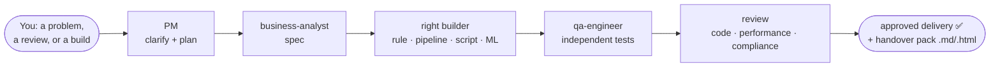

# Compliance Surveillance Engineering - Virtual Team

> *An AI **engineering** team - PM, builders, reviewers and subject-matter experts - that builds
> and reviews the technology behind compliance surveillance, right inside Claude Code. Raw data is
> hard-blocked from the model; anything else you share carries a data-safety attestation.*


> ⚗️ **Proof of concept.** An exploratory experiment in what an AI "engineering team" can do
> inside Claude Code - **not** a production system, and **not** regulatory tooling. Treat its
> output as a starting point for real engineers and reviewers, not as assured or accredited work.
>
> 🛑 **Dormant by default.** The team is **opt-in** and never takes over your sessions. A normal
> `claude` session is just standard Claude Code; the agents and the "Morgan" persona wake up
> **only** when you run `/engage` (or another team command, or simply ask for the team). The sole
> always-on piece is the data-safety guard.

> ## ✨ What's new in 0.7.6
>
> - **🏷️ Morgan states the team version on startup** - `/engage` and `/meet-the-team` now show the
>   loaded build version in Morgan's opening (read from the plugin manifest), so you can tell at a
>   glance which version is running - handy because an installed plugin is a cached copy and a
>   plain restart won't upgrade it (use `/plugin update`).
>
> Recent **0.7.x**: safety-hook hardening (ADR-002), citations *retrieved, not recalled* against a
> source-verified [regulatory register](config/regulatory-register.yaml) (ADR-001), CI lint/manifest
> gates, audit-grade templates, and a self-masking fix + measured calibration on the **bundled
> example** spoofing scenario (the worked reference example, not the agents themselves).
> 📜 Full release history: [`CHANGELOG.md`](CHANGELOG.md).
>
> 🎬 **See it work** - a full build, end-to-end on synthetic data, captured as a readable
> **[build demo transcript](docs/demos/build-demo.md)**, with every produced artifact in
> [`docs/demos/build-artifacts/`](docs/demos/build-artifacts/) (spec → code → 3 reviews → tuning →
> delivery report). Other transcripts: [review](docs/demos/review-demo.md) ·
> [data-safety](docs/demos/data-safety-demo.md) · [run comparison](docs/demos/build-run-comparison.md).

A **virtual compliance-surveillance *engineering* team made of AI assistants** - the
**engineering** behind surveillance. It builds and reviews the **technology that detects** money
laundering, market manipulation and trader misconduct - rather than performing the compliance,
monitoring or investigation work itself. Detection rules are just one deliverable: it equally
builds **data pipelines / ETL, transformation and utility scripts** (Python, Scala, Java,
PowerShell, Bash), reconciliation and reporting jobs, and tooling - or simply **reviews** existing
code. It runs in [Claude Code](https://claude.com/claude-code) as **16 focused subagents**:
subject-matter experts who advise, and builders who engineer, test and review - with the work
flowing between them like a real engineering team.

> 🟢 **New to AI agents and LLMs?** Start with [`docs/OVERVIEW.md`](docs/OVERVIEW.md) - a
> plain-English tour of what this is, who the team are, and how it keeps confidential data away
> from the AI. No prior knowledge needed.



**The safety rule, in one line:** raw data under `data/raw/` is **hard-blocked** - an always-on
guard stops any agent from reading it. For anything else you share, **you attest it's masked,
synthetic, or anonymised** (a startup disclaimer makes this explicit - the responsibility is
yours). Prefer **masked** (identities scrambled, behaviour preserved) or **synthetic** (entirely
made up). See [how real data is handled](#-handling-real-data).

---

**📑 Jump to** - [👥 Meet the team](#-meet-the-team) · [🚀 Quick start](#-quick-start) · [📦 Install](#-install) · [🤖 Using them](#-using-them) · [📓 Worked example](#-worked-example) · [🔍 Code-review tooling](#-code-review-tooling) · [🧪 Self-test](#-self-test-eval-harness) · [🪝 Safety hooks](#-the-two-safety-hooks-plain-english) · [🔒 Real-data handling](#-handling-real-data) · [💰 Token usage](#-token-usage--optimisation) · [📁 Layout](#-layout) · [🗺️ Roadmap](#-roadmap) · [🔧 Config](#-notes-on-the-config) · [🙏 Credits](#-credits)

---

## 👥 Meet the team

Fifteen specialists, one PM and a tireless junior (16 agents in all) - each with a day job, a name, strong opinions,
and a Slack status that tells you more than their job title does. (Inside a session, type
`/meet-the-team` and Morgan does the introductions live.) **🧠 Advisors** are read-only - your
*independent* check, so they can critique all day but can't touch the code (segregation of duties,
basically). **🔧 Builders** write the stuff.

**🎩 Morgan** - *Project Manager & orchestrator.* Translates regulator-speak into plain English,
leads with "yes, here's how", and physically cannot let a piece of work end at "analysis". Will
get it past the reviewers **and** the change board. · *Slack:* "happy to take that as an action."

### 🔧 Builders - they engineer the surveillance technology

- **Amara** - *Business Analyst.* Asks "but what does the regulation *actually require*?" until the
  spec can't be misread. BABOK to her bones; allergic to ambiguity and to thresholds that turned up
  without a rationale. · *Slack:* "requirement unclear → workshop booked (recurring)."
- **Mateo** - *Detection Rules Developer.* Turns "catch the spoofers" into deterministic, tested
  logic - second line of defence, in code form. A rule without a false-positive test is, to him,
  just a rumour. · *Slack:* "no test, no merge. it's in the SDLC."
- **Ana** - *Data Analyst.* Lives in the data and the false positives; trusts nothing until she's
  seen the distribution. Will name your FP driver before you've finished writing the ticket. ·
  *Slack:* "the data says otherwise."
- **Theo** - *Tuning Analyst.* Can defend a threshold to a regulator with a straight face - ATL/BTL,
  segmentation, the lot. Treats "let's just round it to 10k" as a personal insult. · *Slack:*
  "show me the below-the-line sample."
- <a id="mei"></a>**Mei** - *ML Engineer.* Reaches for ML only when plain rules genuinely aren't enough - and says
  so out loud, because she knows [Viktor](#viktor)'s coming. Won't ship a model she can't explain to a
  regulator. · *Slack:* "…do we actually need a model for this?"
- **Kenji** - *Platform / Data Engineer.* Builds the plumbing nobody thanks him for until a feed
  drops at quarter-end. Pipelines, ETL, retention, lineage - and a deep, personal grudge against
  silent failures. · *Slack:* "have you tried the runbook?"
- **Linh** - *QA Engineer.* Refuses to mark her own homework - independent by design. Finds the
  edge case you were hoping nobody would raise in UAT. Residual risk: stated, not buried. ·
  *Slack:* "reopening - it's a finding, not a nit."

> Routing by deliverable, not habit: a detection rule → `rules-developer`; an ETL pipeline or
> a PowerShell transform → `platform-engineer`; a reconciliation/reporting job → `data-analyst`;
> **threshold tuning → `tuning-analyst`**; **requirements/elicitation/reg-change → `business-analyst`**;
> an ML model → `ml-engineer`. The PM picks; see CLAUDE.md §6.

### 🧠 Advisors - they guide and sign off (read-only)

- **Hassan** - *Transaction-Monitoring / AML SME.* The money-laundering brain. Structuring,
  smurfing, layering - usually spotted before lunch. Will gently warn you when a "clever" scenario
  would file a thousand defensive SARs and catch nothing. · *Slack:* "that's structuring. and
  that. and that."
- **Camila** - *Trade-Surveillance SME.* Thinks like a spoofer so you don't have to. Spoofing,
  layering, marking the close, insider dealing - reads an order book like a crime novel. ·
  *Slack:* "…and there's the cancel. classic."
- **Cleo** - *Comms-Surveillance SME.* Reads trader chat for a living: lexicons, NLP risk flags,
  e-comms and voice. Fluent in euphemism; deeply unimpressed by "let's take this to my personal
  phone". · *Slack:* "'per my last message' is doing a lot of work here."
- <a id="viktor"></a>**Viktor** - *Model Validator.* Independent of [Mei](#mei) *by design*, and entirely comfortable telling
  her the model's wrong. Lives in **SR 11-7**; the friendly adversary every model needs. ·
  *Slack:* "prove it. then prove it again. then document it."
- **Ravi** - *Code Reviewer.* Reads seven languages (**Python, TypeScript/JS, Scala, Java,
  PowerShell, Bash, SQL**) and the security flaws in all of them. Drives the real analysers
  (ruff/bandit/SpotBugs/ShellCheck/Semgrep…), adds judgement on top - and, sorry, there's a
  hard-coded secret on line 42. · *Slack:* "nit: naming (×40). also: CRITICAL, line 42."
- **Thabo** - *Performance Reviewer.* Asks one question - *"will it survive month-end?"* - and
  answers with evidence, not vibes. **Static by default** (won't run your code uninvited, §7). ·
  *Slack:* "fine in dev. now do it at 10× and T+1."
- **Layla** - *Compliance Reviewer.* The last gate before anything ships: auditability, the
  alert→logic→obligation trail, secrets/PII, the Definition of Done. "Probably fine" does not pass
  review. · *Slack:* "if it isn't documented, it didn't happen."
- **Yuki** - *Data-Quality Reviewer.* Quietly obsessed with the one missing feed that means abuse
  goes undetected - completeness, timeliness, **total coverage**. Knows a silent feed gap *is* the
  control failure. · *Slack:* "no feed, no alert, no idea."

### ⚙️ …and behind the scenes

- **Pip** - *Review Coordinator.* Haiku-tier and proud of it. Preps every review - detects the
  context, picks the lenses, scores findings and keeps the Found/Reported/Filtered tallies - so the
  senior reviewers never burn opus on arithmetic. Will absolutely raise a ticket for it. ·
  *Slack:* "review prepped & triaged ▓▓▓░░ (JIRA raised)"

> Why read-only matters: an advisor that could quietly edit the thing it's reviewing isn't a
> real independent check. The restriction is enforced by the tools each agent is granted -
> advisors get `Read, Grep, Glob` only - not by convention.

## 🚀 Quick start

### ✅ Simplest - open the repo as a project (no install, no marketplace)

The most reliable way. Project-scoped skills and agents **auto-load** - nothing to install:

```bash
git clone https://github.com/danieledge/virtual-surv-IT.git
cd virtual-surv-IT     # launch Claude FROM the repo root (discovery doesn't walk up dirs)
claude
```

Then run `/help` - you should see `/engage`, `/deep-review`, `/audit-review`, …. New here? Type
**`/demo`** to watch Morgan run a full engagement end-to-end on safe synthetic data (narrating every
decision), or **`/meet-the-team`** for introductions; then `/engage` to start. (Also
`pip install -r requirements-dev.txt` for the worked example, tests and the `.md→.html` render.)

> 🎬 **Prefer to read it first?** Real demo transcripts are rendered right here on GitHub -
> [**`docs/demos/`**](docs/demos/): a [review](docs/demos/review-demo.md), the
> [data-safety guard blocking a read live](docs/demos/data-safety-demo.md), and a
> [build from scratch](docs/demos/build-demo.md). No setup needed.

> ⚠️ **Two gotchas that waste people's time:**
> - **Claude can't install the plugin for you.** `/plugin …` is a command **you** type - if you
>   ask the assistant to "install the plugin" it may *say* it did without anything happening.
> - **Don't copy the repo into `~/.claude/skills/`.** The repo's skills live at
>   `.claude/skills/<name>/SKILL.md`, so copying the whole folder mis-nests them and they won't
>   load. Use project mode (above) or a real plugin install (below).

### Install once - launch the team on demand from *any* project

Install it as a plugin and the team is available in every project, summoned with one command.

> 🛑 **You must type the `/plugin` commands yourself.** `/plugin …` is an interactive command -
> if you *ask the assistant* to "install the plugin" it may claim success without anything
> happening. And first remove any earlier hand-copy (e.g. `~/.claude/skills/…`) - it conflicts.

**1. Add the marketplace and install** (type these in Claude Code yourself):
```
# From GitHub (works anywhere, nothing to clone):
/plugin marketplace add danieledge/virtual-surv-IT
/plugin install compliance-surveillance-team@virtual-surv-it

# …or from a local copy instead of GitHub:
/plugin marketplace add /path/to/virtual-surv-IT
/plugin install compliance-surveillance-team@virtual-surv-it
```

**2. Restart Claude Code.**

**3. From any project, summon the team on demand** (commands are namespaced):
```
/compliance-surveillance-team:engage
```
…and likewise `…:deep-review`, `…:audit-review`, `…:handover`, etc.

**Verify it installed:** run `/plugin` - it should list **compliance-surveillance-team** as
enabled (recorded in your config under `enabledPlugins`). **If it's not listed, the install
didn't run** - re-type the commands above yourself.

*(Just need it for one session? `claude --plugin-dir /path/to/virtual-surv-IT` loads it
ephemerally, not saved.)*

You get the 16 agents, the workflow commands and the raw-data guard hook in every project.

> **What works from another project vs repo-as-project.** The full **review/advisory** team -
> `/engage`, all the reviews, the SMEs, Morgan - works everywhere. The helper-**script** steps
> (the `.md`→`.html` render and the masking pipeline) need the plugin's `scripts/` reachable
> from the working directory, which Claude Code doesn't expose to the model's shell from a
> foreign project - so those run cleanest in **repo-as-project** mode. For "summon the team to
> review/advise on my current project", the plugin install is exactly right.

> **Data-safety guard is fully portable.** It's a hook, so it receives `CLAUDE_PROJECT_DIR` and
> protects **your project's** `data/raw/` (not the plugin's) wherever the plugin is installed -
> backed by the OS-level `permissions.deny` in settings. (Note: the hook runs `python3`; the
> guard is inert without Python - the deny-list still applies.)

Then just **talk to the PM** - describe whatever you've got:

```
/engage I need to detect wash trades in our equities flow
/engage here's a PowerShell script, review it and tell me if it'd survive an audit
/engage build this from the attached FSD
```

> **You only type `/engage` once** - to kick off a piece of work. After that, just reply in
> plain English ("yes, go ahead", "add a false-positive test", "now do the handover");
> Morgan stays in role for the whole session. Use `/engage` again only to start a new,
> separate piece of work, or a focused command (`/audit-review`, `/handover`, …) to jump
> straight to a specific workflow.

The PM (the main session) then:
1. **Asks you clarifying questions** and waits for your answers - it won't guess scope,
   jurisdiction, data or success criteria.
2. **Offers a menu of deliverables** to pick from (BRD, FSD, ADRs, RTM, review report,
   audit pack…).
3. **Agrees a plan** with you (the Engagement Brief), then **runs the right specialists**.
4. **Hands back deliverables in both `.md` and `.html`** under `artifacts/`.

Prefer to drive a specific step yourself? Use the focused commands:
`/write-brd` · `/brd-to-fsd` · `/deep-review` · `/audit-review` · `/build-solution` ·
`/new-scenario` (see [Using them](#-using-them)).

> Don't have Claude Code yet? Install it from <https://claude.com/claude-code>, then run
> `claude` inside this folder. New to agents/LLMs? Read
> [`docs/OVERVIEW.md`](docs/OVERVIEW.md) first.

## 📁 Layout

```
.claude-plugin/               # plugin + marketplace manifests (installable via /plugin)
CLAUDE.md                     # shared team handbook (example defaults - customise as needed)
.claude/agents/               # 16 subagents (15 specialists + review-scorer helper)
  business-analyst.md     # BA            (build)
  tm-sme.md                   # AML SME       (advisory, read-only)
  trade-surveillance-sme.md   # SME           (advisory, read-only)
  comms-surveillance-sme.md   # SME           (advisory, read-only)
  rules-developer.md          # detection rules (build)
  platform-engineer.md        # pipelines/ETL/scripts/infra (build)
  data-analyst.md             # analysis, FP analysis, data-quality, reporting/MI (build)
  tuning-analyst.md           # threshold calibration / alert tuning (ATL-BTL) (build)
  ml-engineer.md              # AI/ML         (build)
  qa-engineer.md              # independent testing & QA evidence (build)
  model-validator.md          # independent model validation (advisory, read-only)
  code-reviewer.md            # multi-language code review (advisory, read-only)
  performance-reviewer.md     # performance & scalability review (advisory, read-only)
  compliance-reviewer.md      # audit/compliance review (advisory, read-only)
  data-quality-reviewer.md    # data completeness & coverage assurance (advisory, read-only)
  review-scorer.md            # cheap-tier (haiku) helper: context/scoring/filtering (read-only)
```

## 📦 Install

The team is a set of files you commit into your repo. To get the whole team - not just the
agents - copy these:

1. `CLAUDE.md` to your repo root (merge if you already have one) - the shared handbook.
2. `.claude/agents/` - the 16 subagents.
3. `.claude/skills/` - the 20 workflows (`/engage`, `/audit-review`, …); without these you
   get agents but no front door.
4. `.claude/hooks/` **and** `.claude/settings.json` - the always-on data-safety guard and its
   wiring. Don't skip these: they are the §5 control that keeps real data away from the model.
5. `docs/templates/` - the artifact templates the workflows render.
6. Restart Claude Code (subagents and skills load at session start), then run `/agents` and
   `/help` to confirm the team and its commands appear.
7. (Optional) `CLAUDE.md` §2/§3 ship with example defaults so the team works immediately -
   replace the example jurisdictions and stack with your own when you have them.

(If you install this repo as a Claude Code **plugin** via `.claude-plugin/`, all of the above
ships together - see the manifest.)

## 🤖 Using them

It's one **dynamic, agile delivery team** with a single front door: the **PM, "Morgan"** -
warm, plain-speaking, can-do but realistic. Throw it a problem, code to review, or
requirements to build, and it clarifies, lets you pick the deliverables, then orchestrates
the specialists.

```
/engage <a problem, code to review, or a set of requirements>
```

The PM asks clarifying questions (and waits for your answers), offers a **menu of documentary
artifacts** to choose from, summarises everything in an Engagement Brief, then oversees
delivery. Focused commands for each entry point:

| Command | Use it for | Pattern |
|---|---|---|
| `/engage` | anything - the front door | PM intake + dynamic routing |
| `/prepare-data` | get safe data ready (synthetic or masked) before analysis | guided onboarding + validation |
| `/write-brd` | idea → Business Requirements (BABOK + EARS) | prompt chaining |
| `/brd-to-fsd` | BRD → Functional Spec (ISO 29148 + Gherkin) | prompt chaining |
| `/deep-review` | detailed code review (bugs, security, architecture, impact) | dimension fan-out + scoring |
| `/performance-review` | performance & scalability vs target data volumes | profiling evidence |
| `/audit-review` | existing code → robust & audit-ready? | evaluator-optimizer loop |
| `/remediate` | legacy / poorly-built code → assess, fix, hand over | assess → prioritise → fix loop |
| `/build-solution` | full requirements → end-to-end build | orchestrator-workers |
| `/handover` | developer + QA test-evidence handover pack | independent QA + dev docs |
| `/new-scenario` | a single detection scenario | spec → SME → build → review |

Every deliverable is produced in **`.md` and `.html`** (via `scripts/render_html.py`) for
easy distribution. See **[`docs/WAYS-OF-WORKING.md`](docs/WAYS-OF-WORKING.md)** for the
frameworks, the artifact menu and the traceability spine.

You can also just describe a task in plain English (Claude matches on each agent's
`description`), or enable experimental agent teams via `CLAUDE_CODE_EXPERIMENTAL_AGENT_TEAMS`
for genuinely parallel workstreams.

## 📓 Worked example

A complete reference scenario ships with the repo so the conventions are concrete:

```
rules/spoofing.py            # MAR spoofing detection (deterministic, explainable)
scripts/gen_synthetic.py     # synthetic order-flow generator (§5 - no real data)
tests/test_spoofing.py       # true-positive + false-positive cases (§4)
docs/scenarios/spoofing.md   # audit trail: alert → logic → obligation
docs/WAYS-OF-WORKING.md      # frameworks, workflows, artifact menu, traceability spine
docs/team-operating-guide.md # the PM's detailed operating rules (read on-engage; keeps CLAUDE.md lean)
docs/demos/                  # real /demo transcripts (review, data-safety, build) - readable on GitHub
docs/agent-design.md         # how the team is built to agent best-practice + model-tiering rationale + conformance matrix
docs/prepare-data-roadmap.md # path to make /prepare-data accept more data safely ("throw anything at it")
docs/DEFINITION-OF-DONE.md   # the evidenced gate every delivery must meet
docs/scope-and-stack.md      # example regulatory scope + tech stack (customise; kept out of the always-loaded handbook)
docs/code-review-method.md   # confidence scoring, filtering, deep review (adapted from turingmind)
docs/templates/              # delivery-report (consolidated default) + BRD, FSD, ADR, RTM, review/performance, dev+QA handover, change/ops, scenario, model-validation
scripts/render_html.py       # render any .md artifact to standalone .html for distribution
scripts/eval_score.py        # deterministic scorer for the team-quality eval harness
evals/                       # team-quality eval harness: rubrics + 21 golden cases (regression net)
.claude/skills/              # workflows: /engage, /meet-the-team, /demo, /prepare-data, /assess-coverage, /write-brd, /brd-to-fsd, /elicit-requirements, /reg-change-impact, /analyse-data, /tune-thresholds, /validate-tm-model, /run-evals, /deep-review, /performance-review, /audit-review, /remediate, /build-solution, /handover, /new-scenario
.github/workflows/ci.yml     # tests + lint (ruff/bandit/shellcheck) + manifest validation + gitleaks + no-raw-data check
.pre-commit-config.yaml      # local secret / raw-data guardrails
```

Quickstart:

```bash
pip install -r requirements-dev.txt
pytest                                   # all tests green
python -m scripts.gen_synthetic --kind spoofing --out data/synthetic/spoofing.jsonl
pre-commit install                       # optional: enable local guardrails
```

Add a new detection with `/new-scenario <requirement>`, which chains
business-analyst → SME → rules-developer → code-reviewer → compliance-reviewer per the
handbook.

## 🔍 Code-review tooling

The `code-reviewer` agent drives standard analysers - it doesn't reinvent rules. The Python
ones are in `requirements-review.txt` (kept separate so the core test install stays lean).
The rest install via the OS / build tooling:

> **Without these installed, reviews still run - but degrade to inference-only (🧠) instead of
> tool-backed measured (📊) findings.** The review's 🔬 tooling-coverage line will say what
> couldn't run. Install them before testing if you want analyser-evidenced results.

| Language | Install |
|---|---|
| Python | `pip install -r requirements-review.txt` (ruff, black, mypy, bandit, pip-audit, semgrep) |
| Bash | `apt install shellcheck` · `go install mvdan.cc/sh/v3/cmd/shfmt@latest` |
| PowerShell | `pwsh -c 'Install-Module PSScriptAnalyzer -Scope CurrentUser'` |
| Java | `checkstyle`, `pmd`, `spotbugs` via your build tool (Maven/Gradle) or `brew`/`apt` |
| Scala | `scalafmt`, `scapegoat`/`wartremover` via sbt plugins |
| Any | Semgrep (`pip`) for multi-language; gitleaks for secrets |

The agent runs whatever is present and reports which analysers were unavailable - nothing is
silently skipped. None of these are required to *use* the team; they sharpen `code-reviewer`.

## 🧪 Self-test (eval harness)

The repo's **84 unit tests** check the *code*. The **eval harness** ([`evals/`](evals/)) checks the
**quality of what the team produces** - so a prompt change that silently weakens a review gets
caught, not shipped. (This is the regression net Anthropic's multi-agent guidance recommends.)

- **7 rubrics** (code-review · coverage · spec/traceability · tuning · data-safety ·
  prompt-injection · regulatory-citation) + **21 golden cases** with deliberately seeded issues
  *and* false-positive traps (all synthetic), including prompt-injection and fabricated-citation traps.
- **Deterministic scorer** ([`scripts/eval_score.py`](scripts/eval_score.py)) - matches the team's
  findings against each case's ground truth: recall, must-find criticals, FP-traps. **Unit-tested
  (7 tests), runs free in CI** - no tokens.
- **`/run-evals`** runs the live team per case, scores it, adds an **LLM-judge** for the qualitative
  dimensions, and prints a scoreboard - flagging any regression. *(Spends tokens; run at milestones.)*

> Proven against a real run: the actual `code-reviewer`, run blind on the seeded-bug case, scored
> **recall 1.0** - it caught both planted criticals and correctly left the documented threshold
> (the false-positive trap) alone.

## 🪝 The two safety hooks (plain English)

A *hook* is a small script Claude Code runs automatically **right before** it uses a tool, and it
can **allow** or **block** that action. This plugin ships two, **always on** (they run even when the
team is dormant):

**1. The raw-data guard** (`guard-raw-data.py`) - *agents must never read real, unmasked data.*
Anything an agent reads is sent to the AI model, so real records (PII/MNPI) can't go that way. The
hook blocks any read/search/command whose path lands inside `data/raw/`. Point the team at masked or
synthetic data instead.

**2. The code-execution gate** (`guard-code-execution.py`) - *reviewing code means reading it, not
running it.* Running untrusted code is a real risk, so commands that **execute** code (test runners,
scripts, profilers) are blocked **unless you've given consent** - a `.claude/.exec-consent` marker
(written when you answer "yes" at intake) or `CST_ALLOW_EXEC=1`. The team's own `scripts/` helpers
are always allowed.

Both are wired in **two** places so they fire in either mode - `hooks/hooks.json` (installed as a
plugin) and `.claude/settings.json` (this repo opened as a project) - and a test keeps the two copies
identical.

**How strong are they? (the honest answer.)** For the file tools (`Read`/`Grep`/`Glob`) the block is
backed by the OS-level `permissions.deny` list, so it genuinely holds. For **shell commands** the
guards work by *reading the text of the command* - a strong default and a consent record, but **not
a sandbox**: a determined user can dodge string-matching (e.g. hide a path in a variable). The real
boundary for shell is OS file permissions / keeping raw data off the box. The full bypass analysis
and the hardening backlog are in [`docs/adr/ADR-002`](docs/adr/ADR-002-safety-hook-threat-model.md);
operating notes are in [`docs/house-rules.md`](docs/house-rules.md).

## 🔒 Handling real data

**Raw data under `data/raw/` is hard-blocked** - the guard stops any agent reading it, and
anything an agent reads goes to the model provider as context. Two safe ways to get data to the
team:

1. **Mask it** through the pipeline below (recommended for real data) → point agents at
   `data/masked/`; or **synthesise** it (safest, shareable).
2. **Provide already-safe data** (synthetic / masked / anonymised). A **startup disclaimer** has
   you confirm it carries no prohibited PII/MNPI - that's your responsibility, not the team's.

Either way, **committed examples, tests, artifacts and logs stay synthetic/masked only** (§5) -
the attestation covers the analysis *inputs* you point at, not what gets written into the repo.
An **automatic masking workflow** (so you don't have to self-attest) is on the [roadmap](#-roadmap).
The pipeline:

```
real ─▶ data/raw/ ──[ python -m scripts.ingest ]──▶ data/masked/ ─▶ agents / dev
        (agent-blocked)   schema-driven masking        (governed)
                                  │
                                  └─ fit a synthetic generator for anything that leaves the env
```

- **`scripts/ingest.py`** - schema-driven masking (`config/masking-schema.yaml`). Each field
  has a role: `token` (keyed HMAC, preserves linkage), `shift` (per-entity time shift,
  preserves deltas), `keep` (signal-bearing values), `generalise`, `redact` (free text).
  Key from `MASKING_KEY` in `~/.secrets` - no insecure default. ⚠️ **`redact` is regex-only**
  (email/IBAN/card/SSN/phone) - fine for structured fields, **not safe for real comms/chat**
  (misses names + obfuscated IDs); swap in NER before masking real communications (roadmap).
- **`scripts/validate_masking.py`** - two modes. **Default** = a *config self-test* on a synthetic
  fixture: it proves the schema + masking logic are sound (no residual identifiers/PII in the
  fixture, the spoofing rule fires identically masked-vs-original, k-anonymity over any *declared*
  quasi-identifiers). It does **not** inspect your data. **`--in data/masked/x.jsonl`** = scans
  **your actual masked file** for residual free-text PII (string fields) + k-anonymity. *(It can't
  verify "no original identifier survived" or fidelity without the originals - by design they never
  reach it.)* Note: k-anonymity is **off until you declare `quasi_identifiers`** in the schema.
- **`scripts/synthesise.py`** - the safest tier: learns the *shape* of masked data
  (size/timing distributions + the spoofing motif at its observed rate) and emits fully
  **synthetic** sessions that share no real entity, timestamp or row. This is what's safe
  to put in front of an agent or to share outside the environment.
- **`.claude/hooks/guard-raw-data.py`** - PreToolUse hook (wired in both `.claude/settings.json`
  and `hooks/hooks.json`) that blocks any agent `Read`/`Grep`/`Glob`/`Bash` touching `data/raw/`.
  See [the safety-hooks section](#-the-two-safety-hooks-plain-english) for what "blocks" means for
  shell commands vs the file tools.

```bash
export MASKING_KEY=...                                   # from ~/.secrets
python -m scripts.ingest --in data/raw/x.jsonl --out data/masked/x.jsonl
python -m scripts.validate_masking                       # config self-test (synthetic fixture)
python -m scripts.validate_masking --in data/masked/x.jsonl   # scan YOUR masked file for residual PII
```

> Pseudonymised data is still personal data (GDPR). Masking enables local development;
> prefer fully synthetic data for anything that leaves the environment.

## 🔧 Notes on the config

- Advisory agents are restricted to read-only tools (`Read, Grep, Glob`, sometimes `Bash`)
  so they physically cannot alter detection logic.
- Build agents have write access (`Read, Write, Edit, Bash, Grep, Glob`).
- Accumulated knowledge (house typologies, tuning decisions, recurring findings) lives in a
  committed file, [`docs/house-rules.md`](docs/house-rules.md) - advisory agents recommend
  additions and the PM commits them. (Claude Code subagents have no per-agent memory; a
  committed file is the real, auditable mechanism.)
- Models: **4 opus** (the final/unchecked judgement + novel-design roles) · **11 sonnet** ·
  **1 haiku** - the per-agent rationale and best-practice conformance live in
  [`docs/agent-design.md`](docs/agent-design.md). Change the `model:` field freely.

## 💰 Token usage & optimisation

Multi-agent setups cost tokens, so the team is built to be cost-conscious. Measured on a real run
(the Agent tool reports actual usage; ~4 chars/token, so ±15%):

| What | Tokens | ~API cost | When it's paid |
|---|---|---|---|
| One quick `code-reviewer` review (small file, opus) | **~18.7k** | **~$0.80** | per review agent |
| A lean engagement (intake + scorer + reviewer + synthesis) | ~35-50k | ~$0.50-1.00 | per engagement |
| A **full build → 3 reviews → tuning → performance** delivery (8 agents, measured) | **~182k** | **~$3-6** | the heavy end - a complete reviewed+calibrated deliverable (see the [build demo](docs/demos/build-artifacts/delivery-report.md) §7) |
| A full fan-out (right-sizing off) | ~150k+ | ~$3-7 | rarely - reserved for broad work |

> 💵 **Cost basis (rough, ±2×).** At list prices - **opus ~$15/$75, sonnet ~$3/$15, haiku ~$1/$5**
> per million input/output tokens. The reported token counts are *totals* (no input/output split), so
> these assume a ~50/50 mix; actual cost varies with the split, prices change, and prompt-caching can
> cut it substantially. Treat as order-of-magnitude, not a quote.
>
> 🧾 **For fun:** the build demo's delivery report has a [tongue-in-cheek **rate card**](docs/demos/build-artifacts/delivery-report.md)
> - that full 8-agent delivery (~$3.60 API, ~9 min) is ~£2-4k of human consulting effort. *The boring
> 80% in minutes, so people spend their day on the judgement that matters.*

**Optimisations in place** (these are the levers that matter, per Anthropic's cost guidance):
- **Model tiering** - **4 opus / 11 sonnet / 1 haiku**; opus (~5× sonnet) reserved for the four
  final-judgement/novel-design roles, haiku for the mechanical review bookkeeping.
- **Right-sizing** - a narrow change fires 2-3 agents, not 16; the PM states the agent count at the gate.
- **Artifacts-as-blackboard** - agents return condensed results; big output goes to files, not back
  through the orchestrator's context.
- **Clean console** - detail to artifacts, not the chat.
- **Lean always-on context (0.5.x)** - `CLAUDE.md` was slimmed **~44%** (~5.2k → ~2.9k tokens) by
  moving on-engage operating detail to [`docs/team-operating-guide.md`](docs/team-operating-guide.md).
  It loads into *every* session and is inherited by *every* subagent, so this saves ~2.3k tokens per
  session - multiplied across a fan-out (a 5-agent run saves ~11k).

## 🗺️ Roadmap

Tracked enhancements, with the rationale for each. *(Done this cycle: **subagent self-assessment** -
agents now self-verify against their brief and flag gaps before returning, CLAUDE.md §6.)*

**Quality & evaluation**
- ✅ **Team-quality eval harness - SHIPPED (0.5.0)** - `evals/` has 7 rubrics + 21 golden cases
  (seeded issues + false-positive traps) across review, coverage, spec/traceability, tuning and
  data-safety. The deterministic scorer (`scripts/eval_score.py`) is unit-tested; `/run-evals`
  runs the live team + an LLM-judge and prints a scoreboard. *Remaining:* grow the case set and
  calibrate the judge against human scores over time.

**🚧 TODO - Automatic data-masking workflow** - detail in [`docs/prepare-data-roadmap.md`](docs/prepare-data-roadmap.md)

> **The goal:** *"throw a dataset at it and it masks/anonymises it safely"* - so the team can take
> real data **without the user having to self-attest** it's clean. **Until that ships, the interim
> control is the startup data-safety disclaimer** (you confirm shared data is masked/synthetic/
> anonymised; `data/raw/` stays hard-blocked). This workflow is what *replaces* that disclaimer.

- **Local schema-inference profiler** - propose a masking schema from a local profile (no agent
  reads raw data). *Why:* removes the biggest `/prepare-data` friction and the manual schema step.
- **NER/Presidio redaction** - replace regex-only free-text masking. *Why:* makes **comms/chat**
  data viable (regex misses names / obfuscated IDs).
- **Format adapters** (CSV/Parquet/Excel/nested) + **real synthetic (SDV)**. *Why:* "throw any
  structured file at it", safely; synthetic is the genuine trust-the-output path.
- **Auto-validation gate** - run the masking/NER check over the output and **block on residual
  PII**, so "auto-masked" is *proven* safe, not just attempted.

**Evidence - move foundational → verified** - detail in [`docs/house-rules.md`](docs/house-rules.md)
- **Comms-surveillance *practice*** (lexicon/NLP/voice/coverage methodology), **per-scenario
  detection-tuning practice**, and the **DA/BA boundary**. *Why:* the *regulatory* citations are
  verified; these *practice* details are industry-grounded, not primary-sourced - verify before
  relying on them in a real engagement.

**Worked example**
- **Larger labelled synthetic calibration set** for the spoofing scenario (the shipped fixture is
  12 events). *Why:* enables a *measured* `/tune-thresholds` demo (ATL/BTL, real FP reduction)
  rather than an illustrative one. Plus the price-context (distance-from-touch) check noted in
  [`docs/scenarios/spoofing.md`](docs/scenarios/spoofing.md).

## 📚 Built on - Anthropic agent guidance

This team is designed to follow Anthropic's published best practice for agents and multi-agent
systems. The conformance audit is in [`docs/agent-design.md`](docs/agent-design.md); the sources:

- [**Building Effective Agents**](https://www.anthropic.com/engineering/building-effective-agents) - patterns + "use the simplest thing that works".
- [**How we built our multi-agent research system**](https://www.anthropic.com/engineering/multi-agent-research-system) - orchestrator-worker, delegation briefs, ~15× token cost, failure modes.
- [**Effective context engineering for AI agents**](https://www.anthropic.com/engineering/effective-context-engineering-for-ai-agents) - context isolation, compaction, agentic memory.
- [**Subagents (Claude Agent SDK)**](https://code.claude.com/docs/en/agent-sdk/subagents) · [**Claude Code subagents**](https://code.claude.com/docs/en/subagents) - frontmatter, tools, model tiering, isolation.

## 🙏 Credits

- The `code-reviewer`'s **confidence-scoring, false-positive filtering, filter-transparency
  and deep-review** approach is adapted from
  [**turingmind-code-review**](https://github.com/turingmindai/turingmind-code-review)
  (MIT, © 2026 TuringMind). See [`docs/code-review-method.md`](docs/code-review-method.md).
  Our additions: regulated-domain audit mode and data-safety/traceability weighting.
