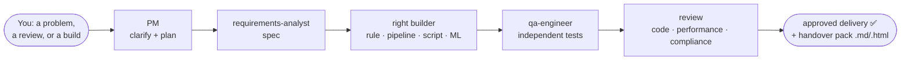

# Compliance Surveillance Engineering — Virtual Team

> ⚗️ **Proof of concept / experiment.** This is an exploratory POC for what an AI
> "engineering team" could do inside Claude Code — not a production system or regulatory
> tooling. Treat its outputs as a starting point for real engineers and reviewers, not as
> assured or accredited work.
>
> 🛑 **Dormant by default.** The team is **opt-in** — it does not take over your sessions.
> A normal `claude` session behaves like standard Claude Code; the team, the agents and the
> "Morgan" persona activate **only** when you run `/engage` (or another team command, or ask
> for the team). The one always-on piece is the data-safety guard.

A **virtual compliance surveillance *engineering* team made of AI assistants** — it doesn't
*do* compliance, it **builds the surveillance solutions and technology** behind detecting
money laundering, market manipulation and trader misconduct. Detection rules are just one
deliverable: it equally builds **data pipelines / ETL, transformation and utility scripts
(Python, Scala, Java, PowerShell, Bash), reconciliation and reporting jobs, tooling**, or
simply **reviews** existing code. It runs in
[Claude Code](https://claude.com/claude-code) as a set of 13 focused "subagents": some are
subject-matter experts who only advise, others engineer, test and review the solutions, and
the work flows between them like a real engineering team.

> 🟢 **New to AI agents and LLMs? Read [`docs/OVERVIEW.md`](docs/OVERVIEW.md) first** — a
> plain-English tour of what this is, who the team are, and how it keeps confidential data
> away from the AI. No prior knowledge needed.



**The safety rule in one line:** real data is never shown to the AI — it's either *masked*
(identities scrambled, behaviour kept) or fully *synthetic* (made up), and an automatic
guard blocks any agent from reading raw records. See
[How real data is handled](#handling-real-data-masking-pipeline).

## Quick start — using the team

### Offline / corporate install (no marketplace needed)

If marketplaces are disabled in your environment, **download the repo and use it locally** —
no marketplace connection required:

```bash
# get the code (download the ZIP from GitHub, or clone)
git clone https://github.com/danieledge/virtual-surv-IT.git
cd virtual-surv-IT

# (A) simplest — just open it as a project; project-scoped agents/commands load automatically
claude

# (B) use it as a plugin in ANY other project, from your local copy (no marketplace):
claude --plugin-dir /path/to/virtual-surv-IT
```

A third option for persistent local use without a marketplace: copy the folder to
`~/.claude/skills/compliance-surveillance-team/` — it loads automatically as an
`@skills-dir` plugin on the next session (unless your admins block that source).

For the worked example, tests and masking pipeline, also:
`pip install -r requirements-dev.txt` (pytest + Markdown for `.md→.html`).

### Or, where marketplaces are allowed

```
/plugin marketplace add danieledge/virtual-surv-IT
/plugin install compliance-surveillance-team@virtual-surv-it
```

Either way you get the 13 agents, the workflow commands and the raw-data guard hook.

Then just **talk to the PM** — describe whatever you've got:

```
/engage I need to detect wash trades in our equities flow
/engage here's a PowerShell script, review it and tell me if it'd survive an audit
/engage build this from the attached FSD
```

> **You only type `/engage` once** — to kick off a piece of work. After that, just reply in
> plain English ("yes, go ahead", "add a false-positive test", "now do the handover");
> Morgan stays in role for the whole session. Use `/engage` again only to start a new,
> separate piece of work, or a focused command (`/audit-review`, `/handover`, …) to jump
> straight to a specific workflow.

The PM (the main session) then:
1. **Asks you clarifying questions** and waits for your answers — it won't guess scope,
   jurisdiction, data or success criteria.
2. **Offers a menu of deliverables** to pick from (BRD, FSD, ADRs, RTM, review report,
   audit pack…).
3. **Agrees a plan** with you (the Engagement Brief), then **runs the right specialists**.
4. **Hands back deliverables in both `.md` and `.html`** under `artifacts/`.

Prefer to drive a specific step yourself? Use the focused commands:
`/write-brd` · `/brd-to-fsd` · `/deep-review` · `/audit-review` · `/build-solution` ·
`/new-scenario` (see [Using them](#using-them)).

> Don't have Claude Code yet? Install it from <https://claude.com/claude-code>, then run
> `claude` inside this folder. New to agents/LLMs? Read
> [`docs/OVERVIEW.md`](docs/OVERVIEW.md) first.

## Layout

```
.claude-plugin/               # plugin + marketplace manifests (installable via /plugin)
CLAUDE.md                     # shared team handbook (example defaults — customise as needed)
.claude/agents/               # 13 subagents
  requirements-analyst.md     # BA            (build)
  tm-sme.md                   # AML SME       (advisory, read-only)
  trade-surveillance-sme.md   # SME           (advisory, read-only)
  comms-surveillance-sme.md   # SME           (advisory, read-only)
  rules-developer.md          # detection rules (build)
  cloud-architect.md          # pipelines/ETL/scripts/infra (build)
  data-analyst.md             # tuning, data-quality, reporting (build)
  ml-engineer.md              # AI/ML         (build)
  qa-engineer.md              # independent testing & QA evidence (build)
  model-validator.md          # independent model validation (advisory, read-only)
  code-reviewer.md            # multi-language code review (advisory, read-only)
  performance-reviewer.md     # performance & scalability review (advisory, read-only)
  compliance-reviewer.md      # audit/compliance review (advisory, read-only)
```

## Meet the agents

Thirteen specialists, each defined by a short job description in `.claude/agents/`. They split
into **🧠 advisors** (read-only — they review and recommend but cannot change code, which
keeps them independent) and **🔧 builders** (they engineer and test the detection systems).

### 🔧 Builders — they engineer the surveillance technology

- **`requirements-analyst`** — turns a regulatory or business need into a clear,
  implementable spec (user stories, acceptance criteria, true/false-positive cases) before
  any code is written.
- **`rules-developer`** — implements and refactors deterministic detection rules and
  scenario logic for transaction monitoring and trade surveillance, from a validated spec.
- **`data-analyst`** — tuning, false-positive analysis, threshold calibration, coverage
  testing, plus data-quality, reconciliation and reporting/MI work.
- **`ml-engineer`** — builds ML/AI-based detection where rules aren't enough (anomaly
  detection, NLP for comms, behavioural scoring, alert triage).
- **`cloud-architect`** — designs **and builds** the data pipelines and platform: ingestion,
  ETL, streaming/batch transformation, transformation/utility scripts (Python, Scala, Java,
  PowerShell, Bash), infra/IaC, retention/immutability, data residency, resilience.
- **`qa-engineer`** — **independent** testing: designs and runs the test plan, then produces
  the QA handover evidencing what ran, coverage, gaps and residual risk. Separate from the
  builder, so it doesn't mark its own homework.

> Routing by deliverable, not habit: a detection rule → `rules-developer`; an ETL pipeline or
> a PowerShell transform → `cloud-architect`; a reconciliation/reporting job → `data-analyst`;
> an ML model → `ml-engineer`. The PM picks; see CLAUDE.md §6.

### 🧠 Advisors — they guide and sign off (read-only)

- **`tm-sme`** — transaction-monitoring / AML expert: detection scenarios, typologies,
  thresholds, segmentation, SAR/STR rationale.
- **`trade-surveillance-sme`** — market-abuse expert: spoofing, layering, wash trades,
  marking the close, insider dealing, front running.
- **`comms-surveillance-sme`** — communications-surveillance expert: lexicons, NLP risk
  policies, e-comms and voice monitoring mapped to conduct risk.
- **`model-validator`** — **independent** validation of any statistical/ML model
  (soundness, performance, bias, stability, explainability). Independent of `ml-engineer`
  by design, so it's free to challenge.
- **`code-reviewer`** — comprehensive code review across **Python, Scala, Java, PowerShell
  and Bash**. Drives the established linters/analysers for each language (ruff/mypy/bandit,
  Checkstyle/SpotBugs/PMD, scalafmt/scapegoat, PSScriptAnalyzer, ShellCheck, plus Semgrep) —
  not reinvented rules — and adds judgment on top. Quick or deep (detailed) review.
- **`performance-reviewer`** — performance & scalability review: complexity, hot paths,
  I/O/queries, memory, concurrency, and behaviour **at surveillance data volumes**. Drives
  established profilers (cProfile/py-spy/scalene, JMH/async-profiler, hyperfine, EXPLAIN) and
  reports evidence-backed findings.
- **`compliance-reviewer`** — final sign-off after any change: auditability, the
  alert→logic→obligation trace, secrets/PII, test coverage, and the Definition of Done.

> Why read-only matters: an advisor that could quietly edit the thing it's reviewing isn't a
> real independent check. The restriction is enforced by the tools each agent is granted —
> advisors get `Read, Grep, Glob` only — not by convention.

## Install

The team is a set of files you commit into your repo. To get the whole team — not just the
agents — copy these:

1. `CLAUDE.md` to your repo root (merge if you already have one) — the shared handbook.
2. `.claude/agents/` — the 13 subagents.
3. `.claude/skills/` — the 11 workflows (`/engage`, `/audit-review`, …); without these you
   get agents but no front door.
4. `.claude/hooks/` **and** `.claude/settings.json` — the always-on data-safety guard and its
   wiring. Don't skip these: they are the §5 control that keeps real data away from the model.
5. `docs/templates/` — the artifact templates the workflows render.
6. Restart Claude Code (subagents and skills load at session start), then run `/agents` and
   `/help` to confirm the team and its commands appear.
7. (Optional) `CLAUDE.md` §2/§3 ship with example defaults so the team works immediately —
   replace the example jurisdictions and stack with your own when you have them.

(If you install this repo as a Claude Code **plugin** via `.claude-plugin/`, all of the above
ships together — see the manifest.)

## Using them

It's one **dynamic, agile delivery team** with a single front door: the **PM, "Morgan"** —
warm, plain-speaking, can-do but realistic. Throw it a problem, code to review, or
requirements to build, and it clarifies, lets you pick the deliverables, then orchestrates
the specialists.

```
/engage <a problem, code to review, or a set of requirements>
```

The PM asks clarifying questions (and waits for your answers), offers a **menu of documentary
artifacts** to choose from, summarises everything in an Engagement Brief, then oversees
delivery. Focused commands for each entry point:

| Command | Use it for | Pattern |
|---|---|---|
| `/engage` | anything — the front door | PM intake + dynamic routing |
| `/prepare-data` | get safe data ready (synthetic or masked) before analysis | guided onboarding + validation |
| `/write-brd` | idea → Business Requirements (BABOK + EARS) | prompt chaining |
| `/brd-to-fsd` | BRD → Functional Spec (ISO 29148 + Gherkin) | prompt chaining |
| `/deep-review` | detailed code review (bugs, security, architecture, impact) | dimension fan-out + scoring |
| `/performance-review` | performance & scalability vs target data volumes | profiling evidence |
| `/audit-review` | existing code → robust & audit-ready? | evaluator–optimizer loop |
| `/remediate` | legacy / poorly-built code → assess, fix, hand over | assess → prioritise → fix loop |
| `/build-solution` | full requirements → end-to-end build | orchestrator–workers |
| `/handover` | developer + QA test-evidence handover pack | independent QA + dev docs |
| `/new-scenario` | a single detection scenario | spec → SME → build → review |

Every deliverable is produced in **`.md` and `.html`** (via `scripts/render_html.py`) for
easy distribution. See **[`docs/WAYS-OF-WORKING.md`](docs/WAYS-OF-WORKING.md)** for the
frameworks, the artifact menu and the traceability spine.

You can also just describe a task in plain English (Claude matches on each agent's
`description`), or enable experimental agent teams via `CLAUDE_CODE_EXPERIMENTAL_AGENT_TEAMS`
for genuinely parallel workstreams.

## Worked example & repo layout

A complete reference scenario ships with the repo so the conventions are concrete:

```
rules/spoofing.py            # MAR spoofing detection (deterministic, explainable)
scripts/gen_synthetic.py     # synthetic order-flow generator (§5 — no real data)
tests/test_spoofing.py       # true-positive + false-positive cases (§4)
docs/scenarios/spoofing.md   # audit trail: alert → logic → obligation
docs/WAYS-OF-WORKING.md      # frameworks, workflows, artifact menu, traceability spine
docs/DEFINITION-OF-DONE.md   # the evidenced gate every delivery must meet
docs/scope-and-stack.md      # example regulatory scope + tech stack (customise; kept out of the always-loaded handbook)
docs/code-review-method.md   # confidence scoring, filtering, deep review (adapted from turingmind)
docs/templates/              # delivery-report (consolidated default) + BRD, FSD, ADR, RTM, review/performance, dev+QA handover, change/ops, scenario, model-validation
scripts/render_html.py       # render any .md artifact to standalone .html for distribution
.claude/skills/              # workflows: /engage, /prepare-data, /write-brd, /brd-to-fsd, /deep-review, /performance-review, /audit-review, /remediate, /build-solution, /handover, /new-scenario
.github/workflows/ci.yml     # runs tests + gitleaks + a no-raw-data check
.pre-commit-config.yaml      # local secret / raw-data guardrails
```

Quickstart:

```bash
pip install -r requirements-dev.txt
pytest                                   # all tests green
python -m scripts.gen_synthetic --kind spoofing --out data/synthetic/spoofing.jsonl
pre-commit install                       # optional: enable local guardrails
```

Add a new detection with `/new-scenario <requirement>`, which chains
requirements-analyst → SME → rules-developer → code-reviewer → compliance-reviewer per the
handbook.

## Code-review tooling

The `code-reviewer` agent drives standard analysers — it doesn't reinvent rules. The Python
ones are in `requirements-review.txt` (kept separate so the core test install stays lean).
The rest install via the OS / build tooling:

| Language | Install |
|---|---|
| Python | `pip install -r requirements-review.txt` (ruff, black, mypy, bandit, pip-audit, semgrep) |
| Bash | `apt install shellcheck` · `go install mvdan.cc/sh/v3/cmd/shfmt@latest` |
| PowerShell | `pwsh -c 'Install-Module PSScriptAnalyzer -Scope CurrentUser'` |
| Java | `checkstyle`, `pmd`, `spotbugs` via your build tool (Maven/Gradle) or `brew`/`apt` |
| Scala | `scalafmt`, `scapegoat`/`wartremover` via sbt plugins |
| Any | Semgrep (`pip`) for multi-language; gitleaks for secrets |

The agent runs whatever is present and reports which analysers were unavailable — nothing is
silently skipped. None of these are required to *use* the team; they sharpen `code-reviewer`.

## Handling real data (masking pipeline)

Agents must never see raw records — anything an agent reads goes to the model provider as
prompt context. So real data only enters through a masking pipeline, and agents sit
downstream of it:

```
real ─▶ data/raw/ ──[ python -m scripts.ingest ]──▶ data/masked/ ─▶ agents / dev
        (agent-blocked)   schema-driven masking        (governed)
                                  │
                                  └─ fit a synthetic generator for anything that leaves the env
```

- **`scripts/ingest.py`** — schema-driven masking (`config/masking-schema.yaml`). Each field
  has a role: `token` (keyed HMAC, preserves linkage), `shift` (per-entity time shift,
  preserves deltas), `keep` (signal-bearing values), `generalise`, `redact` (free text).
  Key from `MASKING_KEY` in `~/.secrets` — no insecure default.
- **`scripts/validate_masking.py`** — gate that proves a config is safe *and* useful: no
  residual identifiers/PII, k-anonymity over quasi-identifiers, **and** the spoofing rule
  fires identically on masked vs. original data (fidelity).
- **`scripts/synthesise.py`** — the safest tier: learns the *shape* of masked data
  (size/timing distributions + the spoofing motif at its observed rate) and emits fully
  **synthetic** sessions that share no real entity, timestamp or row. This is what's safe
  to put in front of an agent or to share outside the environment.
- **`.claude/hooks/guard-raw-data.py`** — PreToolUse hook (wired in `.claude/settings.json`)
  that blocks any agent `Read`/`Bash` touching `data/raw/`.

```bash
export MASKING_KEY=...                                   # from ~/.secrets
python -m scripts.ingest --in data/raw/x.jsonl --out data/masked/x.jsonl
python -m scripts.validate_masking                       # exit 0 = safe + faithful
```

> Pseudonymised data is still personal data (GDPR). Masking enables local development;
> prefer fully synthetic data for anything that leaves the environment.

## Notes on the config

- Advisory agents are restricted to read-only tools (`Read, Grep, Glob`, sometimes `Bash`)
  so they physically cannot alter detection logic.
- Build agents have write access (`Read, Write, Edit, Bash, Grep, Glob`).
- Accumulated knowledge (house typologies, tuning decisions, recurring findings) lives in a
  committed file, [`docs/house-rules.md`](docs/house-rules.md) — advisory agents recommend
  additions and the PM commits them. (Claude Code subagents have no per-agent memory; a
  committed file is the real, auditable mechanism.)
- Models: deep-reasoning roles use `opus`, build/analysis roles use `sonnet`. Change the
  `model:` field freely.

## Credits

- The `code-reviewer`'s **confidence-scoring, false-positive filtering, filter-transparency
  and deep-review** approach is adapted from
  [**turingmind-code-review**](https://github.com/turingmindai/turingmind-code-review)
  (MIT, © 2026 TuringMind). See [`docs/code-review-method.md`](docs/code-review-method.md).
  Our additions: regulated-domain audit mode and data-safety/traceability weighting.
