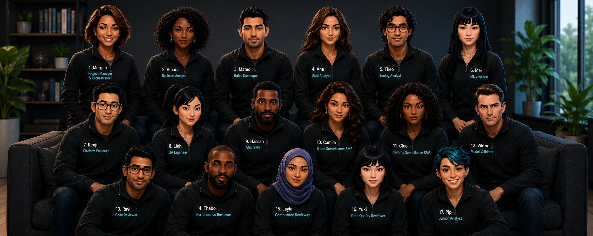
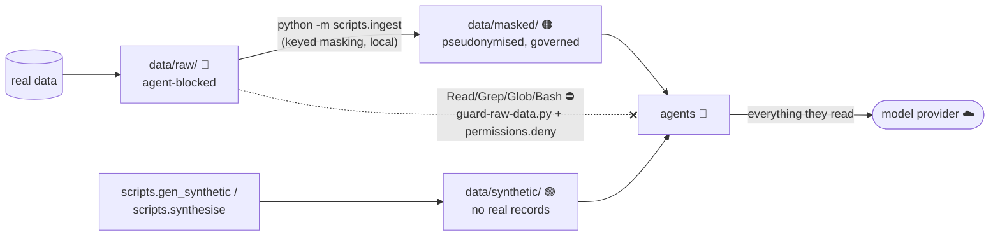

<a id="readme-top"></a>

# Virtual Surv-IT


> *AI-powered Compliance Surveillance **Engineering** Team for Claude Code - a PM, builders,
> reviewers and subject-matter experts that build and review the technology behind surveillance,
> right inside Claude Code. Raw data is hard-blocked from the model; anything else you share
> carries a data-safety attestation.*

> ⚗️ **Proof of concept, in active development.** An exploratory experiment in what an AI
> "engineering team" can do inside Claude Code - **not** a production system, and **not** regulatory
> tooling. It is **evolving quickly, will contain bugs, and may behave in unexpected ways** - expect
> rough edges and breaking changes, and **review everything it produces.** Treat its output as a
> starting point for real engineers and reviewers, not as assured or accredited work.
>
> 🛑 **Dormant by default.** The team is **opt-in** and never takes over your sessions. A normal
> `claude` session is just standard Claude Code; the agents and the "Morgan" persona wake up
> **only** when you run `/engage` (or another team command, or simply ask for the team). The sole
> always-on piece is the data-safety guard.

Virtual Surv-IT is a **collaborative AI engineering framework**: instead of relying on a single
AI assistant, it assembles a **team of specialist AI agents** inside Claude Code to design, build,
review, test and document **compliance-surveillance software** - so work is reviewed, refined and
delivered through structured collaboration, like a real engineering team.

It's the **engineering** behind surveillance - it builds and reviews the **technology that detects**
money laundering, market manipulation and trader misconduct, rather than performing the compliance,
monitoring or investigation work itself. Detection rules are just one deliverable: it equally builds
**data pipelines / ETL, transformation and utility scripts** (Python, Scala, Java, PowerShell, Bash),
reconciliation and reporting jobs, and tooling - or simply **reviews** existing code. It runs in
[Claude Code](https://claude.com/claude-code) as **a PM (Morgan) plus 16 focused subagents**:
subject-matter experts who advise, and builders who engineer, test and review.

> **New to AI agents and LLMs?** Start with [`docs/OVERVIEW.md`](docs/OVERVIEW.md) - a
> plain-English tour of what this is, who the team are, how a job flows through them, and how it
> keeps confidential data away from the AI. No prior knowledge needed.


> **Not all 16 every time.** The roster is a **library of specialists, not a fixed pipeline.**
> The PM (Morgan) engages **only the agents a task needs** - typically **2-5** (often just a builder
> + a reviewer), and **never all 16**. The diagram above is the *shape* of a full delivery; most
> tasks use a leaner subset. That selection is **how the team controls cost** *and* how it stays
> true to Anthropic's *"use the simplest thing that works"* guidance - complexity is opt-in, not the
> default.

**The safety rule, in one line:** raw data under `data/raw/` is **hard-blocked** - an always-on
guard stops any agent from reading it. For anything else you share, **you attest it's masked,
synthetic, or anonymised** (a startup disclaimer makes this explicit - the responsibility is
yours). Prefer **masked** (identities scrambled, behaviour preserved) or **synthetic** (entirely
made up). See [how real data is handled](#-handling-real-data).

**See it work** - a full build, end-to-end on synthetic data, captured as a readable
**[build demo transcript](docs/demos/build-demo.md)** (every artifact in
[`docs/demos/build-artifacts/`](docs/demos/build-artifacts/)). Other transcripts:
[review](docs/demos/review-demo.md) · [data-safety](docs/demos/data-safety-demo.md).

<details>
<summary>✨ <b>What's new in 0.8.0</b> - true dormancy, fail-closed guards, human-only consent, eval contract in CI (full history → <a href="CHANGELOG.md"><code>CHANGELOG.md</code></a>)</summary>

- **😴 True dormancy** - a session that never types `/engage` now pays ~nothing for the team:
  skill descriptions don't load at all (`disable-model-invocation`), `CLAUDE.md` cut to a lean
  always-on core (operating detail moved to the on-engage guide `/engage` actually reads), agent
  descriptions trimmed, and installs are **enabled per project** (no machine-wide roster tax).
- **🛡️ Guards fail closed + humans hold the keys** - a crash in a guard now *blocks* instead of
  silently proceeding, and a **third hook** stops the model granting itself execution consent or
  editing the settings/hooks: *you* create `.claude/.exec-consent` (the team gives you the exact
  command); intake "yes" is intent, the marker is the consent (ADR-002 v0.3.1).
- **🧪 Eval harness contract runs in CI** - every golden case's manifest is schema-checked and
  the scorer proven to discriminate (perfect run passes, empty run fails), token-free; review
  pipeline stops double-scoring findings; reviewers instructed that a clean verdict is valid.
- Tests **84 → 170**; full setup-audit findings + before/after token numbers in the CHANGELOG.

Recent **0.7.x**: build-demo re-run with fresh artifacts; README overhauled + summary-email on every close; audited against
Anthropic's guidance + self-assessment corrected; memory is project-scoped (no project memory in
the plugin); reviews coach "vibe-coded" code (prompting guidance); docs slimmed + masking claims
corrected; Morgan states the loaded version on startup; safety-hook hardening (ADR-002); citations
*retrieved, not recalled* against a source-verified
[regulatory register](config/regulatory-register.yaml) (ADR-001).
📜 Full release history: [`CHANGELOG.md`](CHANGELOG.md).

</details>

---

**📑 Jump to** - [🤔 Why](#-why-virtual-surv-it) · [✨ Features](#-features) · [🚀 Quick start](#-quick-start) · [👥 Meet the team](#-meet-the-team) · [🤖 Using them](#-using-them) · [📓 Worked example](#-worked-example) · [🧭 Core principles](#-core-principles) · [🔍 Tooling](#-code-review-tooling) · [🧪 Self-test](#-self-test-eval-harness) · [🪝 Safety hooks](#-the-safety-hooks-plain-english) · [🔒 Real-data handling](#-handling-real-data) · [📁 Layout](#-layout) · [🔧 Config](#-notes-on-the-config) · [💰 Token usage](#-token-usage--optimisation) · [🗺️ Roadmap](#-roadmap) · [⚠️ Known issues](#known-issues) · [📖 Docs](#-documentation) · [🤝 Contributing](#-contributing) · [📚 Built on](#-built-on--acknowledgements) · [📄 License](#-license)

---

## 🤔 Why Virtual Surv-IT?

### Why surveillance & financial-crime IT is a uniquely hard place to build

Surveillance technology isn't ordinary software delivery. Four things make it brutal - and, as
the next two sections argue, make it a domain where AI can genuinely help, provided it arrives
as a *team with controls* rather than a chat window:

- **The expertise doesn't live in one head.** A single change - say, tightening a spoofing
  threshold - crosses regulatory interpretation, requirements analysis, detection engineering,
  statistics (ATL/BTL calibration), model risk, QA and audit evidence. People who hold more than
  two of those disciplines are rare and expensive; teams queue for them, and change backlogs grow.
- **Failure is silent and asymmetric.** A bug in normal software shows up as a crash or a
  complaint. In surveillance, a dead data feed or a mistuned threshold shows up as **nothing** -
  no alert, no error, abuse flowing through undetected - until an auditor or regulator finds it
  ([FCA Market Watch 79](https://www.fca.org.uk/publications/newsletters/market-watch-79), May
  2024: an un-activated feed meant an insider-dealing scenario fired **zero
  alerts for 3+ years**). The countermeasure is independent assurance of coverage, data and
  tuning - which is staffing-intensive, so it's exactly what gets squeezed.
- **The paperwork *is* the product.** Every threshold needs a documented rationale, every alert
  a traceable path back to the obligation it serves, every tuning decision evidence that will
  stand up to a regulator **years later**. In most teams the evidenced 80% - specs, RTMs, test
  evidence, tuning packs, handover docs, MI - consumes the experts' time and still arrives
  inconsistent.
- **The data is the firm's most sensitive** - transactions, orders and communications carrying
  PII and potentially MNPI. You cannot simply paste it into an AI tool; any AI approach has to
  be *structurally* incapable of exfiltrating it, not just told to be careful.

### The hypothesis this project explores: AI can genuinely help here

Those four pressures are, on inspection, a surprisingly good match for what large language
models are actually good at - and that match is the **hypothesis Virtual Surv-IT was built to
test**, not an assumption it starts from:

- Most of the work is **translation between formalisms**: regulation → requirement → spec →
  code → test → evidence. Each hop is language work with a checkable output - the sweet spot
  of an LLM, and each hop is where surveillance change is slowest today.
- The **evidenced 80% is exactly the automatable 80%**: specs, RTMs, tuning packs, QA
  evidence, handover docs and MI are structured documents derived from decisions - an LLM can
  draft them consistently, in minutes, every time, while the *decisions* stay human.
- **Consistency is a feature the domain buys, not a nicety**: a regulator comparing two tuning
  packs from two quarters benefits from them being structurally identical; humans drift,
  templates + agents don't.
- The **failure modes of AI are manageable with the domain's own tools**: hallucinated
  citations → retrieval from a verified register; unchecked output → independent review;
  over-claiming → evidence tagging; data exposure → hard architectural blocks. The domain has
  spent decades building controls for fallible humans - they transfer.

The project's demos, worked example and [eval harness](#-self-test-eval-harness) are the
evidence gathered so far: an end-to-end build with measured calibration on synthetic data,
reviews that catch seeded defects without inflating clean code, and safety guards that hold
under test (and have caught their own authors). Where the hypothesis is *not* yet proven, the
repo says so - see the evidence basis in [`docs/house-rules.md`](docs/house-rules.md) and the
[known issues](#known-issues).

### Why a specialist *team* with independent review - not one assistant

But "AI can help" is not the same as "one AI assistant can help". A single general-purpose
assistant does each of those disciplines shallowly, with nobody checking its work - and its
output is a chat transcript, not an audit trail. Virtual Surv-IT splits the work across
specialists and builds in **independent review**:

- **Business analysis** - turning a regulatory obligation into a buildable, unambiguous spec.
- **Surveillance rule development** - deterministic, tested detection logic.
- **Data engineering** - pipelines, ETL, transformation/utility scripts.
- **Data analysis & threshold tuning** - false-positive analysis, ATL/BTL calibration, MI.
- **ML / AI detection** - and *independent* model validation.
- **QA** - independent test design and evidence (it doesn't mark its own homework).
- **Code, performance & compliance review** - quality, scalability and audit-readiness.
- **Data-quality & coverage assurance** - the missing feed that means abuse goes undetected.
- **Technical documentation** - handover a real developer can build, run and maintain from.

…and maps the domain's own control expectations onto the AI itself:

- **Segregation of duties, enforced** - reviewers and validators are **read-only by tool
  grant**, not by convention: the checker physically cannot edit the thing it checks, the model
  validator is independent of the model builder, QA doesn't test its own build. The
  maker-checker discipline regulators expect of humans, applied to agents.
- **An audit trail by construction** - every deliverable arrives with the RTM
  (obligation → requirement → code → test), thresholds with rationale and tuning date,
  **pinpoint citations retrieved from a source-verified register** (a mechanical gate flags
  anything recalled from memory as *unverified* rather than letting it pass as fact - the
  register is small today and grows entry-by-entry, each human-verified once; ADR-001),
  findings tagged
  📊 measured vs 🧠 inferred, all behind an evidenced [Definition of Done](docs/DEFINITION-OF-DONE.md).
  The silent-failure modes get their own specialist (coverage & feed assurance) instead of
  being an afterthought.
- **Data safety as architecture, not policy** - raw data is **hard-blocked from the model** by
  hooks and OS-level permissions; the sanctioned path is keyed masking or fully synthetic data;
  execution of handed-over code is human-consent gated. The AI can be useful *downstream* of
  the controls without ever being trusted *with* the crown jewels.
- **The economics finally work** - the evidenced 80% (specs, tuning packs, QA evidence,
  handover docs, MI) is produced in minutes for API-token cost, consistently formatted and
  traceable, while **humans keep the judgement**: every gate returns to a person, and nothing
  touches a live system without sign-off. Your scarce cross-disciplinary experts review and
  decide instead of drafting and formatting.

The result is an engineering workflow that produces more **consistent, auditable and
maintainable** output than one generalist assistant - because the work is specialised,
**independently reviewed**, and **right-sized** to each task (see below). *(All of it within
the proof-of-concept framing above: a demonstration of the architecture, for real engineers
and reviewers to build on - not accredited regulatory tooling.)*

<sub>[↑ Back to top](#readme-top)</sub>

## ✨ Features

| Capability | What it gives you |
|---|---|
| A real engineering team | A PM (Morgan) + 16 specialist subagents, not one generalist. |
| Right-sized per task | The PM engages only the agents a job needs (typically 2-5, never all 16) - cost-controlled and faithful to Anthropic's "simplest thing that works". |
| Built-in independent review | Reviewers are read-only by tool grant (segregation of duties): they recommend, builders fix. |
| More than detection rules | Pipelines/ETL, transformation scripts, ML, reviews and docs - not just rules. |
| Data-safety by design | Raw data hard-blocked from the model; masking + synthetic on-ramp. |
| Evidence-based & auditable | Alert → logic → obligation traceability, behind a Definition of Done. |
| Self-tested | An eval harness (rubrics + golden cases) catches quality regressions. |
| Claude Code native | Install as a plugin; dormant by default until you invoke it. |
| Extensible & modular | Add or re-tier specialists independently. |
| Documentation generation | Every deliverable in `.md` + `.html`, plus a summary email. |

<sub>[↑ Back to top](#readme-top)</sub>

## 🚀 Quick start

### 🔌 Install as a plugin (recommended) - then enable it **per project**

Install once, then **enable the team only in the projects that use it** - a deliberate
token-economy step, not an oversight (the "why" is right below).

> 🛑 **You must type the `/plugin` commands yourself.** `/plugin …` is an interactive command - if
> you *ask the assistant* to "install the plugin" it may claim success without anything happening.
> (First remove any earlier hand-copy like `~/.claude/skills/…` - it conflicts.)

**1. Add the marketplace and install** (type these in Claude Code yourself):
```
# From GitHub (works anywhere, nothing to clone):
/plugin marketplace add danieledge/virtual-surv-IT
/plugin install compliance-surveillance-team@virtual-surv-it

# …or from a local copy instead of GitHub:
/plugin marketplace add /path/to/virtual-surv-IT
/plugin install compliance-surveillance-team@virtual-surv-it
```

**2. Scope the enablement to the projects that need it.** If the install enabled the plugin at
**user** scope (check `/plugin` - or `~/.claude/settings.json` → `enabledPlugins`), disable it
there, and instead enable it **in each project where you want the team**: from that project run
`/plugin` and enable it *for this project*, or add to that project's `.claude/settings.json`:
```json
{ "enabledPlugins": { "compliance-surveillance-team@virtual-surv-it": true } }
```

> **Why per-project instead of "enabled everywhere"?** Claude Code loads every enabled plugin's
> **agent descriptions into every session's context** so it can route work to them - there is no
> lazy-load mechanism for agents. A user-scope enable therefore taxes *every* project on the
> machine (~1.2k tokens per session, every session) for a team most of them never summon - the
> opposite of this repo's **dormant-by-default** principle. The team's *skills* are already free
> everywhere (they set `disable-model-invocation: true`, so their descriptions never load and the
> commands stay typeable); the agent roster is the irreducible cost, so it's scoped to the
> projects that actually use it. (The 2026-07-01 setup audit measured the old always-on posture
> at ~2.7k tokens per session per project - hence this step.)

**3. Restart Claude Code. From an enabled project, summon the team** (commands are namespaced):
```
/compliance-surveillance-team:engage
```
…and likewise `…:deep-review`, `…:audit-review`, `…:handover`, etc.

**Verify:** in the project, run `/plugin` - **compliance-surveillance-team** should show as
enabled for that project. *(One session only, any directory?
`claude --plugin-dir /path/to/virtual-surv-IT` loads it temporarily, not saved.)*

You get the 16 agents, the workflow commands and the raw-data guard hook in every **enabled**
project. Then just **talk to the PM** - describe whatever you've got:

```
/compliance-surveillance-team:engage I need to detect wash trades in our equities flow
/compliance-surveillance-team:engage here's a PowerShell script - would it survive an audit?
/compliance-surveillance-team:engage build this from the attached FSD
```

> **You only invoke `engage` once** - to kick off a piece of work. After that, just reply in plain
> English ("yes, go ahead", "add a false-positive test", "now do the handover"); Morgan stays in
> role for the whole session. Invoke it again only to start a new, separate piece of work, or use a
> focused command (`…:audit-review`, `…:handover`, …) to jump straight to a specific workflow.

> **Everything works from any project - the team detects its own run mode.** At engage, Morgan
> checks whether it's running repo-as-project or as an installed plugin, states the mode in the
> opening banner, and resolves the helper scripts accordingly (the plugin's bundled copies run
> by path from a foreign project - the `.md`→`.html` render included). You don't need to
> remember any of this. Two things still want the repo opened as the project: the **masking
> pipeline** needs your project to hold its own `config/masking-schema.yaml` + `MASKING_KEY`
> (Morgan offers to set that up), and `/demo`'s Build flavour + `/run-evals` use the repo's own
> test suite and golden cases.

> **Data-safety guard is fully portable.** It's a hook, so it receives `CLAUDE_PROJECT_DIR` and
> protects **your project's** `data/raw/` (not the plugin's) wherever the plugin is installed -
> backed by the OS-level `permissions.deny`. (The hook runs `python3`; without Python the guard is
> inert - the deny-list still applies.)

> Don't have Claude Code yet? Install it from <https://claude.com/claude-code>.

<details>
<summary>📂 <b>Or: open the repo as a project</b> (no install) - best for <code>/demo</code>, the worked example and the scripts</summary>

Project-scoped skills and agents **auto-load** - nothing to install, and the bundled scripts
(`/demo`, the worked example, the masking pipeline, the `.md→.html` render) all work out of the box:

```bash
git clone https://github.com/danieledge/virtual-surv-IT.git
cd virtual-surv-IT     # launch Claude FROM the repo root (discovery doesn't walk up dirs)
claude
```

Then run `/help` - you should see `/engage`, `/deep-review`, `/audit-review`, … New here? Type
**`/demo`** to watch Morgan run a full engagement end-to-end on safe synthetic data, or
**`/meet-the-team`** for introductions; then `/engage` to start. (Also
`pip install -r requirements-dev.txt` for the worked example, tests and the `.md→.html` render.)
Here the commands are **not** namespaced - just `/engage`, `/demo`, etc.

> ⚠️ **Don't copy the repo into `~/.claude/skills/`.** The repo's skills live at
> `.claude/skills/<name>/SKILL.md`, so copying the whole folder mis-nests them and they won't
> load. Use a real plugin install (above) or project mode (here).

</details>

<details>
<summary>🧩 <b>Manual / partial install</b> - hand-pick the team into an existing repo</summary>

Prefer to hand-pick the team into a repo you already have, without the marketplace? Copy these:

1. `CLAUDE.md` to your repo root (merge if you already have one) - the shared handbook.
2. `.claude/agents/` - the 16 subagents.
3. `.claude/skills/` - the 20 workflows (`/engage`, `/audit-review`, …); without these you
   get agents but no front door.
4. `.claude/hooks/` **and** `.claude/settings.json` - the always-on data-safety guard and its
   wiring. Don't skip these: they are the §5 control that keeps real data away from the model.
5. `docs/templates/` - the artifact templates the workflows render.
6. Restart Claude Code (subagents and skills load at session start), then run `/agents` and
   `/help` to confirm the team and its commands appear.
7. (Optional) `CLAUDE.md` §2/§3 ship with example defaults so the team works immediately -
   replace the example jurisdictions and stack with your own when you have them.

(If you install this repo as a Claude Code **plugin** via `.claude-plugin/`, all of the above
ships together - see the manifest.)

</details>

<sub>[↑ Back to top](#readme-top)</sub>

## 👥 Meet the team



*The team - all seventeen, each labelled with name and role.*

**Morgan** (PM & orchestrator) leads **16 agents** - fifteen specialists and a tireless junior
(Pip) - the seventeen in the photo above. Each has a day job, a name, strong opinions, and a Slack
status that tells you more than their job title does. (Type `/meet-the-team` and Morgan does the
introductions live.) **🧠 Advisors** are read-only - your *independent* check, so they can critique
all day but can't touch the code (segregation of duties, basically). **🔧 Builders** write the stuff.
Morgan engages only the ones a task needs - **not all of them every time**.

> Routing by deliverable, not habit: a detection rule → `rules-developer`; an ETL pipeline or
> a PowerShell transform → `platform-engineer`; a reconciliation/reporting job → `data-analyst`;
> **threshold tuning → `tuning-analyst`**; **requirements/elicitation/reg-change → `business-analyst`**;
> an ML model → `ml-engineer`. The PM picks; see CLAUDE.md §6.

<details>
<summary>👥 <b>The full roster</b> - day jobs, strong opinions and Slack statuses (or run <code>/meet-the-team</code>)</summary>

**🎩 Morgan** - *Project Manager & orchestrator.* Translates regulator-speak into plain English,
leads with "yes, here's how", and physically cannot let a piece of work end at "analysis". Will
get it past the reviewers **and** the change board. · *Slack:* "happy to take that as an action."

### 🔧 Builders - they engineer the surveillance technology

- **Amara** - *Business Analyst.* Asks "but what does the regulation *actually require*?" until the
  spec can't be misread. BABOK to her bones; allergic to ambiguity and to thresholds that turned up
  without a rationale. · *Slack:* "requirement unclear → workshop booked (recurring)."
- **Mateo** - *Detection Rules Developer.* Turns "catch the spoofers" into deterministic, tested
  logic - second line of defence, in code form. A rule without a false-positive test is, to him,
  just a rumour. · *Slack:* "no test, no merge. it's in the SDLC."
- **Ana** - *Data Analyst.* Lives in the data and the false positives; trusts nothing until she's
  seen the distribution. Will name your FP driver before you've finished writing the ticket. ·
  *Slack:* "the data says otherwise."
- **Theo** - *Tuning Analyst.* Can defend a threshold to a regulator with a straight face - ATL/BTL,
  segmentation, the lot. Treats "let's just round it to 10k" as a personal insult. · *Slack:*
  "show me the below-the-line sample."
- **Mei** - *ML Engineer.* Reaches for ML only when plain rules genuinely aren't enough - and says
  so out loud, because she knows Viktor's coming. Won't ship a model she can't explain to a
  regulator. · *Slack:* "…do we actually need a model for this?"
- **Kenji** - *Platform / Data Engineer.* Builds the plumbing nobody thanks him for until a feed
  drops at quarter-end. Pipelines, ETL, retention, lineage - and a deep, personal grudge against
  silent failures. · *Slack:* "have you tried the runbook?"
- **Linh** - *QA Engineer.* Refuses to mark her own homework - independent by design. Finds the
  edge case you were hoping nobody would raise in UAT. Residual risk: stated, not buried. ·
  *Slack:* "reopening - it's a finding, not a nit."

### 🧠 Advisors - they guide and sign off (read-only)

- **Hassan** - *Transaction-Monitoring / AML SME.* The money-laundering brain. Structuring,
  smurfing, layering - usually spotted before lunch. Will gently warn you when a "clever" scenario
  would file a thousand defensive SARs and catch nothing. · *Slack:* "that's structuring. and
  that. and that."
- **Camila** - *Trade-Surveillance SME.* Thinks like a spoofer so you don't have to. Spoofing,
  layering, marking the close, insider dealing - reads an order book like a crime novel. ·
  *Slack:* "…and there's the cancel. classic."
- **Cleo** - *Comms-Surveillance SME.* Reads trader chat for a living: lexicons, NLP risk flags,
  e-comms and voice. Fluent in euphemism; deeply unimpressed by "let's take this to my personal
  phone". · *Slack:* "'per my last message' is doing a lot of work here."
- **Viktor** - *Model Validator.* Independent of Mei *by design*, and entirely comfortable telling
  her the model's wrong. Lives in **SR 11-7**; the friendly adversary every model needs. ·
  *Slack:* "prove it. then prove it again. then document it."
- **Ravi** - *Code Reviewer.* Reads seven languages (**Python, TypeScript/JS, Scala, Java,
  PowerShell, Bash, SQL**) and the security flaws in all of them. Drives the real analysers
  (ruff/bandit/SpotBugs/ShellCheck/Semgrep…), adds judgement on top - and, sorry, there's a
  hard-coded secret on line 42. · *Slack:* "nit: naming (×40). also: CRITICAL, line 42."
- **Thabo** - *Performance Reviewer.* Asks one question - *"will it survive month-end?"* - and
  answers with evidence, not vibes. **Static by default** (won't run your code uninvited, §7). ·
  *Slack:* "fine in dev. now do it at 10× and T+1."
- **Layla** - *Compliance Reviewer.* The last gate before anything ships: auditability, the
  alert→logic→obligation trail, secrets/PII, the Definition of Done. "Probably fine" does not pass
  review. · *Slack:* "if it isn't documented, it didn't happen."
- **Yuki** - *Data-Quality Reviewer.* Quietly obsessed with the one missing feed that means abuse
  goes undetected - completeness, timeliness, **total coverage**. Knows a silent feed gap *is* the
  control failure. · *Slack:* "no feed, no alert, no idea."

### ⚙️ …and behind the scenes

- **Pip** - *Review Coordinator.* Haiku-tier and proud of it. Preps every review - detects the
  context, picks the lenses, scores findings and keeps the Found/Reported/Filtered tallies - so the
  senior reviewers never burn opus on arithmetic. Will absolutely raise a ticket for it. ·
  *Slack:* "review prepped & triaged ▓▓▓░░ (JIRA raised)"

> Why read-only matters: an advisor that could quietly edit the thing it's reviewing isn't a
> real independent check. The restriction is enforced by the tools each agent is granted - no
> advisor holds `Write`/`Edit` (the SMEs hold only `Read, Grep, Glob`; the reviewers add `Bash`
> for static analysers and `git diff`, gated by the execution hook) - not by convention.

</details>

<sub>[↑ Back to top](#readme-top)</sub>

## 🤖 Using them

It's one **dynamic, agile delivery team** with a single front door: the **PM, "Morgan"** -
warm, plain-speaking, can-do but realistic. Throw it a problem, code to review, or
requirements to build, and it clarifies, lets you pick the deliverables, then orchestrates
the specialists.

```
/engage <a problem, code to review, or a set of requirements>
```

The PM **asks clarifying questions** (and waits for your answers - it won't guess scope,
jurisdiction, data or success criteria), offers a **menu of documentary artifacts** to choose from
(BRD, FSD, ADRs, RTM, review report, audit pack…), summarises everything in an Engagement Brief,
**states how many agents it intends to use and why**, then oversees delivery and **hands back each
deliverable in both `.md` and `.html`** under `artifacts/`. Focused commands for each entry point:

| Command | Use it for | Pattern |
|---|---|---|
| `/engage` | anything - the front door | PM intake + dynamic routing |
| `/prepare-data` | get safe data ready (synthetic or masked) before analysis | guided onboarding + validation |
| `/write-brd` | idea → Business Requirements (BABOK + EARS) | prompt chaining |
| `/brd-to-fsd` | BRD → Functional Spec (ISO 29148 + Gherkin) | prompt chaining |
| `/deep-review` | detailed code review (bugs, security, architecture, impact) | dimension fan-out + scoring |
| `/performance-review` | performance & scalability vs target data volumes | profiling evidence |
| `/audit-review` | existing code → robust & audit-ready? | evaluator-optimizer loop |
| `/remediate` | legacy / poorly-built code → assess, fix, hand over | assess → prioritise → fix loop |
| `/build-solution` | full requirements → end-to-end build | orchestrator-workers |
| `/handover` | developer + QA test-evidence handover pack | independent QA + dev docs |
| `/new-scenario` | a single detection scenario | spec → SME → build → review |

**Example requests** (the PM routes each to the right specialists - and only those):

```
Design a spoofing detection algorithm
Review this surveillance rule and tell me if it'd survive an audit
Explain / optimise this SQL query
Create unit tests for this detector
Document this workflow for handover
Build this from the attached FSD
```

Every deliverable is produced in **`.md` and `.html`** (via `scripts/render_html.py`) for
easy distribution, and every engagement closes with a short **summary email** (`.txt`) signed by
Morgan. See **[`docs/WAYS-OF-WORKING.md`](docs/WAYS-OF-WORKING.md)** for the frameworks, the artifact
menu and the traceability spine.

You can also just describe a task in plain English (Claude matches on each agent's
`description`), or enable experimental agent teams via `CLAUDE_CODE_EXPERIMENTAL_AGENT_TEAMS`
for genuinely parallel workstreams.

<sub>[↑ Back to top](#readme-top)</sub>

## 📓 Worked example

A complete reference scenario ships with the repo so the conventions are concrete - the
**bundled example** (the worked example, not the agents themselves):

```
rules/spoofing.py            # MAR spoofing detection (deterministic, explainable)
scripts/gen_synthetic.py     # synthetic order-flow generator (§5 - no real data)
tests/test_spoofing.py       # true-positive + false-positive cases (§4)
docs/scenarios/spoofing.md   # audit trail: alert → logic → obligation
```

(The full repo structure is in [Layout](#-layout). New to the spoofing example?
[`docs/OVERVIEW.md` §6](docs/OVERVIEW.md) explains it in plain English.)

Quickstart:

```bash
pip install -r requirements-dev.txt
pytest                                   # all tests green
python -m scripts.gen_synthetic --kind spoofing --out data/synthetic/spoofing.jsonl
pre-commit install                       # optional: enable local guardrails
```

Add a new detection with `/new-scenario <requirement>`, which chains
business-analyst → SME → rules-developer → code-reviewer → compliance-reviewer per the
handbook.

<sub>[↑ Back to top](#readme-top)</sub>

## 🧭 Core principles

A principle without an enforcement mechanism is a hope. This domain has controls for hopes - so
every principle below names **what enforces it**, and where the enforcement is soft (a prompt,
a convention), that's stated rather than dressed up.

| Principle | What it means | What enforces it |
|---|---|---|
| **Engineering first** | Assists the engineering *behind* surveillance - not compliance, legal or regulatory advice. | Scope statement + proof-of-concept framing; obligations are cited from a verified register, never interpreted as advice. |
| **Dormant until invoked** | A normal session is standard Claude Code; the team wakes only on `/engage` - and costs ~nothing until then. | `disable-model-invocation` on all 20 skills; a lean always-on `CLAUDE.md`; per-project plugin enablement. |
| **Right-sized, not all-hands** | Only the agents a task needs (typically 2-5, never all 16) - the simplest thing that works. | The PM states the intended agent count at the gate (you can veto it); a golden eval case samples the behaviour. Prompt-enforced. |
| **Independent review** | Reviewers, SMEs and the model validator recommend; builders fix. A checker cannot edit the thing it checks; QA doesn't test its own build. | Read-only **tool grants** (no `Write`/`Edit`), not convention - segregation of duties applied to agents. |
| **Humans hold the keys** | Execution consent, settings, and the guards themselves are human-only; nothing touches a live system without sign-off. | The consent-write gate: the model is blocked from writing the consent marker, `settings*.json` or the hook files. Consent = a file only you can create; maintenance = `CST_ALLOW_CONFIG_EDIT=1` at launch. |
| **Safe data by architecture** | Raw data is structurally unreachable by the model; work happens downstream, on masked or synthetic data. | Raw-data hook + OS-level `permissions.deny` + `.gitignore` + a CI job that fails on tracked data files + keyed masking as the only ingest path. |
| **Fail closed** | A crashed control blocks; it never silently allows. | Guard crash wrappers exit 2 (block); the launcher version-probes interpreters; regression tests feed the guards malformed input. |
| **Evidence, not claims** | Findings carry 📊 measured / 🧠 inferred; pinpoint citations are retrieved, not recalled; every delivery traces requirement → code → test → obligation. | The RTM + `check_citations` (flags unregistered citations) + `check_artifacts` (the mechanical DoD gate) + the Definition of Done. |
| **Self-tested** | The team's own quality is regression-tested like code. | 190+ unit tests in CI (incl. the guards driven via their real protocol) + the eval harness: 8 rubrics, 25 golden cases, contract-checked in CI, live-scored by `/run-evals`. |
| **Modular** | Each specialist evolves, retiers or gets replaced independently. | Per-agent frontmatter (`model:`, `tools:`) + manifest validation in CI + the tier table kept in sync by convention. |

<sub>[↑ Back to top](#readme-top)</sub>

## 🔍 Code-review tooling

The `code-reviewer` agent drives standard analysers - it doesn't reinvent rules. None are required
to *use* the team; they sharpen reviews. **Without them, reviews still run - but degrade to
inference-only (🧠) instead of tool-backed measured (📊) findings** (the 🔬 tooling-coverage line
says what couldn't run).

<details>
<summary>🔍 <b>Analyser install per language</b> (optional; sharpens <code>code-reviewer</code>)</summary>

The Python ones are in `requirements-review.txt` (kept separate so the core test install stays
lean). The rest install via the OS / build tooling:

| Language | Install |
|---|---|
| Python | `pip install -r requirements-review.txt` (ruff, black, mypy, bandit, pip-audit, semgrep) |
| Bash | `apt install shellcheck` · `go install mvdan.cc/sh/v3/cmd/shfmt@latest` |
| PowerShell | `pwsh -c 'Install-Module PSScriptAnalyzer -Scope CurrentUser'` |
| Java | `checkstyle`, `pmd`, `spotbugs` via your build tool (Maven/Gradle) or `brew`/`apt` |
| Scala | `scalafmt`, `scapegoat`/`wartremover` via sbt plugins |
| Any | Semgrep (`pip`) for multi-language; gitleaks for secrets |

The agent runs whatever is present and reports which analysers were unavailable - nothing is
silently skipped.

</details>

<sub>[↑ Back to top](#readme-top)</sub>

## 🧪 Self-test (eval harness)

The repo's **188 passing unit tests** (plus 1 skipped without `bleach[css]`) check the *code*. The
**eval harness** ([`evals/`](evals/)) checks the **quality of what the team produces** - so a prompt
change that silently weakens a review gets caught, not shipped. (This is the regression net
Anthropic's multi-agent guidance recommends.)

<details>
<summary>🧪 <b>What's in the harness</b> - 8 rubrics · 25 golden cases · deterministic scorer</summary>

- **8 rubrics** (code-review · coverage · spec/traceability · tuning · data-safety · process-discipline ·
  prompt-injection · regulatory-citation) + **25 golden cases** with deliberately seeded issues
  *and* false-positive traps (all synthetic), including prompt-injection and fabricated-citation traps.
- **Deterministic scorer** ([`scripts/eval_score.py`](scripts/eval_score.py)) - matches the team's
  findings against each case's ground truth: recall, must-find criticals, FP-traps. **Unit-tested
  (9 tests), runs free in CI** - no tokens.
- **`/run-evals`** runs the live team per case, scores it, adds an **LLM-judge** for the qualitative
  dimensions, and prints a scoreboard - flagging any regression. *(Spends tokens; run at milestones.)*

> Proven against a real run: the actual `code-reviewer`, run blind on the seeded-bug case, scored
> **recall 1.0** - it caught both planted criticals and correctly left the documented threshold
> (the false-positive trap) alone.

</details>

<sub>[↑ Back to top](#readme-top)</sub>

## 🪝 The safety hooks (plain English)

A *hook* is a small script Claude Code runs automatically **right before** it uses a tool, and it
can **allow** or **block** that action. This plugin ships two, **always on** (they run even when the
team is dormant). The newcomer-friendly version of the whole safety story is in
[`docs/OVERVIEW.md` §5](docs/OVERVIEW.md); the operational detail is below.

<details>
<summary>🪝 <b>The raw-data guard + the code-execution gate</b> - what they do and how strong they are</summary>

**1. The raw-data guard** (`guard-raw-data.py`) - *agents must never read real, unmasked data.*
Anything an agent reads is sent to the AI model, so real records (PII/MNPI) can't go that way. The
hook blocks any read/search/command whose path lands inside `data/raw/`. Point the team at masked or
synthetic data instead.

**2. The code-execution gate** (`guard-code-execution.py`) - *reviewing code means reading it, not
running it.* Running untrusted code is a real risk, so commands that **execute** code (test runners,
scripts, profilers) are blocked **unless you've given consent** - a `.claude/.exec-consent` marker
or `CST_ALLOW_EXEC=1`. The team's own `scripts/` helpers are always allowed.

**3. The consent-write gate** (`guard-consent-writes.py`) - *only a human can open the execution
gate.* Answering "yes" at intake expresses intent, but it does not unlock anything: the model is
blocked from writing the consent marker, the settings files, and the guard hooks themselves - so a
confused (or prompt-injected) model cannot authorise itself to run code or quietly rewrite its own
guardrails. **You** create the marker - the team gives you the exact command **with the absolute
project path** (e.g. `! touch /path/to/your-project/.claude/.exec-consent`, or the same `touch`
in any terminal); deleting it (closing the gate) and reading it stay allowed, and hook
maintenance needs the human-set `CST_ALLOW_CONFIG_EDIT=1`.

All are wired in **two** places so they fire in either mode - `hooks/hooks.json` (installed as a
plugin) and `.claude/settings.json` (this repo opened as a project) - and a test keeps the two copies
identical.

**How strong are they?** For the file tools (`Read`/`Grep`/`Glob`) the block is
backed by the OS-level `permissions.deny` list, so it genuinely holds. For **shell commands** the
guards work by *reading the text of the command* - a strong default and a consent record, but **not
a sandbox**: a determined user can dodge string-matching (e.g. hide a path in a variable). The real
boundary for shell is OS file permissions / keeping raw data off the box. The full bypass analysis
and the hardening backlog are in [`docs/adr/ADR-002`](docs/adr/ADR-002-safety-hook-threat-model.md);
operating notes are in [`docs/house-rules.md`](docs/house-rules.md).

</details>

<sub>[↑ Back to top](#readme-top)</sub>

## 🔒 Handling real data

**Raw data under `data/raw/` is hard-blocked** - the guard stops any agent reading it, and
anything an agent reads goes to the model provider as context. The whole safety story in one
picture:



Two safe ways to get data to the team:

1. **Mask it** through the pipeline (recommended for real data) → point agents at `data/masked/`;
   or **synthesise** it (safest, shareable).
2. **Provide already-safe data** (synthetic / masked / anonymised). A **startup disclaimer** has
   you confirm it carries no prohibited PII/MNPI - that's your responsibility, not the team's.

Either way, **committed examples, tests, artifacts and logs stay synthetic/masked only** (§5) -
the attestation covers the analysis *inputs* you point at, not what gets written into the repo.
An **automatic masking workflow** (so you don't have to self-attest) is on the [roadmap](#-roadmap).

> Pseudonymised data is still personal data (GDPR). Masking enables local development; prefer fully
> synthetic data for anything that leaves the environment. (Plain-English version:
> [`docs/OVERVIEW.md` §5](docs/OVERVIEW.md).)

> ⚠️ **The masking pipeline is an early proof of concept** - a demonstration of the *workflow*,
> **not** a production-grade anonymiser, and not to be relied on as the sole control. It is
> **expected to be replaced** by a stronger data-preparation pipeline (local schema profiling,
> NER-based free-text redaction, validated synthetic data, and an auto-validation gate that blocks
> on residual PII), not incrementally evolved. Until then, keep real data in `data/raw/`
> (agent-blocked), prefer synthetic, and only ever feed it data your own controls have already
> masked or anonymised.

<details>
<summary>🔒 <b>The masking pipeline</b> - ingest · validate · synthesise (scripts + commands)</summary>

```
real ─▶ data/raw/ ──[ python -m scripts.ingest ]──▶ data/masked/ ─▶ agents / dev
        (agent-blocked)   schema-driven masking        (governed)
                                  │
                                  └─ fit a synthetic generator for anything that leaves the env
```

- **`scripts/ingest.py`** - schema-driven masking (`config/masking-schema.yaml`). Each field
  has a role: `token` (keyed HMAC, preserves linkage), `shift` (per-entity time shift,
  preserves deltas), `keep` (signal-bearing values), `generalise`, `redact` (free text).
  Key from `MASKING_KEY` in `~/.secrets` - no insecure default. ⚠️ **`redact` is regex-only**
  (email/IBAN/card/SSN/phone) - fine for structured fields, **not safe for real comms/chat**
  (misses names + obfuscated IDs); swap in NER before masking real communications (roadmap).
- **`scripts/validate_masking.py`** - two modes. **Default** = a *config self-test* on a synthetic
  fixture: it proves the schema + masking logic are sound (no residual identifiers/PII in the
  fixture, the spoofing rule fires identically masked-vs-original, k-anonymity over any *declared*
  quasi-identifiers). It does **not** inspect your data. **`--in data/masked/x.jsonl`** = scans
  **your actual masked file** for residual free-text PII (string fields) + k-anonymity. *(It can't
  verify "no original identifier survived" or fidelity without the originals - by design they never
  reach it.)* Note: k-anonymity is **off until you declare `quasi_identifiers`** in the schema.
- **`scripts/synthesise.py`** - the safest tier: learns the *shape* of masked data
  (size/timing distributions + the spoofing motif at its observed rate) and emits fully
  **synthetic** sessions that share no real entity, timestamp or row. This is what's safe
  to put in front of an agent or to share outside the environment.
- **`.claude/hooks/guard-raw-data.py`** - PreToolUse hook (wired in both `.claude/settings.json`
  and `hooks/hooks.json`) that blocks any agent `Read`/`Grep`/`Glob`/`Bash` touching `data/raw/`.
  See [the safety-hooks section](#-the-safety-hooks-plain-english) for what "blocks" means for
  shell commands vs the file tools.

```bash
export MASKING_KEY=...                                   # from ~/.secrets
python -m scripts.ingest --in data/raw/x.jsonl --out data/masked/x.jsonl
python -m scripts.validate_masking                       # config self-test (synthetic fixture)
python -m scripts.validate_masking --in data/masked/x.jsonl   # scan YOUR masked file for residual PII
```

</details>

<sub>[↑ Back to top](#readme-top)</sub>

## 📁 Layout

<details>
<summary>📁 <b>One consolidated map of the repo</b></summary>

```
.claude-plugin/                 # plugin + marketplace manifests (installable via /plugin)
CLAUDE.md                       # shared team handbook (example defaults - customise as needed)
.claude/agents/                 # 16 subagents:
   builders                       business-analyst · rules-developer · platform-engineer ·
                                  data-analyst · tuning-analyst · ml-engineer · qa-engineer
   advisors (read-only)           tm-sme · trade-surveillance-sme · comms-surveillance-sme ·
                                  model-validator · code-reviewer · performance-reviewer ·
                                  compliance-reviewer · data-quality-reviewer
   helper                         review-scorer (haiku - review prep, scoring, filter tallies)
.claude/skills/                 # 20 workflows: /engage, /deep-review, /audit-review, /handover,
                                #   /new-scenario, /tune-thresholds, … (see "Using them")
.claude/hooks/ + settings.json  # always-on data-safety + code-execution guards
rules/ · tests/                 # the bundled example (spoofing) + its true/false-positive tests
scripts/                        # masking (ingest), synthesise, render_html, eval_score,
                                #   calibrate_spoofing, check_citations, validate_* helpers
config/                         # masking schema + regulatory register
docs/                           # OVERVIEW · WAYS-OF-WORKING · agent-design · scope-and-stack ·
                                #   scenarios/ · demos/ · templates/ · adr/
evals/                          # team-quality eval harness: 8 rubrics + 25 golden cases
.github/workflows/ci.yml        # tests + lint + manifest validation + gitleaks + no-raw-data check
.pre-commit-config.yaml         # local secret / raw-data guardrails
```

</details>

<sub>[↑ Back to top](#readme-top)</sub>

## 🔧 Notes on the config

<details>
<summary>🔧 <b>Tool permissions · memory scope · model tiering</b></summary>

- Advisory agents are restricted to read-only tools (`Read, Grep, Glob`, sometimes `Bash`)
  so they physically cannot alter detection logic.
- Build agents have write access (`Read, Write, Edit, Bash, Grep, Glob`).
- Memory is **project-scoped, not plugin-scoped** (the plugin is installed across many projects, so
  it accrues no project memory): **project-specific** learnings (typologies, tuning decisions, FP
  drivers) go to the **working project's own memory** (its `CLAUDE.md`); only **general,
  cross-project** conventions live in the committed, plugin-shipped
  [`docs/house-rules.md`](docs/house-rules.md). Advisory agents recommend; the PM commits.
  (Claude Code subagents have no per-agent memory; a committed file is the real, auditable mechanism.)
- Models: **4 opus** (the final/unchecked judgement + novel-design roles) · **11 sonnet** ·
  **1 haiku** - the per-agent rationale and best-practice conformance live in
  [`docs/agent-design.md`](docs/agent-design.md). Change the `model:` field freely.

</details>

<sub>[↑ Back to top](#readme-top)</sub>

## 💰 Token usage & optimisation

Multi-agent setups cost tokens, so the team is built to be cost-conscious - the biggest lever being
**right-sizing** (engaging only the agents a task needs, never all 16).

<details>
<summary>💰 <b>Measured per-run numbers + the optimisations in place</b></summary>

Measured on a real run (the Agent tool reports actual usage; ~4 chars/token, so ±15%):

| What | Tokens | ~API cost | When it's paid |
|---|---|---|---|
| One quick `code-reviewer` review (small file, opus) | **~18.7k** | **~$0.80** | per review agent |
| A lean engagement (intake + scorer + reviewer + synthesis) | ~35-50k | ~$0.50-1.00 | per engagement |
| A **full build → 3 reviews → tuning → performance** delivery (8 agents, measured) | **~182k** | **~$3-6** | the heavy end - a complete reviewed+calibrated deliverable (see the [build demo](docs/demos/build-artifacts/delivery-report.md) §7) |
| A full fan-out (right-sizing off) | ~150k+ | ~$3-7 | rarely - reserved for broad work |

> 💵 **Cost basis (rough, ±2×).** At list prices - **opus ~$15/$75, sonnet ~$3/$15, haiku ~$1/$5**
> per million input/output tokens. The reported token counts are *totals* (no input/output split), so
> these assume a ~50/50 mix; actual cost varies with the split, prices change, and prompt-caching can
> cut it substantially. Treat as order-of-magnitude, not a quote.
>
> 🧾 **For fun:** the build demo's delivery report has a [tongue-in-cheek **rate card**](docs/demos/build-artifacts/delivery-report.md)
> - that full 8-agent delivery (~$3-6 API, ~9 min) is ~£2-4k of human consulting effort. *The boring
> 80% in minutes, so people spend their day on the judgement that matters.*

**Optimisations in place** (these are the levers that matter, per Anthropic's cost guidance):
- **Right-sizing** - the headline lever: a narrow change fires 2-3 agents, not 16; the PM states the
  agent count at the gate, so over-spawning is visible.
- **Model tiering** - **4 opus / 11 sonnet / 1 haiku**; opus (~5× sonnet) reserved for the four
  final-judgement/novel-design roles, haiku for the mechanical review bookkeeping.
- **Artifacts-as-blackboard** - agents return condensed results; big output goes to files, not back
  through the orchestrator's context.
- **Clean console** - detail to artifacts, not the chat.
- **True dormancy (0.8.x, from the 2026-07-01 setup audit)** - a session that never types
  `/engage` now pays almost nothing for the team:
  - all 20 skills set `disable-model-invocation: true`, so their **descriptions don't load into
    context at all** (they stay typeable as slash commands; `/engage` reads a routed workflow's
    `SKILL.md` when chaining);
  - `CLAUDE.md` slimmed again (~185 → 121 lines, ~3.1k → ~1.9k tokens), with the roster, routing
    table and standing rules moved to [`docs/team-operating-guide.md`](docs/team-operating-guide.md)
    - which `/engage` now **explicitly reads** (previously it was referenced but never wired in);
  - the 16 agent descriptions trimmed to crisp routing lines;
  - the plugin is no longer enabled at user scope, so other projects don't load the roster - and
    this repo no longer **double-loads** everything as plugin + project config at once.
  `CLAUDE.md` loads into *every* session and is inherited by *every* subagent, so these savings
  multiply across a fan-out.

</details>

<sub>[↑ Back to top](#readme-top)</sub>

## 🗺️ Roadmap

Tracked enhancements, with the rationale for each. *(Done this cycle: **subagent self-assessment** -
agents now self-verify against their brief and flag gaps before returning, CLAUDE.md §6.)*

<details>
<summary>🗺️ <b>What's shipped and what's next</b></summary>

**Quality & evaluation**
- ✅ **Team-quality eval harness - SHIPPED (0.5.0)** - `evals/` has 8 rubrics + 25 golden cases
  (seeded issues + false-positive traps) across review, coverage, spec/traceability, tuning and
  data-safety. The deterministic scorer (`scripts/eval_score.py`) is unit-tested; `/run-evals`
  runs the live team + an LLM-judge and prints a scoreboard. *Remaining:* grow the case set and
  calibrate the judge against human scores over time.

**🚧 TODO - Automatic data-masking workflow** - detail in [`docs/prepare-data-roadmap.md`](docs/prepare-data-roadmap.md)

> **The goal:** *"throw a dataset at it and it masks/anonymises it safely"* - so the team can take
> real data **without the user having to self-attest** it's clean. **Until that ships, the interim
> control is the startup data-safety disclaimer** (you confirm shared data is masked/synthetic/
> anonymised; `data/raw/` stays hard-blocked). This workflow is what *replaces* that disclaimer.

- **Local schema-inference profiler** - propose a masking schema from a local profile (no agent
  reads raw data). *Why:* removes the biggest `/prepare-data` friction and the manual schema step.
- **NER/Presidio redaction** - replace regex-only free-text masking. *Why:* makes **comms/chat**
  data viable (regex misses names / obfuscated IDs).
- **Format adapters** (CSV/Parquet/Excel/nested) + **real synthetic (SDV)**. *Why:* "throw any
  structured file at it", safely; synthetic is the genuine trust-the-output path.
- **Auto-validation gate** - run the masking/NER check over the output and **block on residual
  PII**, so "auto-masked" is *proven* safe, not just attempted.

**Evidence - move foundational → verified** - detail in [`docs/house-rules.md`](docs/house-rules.md)
- **Comms-surveillance *practice*** (lexicon/NLP/voice/coverage methodology), **per-scenario
  detection-tuning practice**, and the **DA/BA boundary**. *Why:* the *regulatory* citations are
  verified; these *practice* details are industry-grounded, not primary-sourced - verify before
  relying on them in a real engagement.

**Worked example**
- **Larger labelled synthetic calibration set** for the spoofing scenario (the shipped fixture is
  12 events). *Why:* enables a *measured* `/tune-thresholds` demo (ATL/BTL, real FP reduction)
  rather than an illustrative one. Plus the price-context (distance-from-touch) check noted in
  [`docs/scenarios/spoofing.md`](docs/scenarios/spoofing.md).

**Performance / startup** *(nice-to-have)*
- ✅ **Trim routing metadata - SHIPPED (0.8.x)** - skill descriptions no longer load at all
  (`disable-model-invocation: true`); agent descriptions trimmed to crisp routing lines.
- **Merge the two PreToolUse guards into one `python3` call** per tool use. *Why:* the raw-data and
  code-execution guards currently spawn `python3` twice on every `Read`/`Grep`/`Glob`/`Bash` -
  halving the spawns cuts per-call latency without weakening either guard.

</details>

<sub>[↑ Back to top](#readme-top)</sub>

<a id="known-issues"></a>

## ⚠️ Known issues (cosmetic)

Both are **display-only** - they don't affect what the team does (routing, tool grants, the actual
deliverables). Flagged plainly, in the spirit of the proof-of-concept notice at the top.

- **Morgan sometimes narrates the wrong agent *name*** - e.g. "Isla" for the AML SME or "Jordan"
  for the tuning analyst, instead of **Hassan** / **Theo**. The *work* is unaffected: the team
  routes by role slug (`tm-sme`, `tuning-analyst`) and the spawned specialist still runs as its real
  self - only the PM's running commentary drifts.
- **Some emoji render as a box / diamond-with-`?` on older Windows + Edge** (notably 🧑‍💻 and the
  ⚖️ / ⏭️ disposition markers). The files are clean UTF-8 and declare a UTF-8 charset, so this is a
  **font glyph-coverage gap** in that browser/OS - not corruption. The word is always kept beside the
  emoji, so no meaning is lost; an up-to-date system renders them.

<details>
<summary>Why the name drift happens (and why it's only cosmetic)</summary>

The persona names (Amara, Hassan, Theo…) are **cosmetic labels**. The system routes work and grants
tools purely by the **role slug** (`business-analyst`, `tm-sme`, `tuning-analyst`), so a wrong *name*
never changes who does the work or what they're allowed to touch.

Each agent's own file **does** pin its name (`tm-sme.md` opens *"You are Hassan…"*) - but that line
is only ever read by the **subagent** when it's spawned; it never enters **Morgan's** (the
orchestrator's) context. So when Morgan *narrates* who's on a task, its only source for the name is a
**single roster line** in `CLAUDE.md`.

That name↔role mapping is an **arbitrary, non-derivable lookup** - nothing about "tuning-analyst"
implies "Theo"; it's pure memorisation. When that one low-salience line isn't firmly in attention -
a long session, a lot of intervening context, or after the conversation has been
compacted/summarised - the model reconstructs the name from a fuzzy memory and, being a language
model, emits a **plausible-but-invented** teammate name (Isla, Jordan) rather than surfacing the gap.
It shows up more for the less-mentioned roles (the SMEs, tuning) than for the reviewers, whose names
get reinforced by frequent use; and because the name is decorative, **nothing validates it**, so the
drift goes uncorrected.

**Net:** the *actual* subagent always knows it's Hassan/Theo (its own file says so) and always does
the right job - only the PM's commentary occasionally mislabels it. Hence: cosmetic.

</details>

<sub>[↑ Back to top](#readme-top)</sub>

## 📖 Documentation

**Reading paths - the repo has 130+ doc files; start with the path that matches your goal:**

- 🆕 **New here** → [`docs/OVERVIEW.md`](docs/OVERVIEW.md) (plain English, no prior knowledge) →
  this README → [`CLAUDE.md`](CLAUDE.md) (the always-on handbook) → type **`/demo`**.
- 🔧 **Extending the team** (agents/skills/menus) → [`docs/agent-design.md`](docs/agent-design.md)
  (design rationale + conformance matrix) → [`docs/team-operating-guide.md`](docs/team-operating-guide.md)
  (standing rules, roster, routing, question-tool limits) → [`docs/WAYS-OF-WORKING.md`](docs/WAYS-OF-WORKING.md)
  (frameworks + the canonical template catalogue).
- 🕵️ **Auditing / assessing it** → [`docs/DEFINITION-OF-DONE.md`](docs/DEFINITION-OF-DONE.md) →
  [`docs/code-review-method.md`](docs/code-review-method.md) → [`docs/adr/`](docs/adr/) (citation
  grounding ADR-001; safety-hook threat model ADR-002) → [`evals/README.md`](evals/README.md).
- 📊 **Data & tuning** → [Handling real data](#-handling-real-data) (above) →
  [`docs/prepare-data-roadmap.md`](docs/prepare-data-roadmap.md) →
  [`docs/scenarios/spoofing.md`](docs/scenarios/spoofing.md) (the worked example, incl. calibration).

| Guide | What it covers |
|---|---|
| [`docs/OVERVIEW.md`](docs/OVERVIEW.md) | Plain-English tour - start here if you're new to agents/LLMs |
| [`docs/team-operating-guide.md`](docs/team-operating-guide.md) | Standing rules, roster + routing table, question construction (read on-engage) |
| [`docs/WAYS-OF-WORKING.md`](docs/WAYS-OF-WORKING.md) | Frameworks, the canonical template catalogue, the traceability spine |
| [`docs/agent-design.md`](docs/agent-design.md) | Per-agent rationale + the Anthropic best-practice conformance matrix |
| [`docs/DEFINITION-OF-DONE.md`](docs/DEFINITION-OF-DONE.md) | The evidenced gate every delivery must pass before handover |
| [`docs/scope-and-stack.md`](docs/scope-and-stack.md) | The (example) regulatory scope and tech stack - customise to yours |
| [`docs/code-review-method.md`](docs/code-review-method.md) | How reviews score, filter and stay transparent |
| [`docs/house-rules.md`](docs/house-rules.md) | General, cross-project engineering & review conventions |
| [`docs/adr/`](docs/adr/) | Architecture decision records - citation grounding, safety-hook threat model |
| [`CHANGELOG.md`](CHANGELOG.md) | Full release history |

<sub>[↑ Back to top](#readme-top)</sub>

## 🤝 Contributing

Contributions, issues, suggestions and discussions are welcome.

1. Fork the repository and create a feature branch.
2. Keep the guardrails green - CI runs **tests + lint (ruff) + manifest validation + gitleaks +
   a no-raw-data check**; `pre-commit install` runs the secret / raw-data guards locally.
3. **Never commit secrets or real data** - tests and fixtures use synthetic/masked data only (§5).
4. Detection-logic changes need a review (`code-reviewer` + `compliance-reviewer`) and tests
   (true- *and* false-positive cases) before merge.
5. Open a pull request.

See [`CONTRIBUTING.md`](CONTRIBUTING.md) for the detail.

<sub>[↑ Back to top](#readme-top)</sub>

## 📚 Built on & acknowledgements

Virtual Surv-IT explores collaborative AI engineering by combining specialised Claude Code agents
into a coordinated team, with independent review, to produce higher-quality engineering outcomes.
It is designed to follow Anthropic's published best practice for agents and multi-agent systems
(conformance audit in [`docs/agent-design.md`](docs/agent-design.md)):

- [**Building Effective Agents**](https://www.anthropic.com/engineering/building-effective-agents) - patterns + "use the simplest thing that works".
- [**How we built our multi-agent research system**](https://www.anthropic.com/engineering/multi-agent-research-system) - orchestrator-worker, delegation briefs, ~15× token cost, failure modes.
- [**Effective context engineering for AI agents**](https://www.anthropic.com/engineering/effective-context-engineering-for-ai-agents) - context isolation, compaction, agentic memory.
- [**Subagents (Claude Agent SDK)**](https://code.claude.com/docs/en/agent-sdk/subagents) · [**Claude Code subagents**](https://code.claude.com/docs/en/subagents) - frontmatter, tools, model tiering, isolation.

The `code-reviewer`'s **confidence-scoring, false-positive filtering, filter-transparency and
deep-review** approach is adapted from
[**turingmind-code-review**](https://github.com/turingmindai/turingmind-code-review) (MIT, © 2026
TuringMind; see [`docs/code-review-method.md`](docs/code-review-method.md)) - with our additions of
a regulated-domain audit mode and data-safety/traceability weighting.

## ⚖️ Disclaimer

Virtual Surv-IT is an **engineering productivity framework**, and it is **in active development** -
expect bugs, breaking changes and occasional unexpected behaviour. It is **not** a compliance
advisory service and is **not** a substitute for legal, regulatory or professional judgement. Its
outputs are a starting point for real engineers and reviewers - **users remain responsible for
validating all outputs before any production use.**

## 📄 License

MIT - see [`LICENSE`](LICENSE). Third-party attributions are in
[`THIRD-PARTY-LICENSES.md`](THIRD-PARTY-LICENSES.md).
