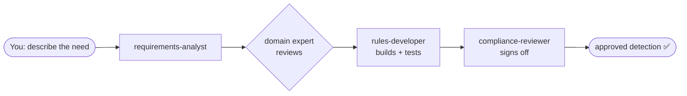

# Compliance Surveillance Engineering — Virtual Team

A **virtual compliance surveillance *engineering* team made of AI assistants** — it doesn't
*do* compliance, it **builds the surveillance solutions and technology** that detect money
laundering, market manipulation and trader misconduct. It runs in
[Claude Code](https://claude.com/claude-code) as a set of 10 focused "subagents": some are
subject-matter experts who only advise, others engineer and test the detection systems, and
the work flows between them like a real engineering team.

> 🟢 **New to AI agents and LLMs? Read [`docs/OVERVIEW.md`](docs/OVERVIEW.md) first** — a
> plain-English tour of what this is, who the team are, and how it keeps confidential data
> away from the AI. No prior knowledge needed.



**The safety rule in one line:** real data is never shown to the AI — it's either *masked*
(identities scrambled, behaviour kept) or fully *synthetic* (made up), and an automatic
guard blocks any agent from reading raw records. See
[How real data is handled](#handling-real-data-masking-pipeline).

## Layout

```
CLAUDE.md                     # shared team handbook (example defaults — customise as needed)
.claude/agents/               # 10 subagents
  requirements-analyst.md     # BA            (build)
  tm-sme.md                   # AML SME       (advisory, read-only)
  trade-surveillance-sme.md   # SME           (advisory, read-only)
  comms-surveillance-sme.md   # SME           (advisory, read-only)
  rules-developer.md          # developer     (build)
  data-analyst.md             # analyst       (build)
  ml-engineer.md              # AI/ML         (build)
  model-validator.md          # independent validation (advisory, read-only)
  cloud-architect.md          # cloud         (advisory + light build)
  compliance-reviewer.md      # review/QA     (advisory, read-only)
```

## Meet the agents

Ten specialists, each defined by a short job description in `.claude/agents/`. They split
into **🧠 advisors** (read-only — they review and recommend but cannot change code, which
keeps them independent) and **🔧 builders** (they engineer and test the detection systems).

### 🔧 Builders — they engineer the surveillance technology

- **`requirements-analyst`** — turns a regulatory or business need into a clear,
  implementable spec (user stories, acceptance criteria, true/false-positive cases) before
  any code is written.
- **`rules-developer`** — implements and refactors deterministic detection rules and
  scenario logic for transaction monitoring and trade surveillance, from a validated spec.
- **`data-analyst`** — tunes the detections: false-positive analysis, threshold calibration,
  coverage testing, and evidencing the volume/coverage trade-off to a regulator.
- **`ml-engineer`** — builds ML/AI-based detection where rules aren't enough (anomaly
  detection, NLP for comms, behavioural scoring, alert triage).
- **`cloud-architect`** — designs the pipelines and infrastructure the detection runs on
  (ingestion, streaming/batch, retention/immutability, data residency, resilience).

### 🧠 Advisors — they guide and sign off (read-only)

- **`tm-sme`** — transaction-monitoring / AML expert: detection scenarios, typologies,
  thresholds, segmentation, SAR/STR rationale.
- **`trade-surveillance-sme`** — market-abuse expert: spoofing, layering, wash trades,
  marking the close, insider dealing, front running.
- **`comms-surveillance-sme`** — communications-surveillance expert: lexicons, NLP risk
  policies, e-comms and voice monitoring mapped to conduct risk.
- **`model-validator`** — **independent** validation of any statistical/ML model
  (soundness, performance, bias, stability, explainability). Independent of `ml-engineer`
  by design, so it's free to challenge.
- **`compliance-reviewer`** — final QA after any change: auditability, the
  alert→logic→obligation trace, secrets/PII, and test coverage.

> Why read-only matters: an advisor that could quietly edit the thing it's reviewing isn't a
> real independent check. The restriction is enforced by the tools each agent is granted —
> advisors get `Read, Grep, Glob` only — not by convention.

## Install

1. Copy `CLAUDE.md` to your repo root (merge if you already have one).
2. Copy the `.claude/agents/` folder into your repo. Commit both so the whole team shares them.
3. Restart Claude Code (subagents load at session start), then run `/agents` to confirm they appear.
4. (Optional) `CLAUDE.md` §2/§3 ship with example defaults so the team works immediately.
   Replace the example jurisdictions and stack with your own when you have them.

## Using them

Automatic: just describe the task — Claude matches on each agent's `description`.

Explicit / chained:
```
Use requirements-analyst to turn this MAR spoofing requirement into a spec,
have trade-surveillance-sme review the detection logic, then rules-developer
implement it and compliance-reviewer check the audit trail.
```

Parallel (optional, experimental, token-heavy): enable agent teams by adding
`CLAUDE_CODE_EXPERIMENTAL_AGENT_TEAMS` to your settings.json, then ask Claude to
spawn a team with a lead.

## Worked example & repo layout

A complete reference scenario ships with the repo so the conventions are concrete:

```
rules/spoofing.py            # MAR spoofing detection (deterministic, explainable)
scripts/gen_synthetic.py     # synthetic order-flow generator (§5 — no real data)
tests/test_spoofing.py       # true-positive + false-positive cases (§4)
docs/scenarios/spoofing.md   # audit trail: alert → logic → obligation
docs/templates/              # scenario spec, scenario doc, model-validation report
.claude/commands/new-scenario.md   # /new-scenario — runs the spec→SME→build→review chain
.github/workflows/ci.yml     # runs tests + gitleaks + a no-raw-data check
.pre-commit-config.yaml      # local secret / raw-data guardrails
```

Quickstart:

```bash
pip install -r requirements-dev.txt
pytest                                   # 5 passing tests
python -m scripts.gen_synthetic --kind spoofing --out data/synthetic/spoofing.jsonl
pre-commit install                       # optional: enable local guardrails
```

Add a new detection with `/new-scenario <requirement>`, which chains
requirements-analyst → SME → rules-developer → compliance-reviewer per the handbook.

## Handling real data (masking pipeline)

Agents must never see raw records — anything an agent reads goes to the model provider as
prompt context. So real data only enters through a masking pipeline, and agents sit
downstream of it:

```
real ─▶ data/raw/ ──[ python -m scripts.ingest ]──▶ data/masked/ ─▶ agents / dev
        (agent-blocked)   schema-driven masking        (governed)
                                  │
                                  └─ fit a synthetic generator for anything that leaves the env
```

- **`scripts/ingest.py`** — schema-driven masking (`config/masking-schema.yaml`). Each field
  has a role: `token` (keyed HMAC, preserves linkage), `shift` (per-entity time shift,
  preserves deltas), `keep` (signal-bearing values), `generalise`, `redact` (free text).
  Key from `MASKING_KEY` in `~/.secrets` — no insecure default.
- **`scripts/validate_masking.py`** — gate that proves a config is safe *and* useful: no
  residual identifiers/PII, k-anonymity over quasi-identifiers, **and** the spoofing rule
  fires identically on masked vs. original data (fidelity).
- **`scripts/synthesise.py`** — the safest tier: learns the *shape* of masked data
  (size/timing distributions + the spoofing motif at its observed rate) and emits fully
  **synthetic** sessions that share no real entity, timestamp or row. This is what's safe
  to put in front of an agent or to share outside the environment.
- **`.claude/hooks/guard-raw-data.py`** — PreToolUse hook (wired in `.claude/settings.json`)
  that blocks any agent `Read`/`Bash` touching `data/raw/`.

```bash
export MASKING_KEY=...                                   # from ~/.secrets
python -m scripts.ingest --in data/raw/x.jsonl --out data/masked/x.jsonl
python -m scripts.validate_masking                       # exit 0 = safe + faithful
```

> Pseudonymised data is still personal data (GDPR). Masking enables local development;
> prefer fully synthetic data for anything that leaves the environment.

## Notes on the config

- Advisory agents are restricted to read-only tools (`Read, Grep, Glob`, sometimes `Bash`)
  so they physically cannot alter detection logic.
- Build agents have write access (`Read, Write, Edit, Bash, Grep, Glob`).
- SMEs and reviewers use `memory: project` to accumulate house typologies and tuning
  decisions across sessions (stored under `.claude/agent-memory/`).
- Models: deep-reasoning roles use `opus`, build/analysis roles use `sonnet`. Change the
  `model:` field freely.
