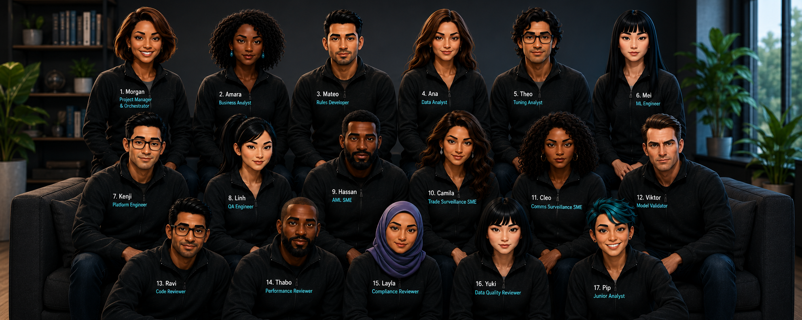
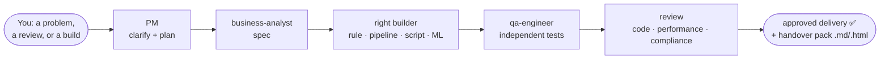
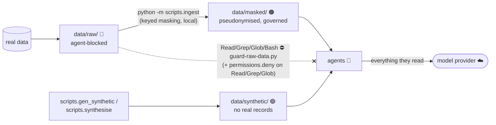

<a id="readme-top"></a>

# Virtual Surv-IT


<table>
<tr><td>

🏷️ **Current version: 0.33.2** (2026-07-30) - *[archive old engagements, faster startups](docs/releases/0.33.md)*<br/>
A workflow-robustness release: the quality checks now fail safe, a close has to pass the gate to count, and sessions resume from disk without re-asking you anything.<br/>
📖 [Release overview](docs/releases/0.33.md) · 📜 [Full changelog](CHANGELOG.md)

</td></tr>
</table>

**Virtual Surv-IT is a virtual engineering team for the software that catches financial crime and
market abuse.** A project manager (Morgan) and **16 specialist AI agents** run it inside
[Claude Code](https://claude.com/claude-code).

Banks and trading firms spot money laundering and market manipulation with software: detection
rules, data pipelines, threshold tuning, test evidence, and the audit paperwork a regulator can
still question years later. That software is slow to build, risky to change, and heavy on
documentation. Virtual Surv-IT is a proof of concept exploring how agentic AI and AI agents can
help with the engineering challenges of this domain: the work is split across a team of
specialists, each doing one job, with **every piece independently checked by a different agent**
before it counts as done.

The team builds the tooling; a person signs off every step.

![The Engagement Machine - one engagement end to end: a single front door (Morgan the PM plans the job and sets the headcount), specialists working in their own sealed workspaces, every hand-off a written artifact pinned to a shared board, a delivery pack that grows as it passes spec, build, independent QA and review, guards that keep real data and secrets out and let no code run without a human turning the key, a done-gate checklist that cannot be skipped, and a human signature before anything ships](docs/assets/engagement-machine.png)

> ⚗️ **Proof of concept, under active development.** An experiment, not production or regulatory
> tooling. It is pre-1.0 and changes often; behaviour and interfaces may break between updates, and
> it can get things wrong. **Review everything it produces; never rely on it as a control or as
> regulatory advice.**

**New to AI agents?** Start with [`docs/OVERVIEW.md`](docs/OVERVIEW.md), a plain-English tour.
**See it work:** the end-to-end [build demo](docs/demos/build-demo.md) on synthetic data
(artifacts in [`docs/demos/build-artifacts/`](docs/demos/build-artifacts/)) ·
[review](docs/demos/review-demo.md) · [data-safety](docs/demos/data-safety-demo.md) transcripts.

> ⏱️ **Try it in 60 seconds.** Type **`/demo`** - from the repo opened as a project, or
> `/compliance-surveillance-team:demo` from a plugin install - and Morgan runs a real engagement
> end-to-end on safe synthetic data, narrating every decision. The Review flavour is light on
> tokens; a full guided Build delivery is a real 9-agent run and costs roughly **$4-8 in API
> tokens** (the measured number in [Token usage](#-token-usage--optimisation)). No tokens to
> spare? The same runs are captured as pre-recorded transcripts in
> [`docs/demos/README.md`](docs/demos/README.md) - reading those is free.

---

**📑 Jump to** - [🤔 Why](#-why-virtual-surv-it) · [✨ Features](#-features) · [🚀 Quick start](#-quick-start) · [👥 Meet the team](#-meet-the-team) · [🤖 Using them](#-using-them) · [📓 Worked example](#-worked-example) · [🧭 Core principles](#-core-principles) · [🔍 Tooling](#-code-review-tooling) · [🧪 Self-test](#-self-test-eval-harness) · [🪝 Safety hooks](#-the-safety-hooks) · [🔒 Real-data handling](#-handling-real-data) · [📁 Layout](#-layout) · [🗂️ Scripts](#-scripts-reference) · [🔧 Config](#-notes-on-the-config) · [💰 Token usage](#-token-usage--optimisation) · [🗺️ Roadmap](#-roadmap) · [📖 Docs](#-documentation) · [⚠️ Known issues](#known-issues) · [🤝 Contributing](#-contributing) · [📚 Built on](#-built-on--acknowledgements) · [📄 License](#-license)

---

📖 **Acronym glossary** - the domain and spec shorthand used throughout: [`docs/glossary.md`](docs/glossary.md)

## 🤔 Why Virtual Surv-IT?

### If you've worked in surveillance IT, you know these moments

This project comes out of working in this domain, and out of a handful of moments most
surveillance technologists will recognise on sight:

- **The quiet discovery that something has been broken for years.** The feed that was never
  switched on. The venue migration that silently dropped a slice of order flow. The symbology
  mapping nobody re-tested after the upgrade. Surveillance fails *silently*: a working system
  and a broken one both look like "no alerts today", and that sits in your stomach precisely
  because nobody can say how long it has been true. The version that became public is
  [FCA Market Watch 79](https://www.fca.org.uk/publications/newsletters/market-watch-79) (May
  2024): a news feed never activated, so the insider-dealing scenario fired **zero alerts for
  over three years**. Every practitioner reading that felt the same thing: *that could have
  been us.* The countermeasure, independently assuring that every feed, instrument and threshold
  is actually working, is staffing-intensive, so it is exactly what gets squeezed.
- **The threshold nobody can explain.** Set years ago by a contractor who has since left, the
  rationale lost with their inbox. Everyone is afraid to touch it; the regulator's review is
  asking why it's 3.0 and not 2.5, and the answer on file is an email chain. In this domain the
  evidence *is* the product: the documented rationale, the tuning date, the trail from an alert
  back to the rule it serves, all expected to stand up **years later**. Producing that evidence
  (the specs, the traceability, the test packs, the reporting) is what quietly consumes your
  scarce experts.
- **The queue behind one "simple" change.** Tighten a spoofing threshold and you have touched
  regulatory interpretation, requirements, detection engineering, statistics, model risk, QA and
  audit evidence. The people who hold more than two of those disciplines are rare, everything
  waits on them, and the backlog grows while they spend their days drafting and formatting
  documents instead of deciding things.
- **The data you can't just paste anywhere.** Transactions, orders and communications carry
  personal data, and potentially inside information: the one dataset in the firm you cannot
  experiment with. Any AI approach has to be *structurally* incapable of leaking it, not just
  told to be careful.

### The hypothesis this project explores: AI can genuinely help here

Those four moments turn out to match what large language models are genuinely good at, and that
match is the **hypothesis Virtual Surv-IT was built to test**, not an assumption it starts from:

- Most of the work is **translation between formalisms**: regulation → requirement → spec →
  code → test → evidence. Each hop is language work with a checkable output, which is what an
  LLM does well, and each hop is where surveillance change is slowest today.
- The **evidenced 80% is exactly the automatable 80%**: specs, RTMs, tuning packs, QA
  evidence, handover docs and MI are structured documents derived from decisions, so an LLM can
  draft them consistently, in minutes, every time, while the *decisions* stay human.
- **Consistency is something the domain actively wants**: a regulator comparing two tuning
  packs from two quarters benefits from them being structurally identical. Humans drift;
  templates and agents don't.
- The **failure modes of AI are manageable with the domain's own tools**: hallucinated
  citations → retrieval from a verified register; unchecked output → independent review;
  over-claiming → evidence tagging; data exposure → hard architectural blocks. The domain has
  spent decades building controls for fallible humans, and those controls transfer.

The project's demos, worked example and [eval harness](#-self-test-eval-harness) are the
evidence gathered so far: an end-to-end build with measured calibration on synthetic data,
reviews that catch seeded defects without inflating clean code, and safety guards that hold
under test (and have caught their own authors). Where the hypothesis is *not* yet proven, the
repo says so; see the evidence basis in [`docs/house-rules.md`](docs/house-rules.md) and the
[known issues](#known-issues).

### Why a specialist *team* with independent review, not one assistant

"AI can help" is not the same as "one AI assistant can help". A single general-purpose
assistant does each of those disciplines shallowly, with nobody checking its work, and its
output is a chat transcript rather than an audit trail. Virtual Surv-IT splits the work across
specialists and builds in **independent review**:

- **Business analysis**: turning a regulatory obligation into a buildable, unambiguous spec.
- **Surveillance rule development**: deterministic, tested detection logic.
- **Data engineering**: pipelines, ETL (extract, transform, load), transformation and utility scripts.
- **Data analysis and threshold tuning**: false-positive analysis, ATL/BTL calibration, MI.
- **ML / AI detection**, with *independent* model validation.
- **QA**: independent test design and evidence (it does not mark its own homework).
- **Code, performance and compliance review**: quality, scalability and audit-readiness.
- **Data-quality and coverage assurance**: the missing feed that means abuse goes undetected.
- **Technical documentation**: handover a real developer can build, run and maintain from.

It also maps the domain's own control expectations onto the AI itself:

- **Segregation of duties.** Advisors and reviewers hold **no `Write`/`Edit` tools**, so they
  can't alter the detection logic they assess; build, QA and validation stay independent by
  running as separate agents with their own context. It is the maker-checker discipline
  regulators expect of humans, applied to agents.
- **An audit trail by construction.** Every deliverable arrives with the RTM
  (obligation → requirement → code → test), thresholds with rationale and tuning date, and
  **pinpoint citations retrieved from a source-verified register** (a mechanical gate flags
  anything recalled from memory as *unverified* rather than letting it pass as fact; the register
  is small today and grows entry by entry, with verified entries human-checked and unconfirmed
  ones flagged; ADR-001). Findings are tagged
  📊 measured vs 🧠 inferred, all behind an evidenced [Definition of Done](docs/DEFINITION-OF-DONE.md).
  The silent-failure modes get their own specialist (coverage and feed assurance) instead of
  being an afterthought.
- **Data safety as architecture, not policy.** Raw data under `data/raw/` is **blocked from the
  model's file-read tools** by a hook and OS permissions; the sanctioned path is keyed masking or
  fully synthetic data; execution of handed-over code is human-consent gated. The AI works
  *downstream* of the controls without being trusted *with* the data itself.
- **The economics work.** The evidenced 80% (specs, tuning packs, QA evidence, handover docs,
  MI) is produced in minutes for API-token cost, consistently formatted and traceable, while
  **humans keep the judgement**: every gate returns to a person, and nothing touches a live
  system without sign-off. Your scarce cross-disciplinary experts review and decide instead of
  drafting and formatting.

The result is an engineering workflow that produces more **consistent, auditable and
maintainable** output than one generalist assistant, because the work is specialised,
**independently reviewed**, and **right-sized** to each task (see below). *(All of it within
the proof-of-concept framing above: a demonstration of the architecture, for real engineers
and reviewers to build on, not accredited regulatory tooling.)*

**Already have ChatGPT or Copilot?** The chat-window-vs-this comparison moved to the FAQ:
[`docs/FAQ.md`](docs/FAQ.md).

<sub>[↑ Back to top](#readme-top)</sub>

> 📌 **Latest release - 0.33.1 (2026-07-29), platform capability adoption** on top of the
> 0.33.0 workflow-robustness release. What they mean for you:
> [`docs/releases/0.33.md`](docs/releases/0.33.md) · full detail: [`CHANGELOG.md`](CHANGELOG.md).

## ✨ Features

What the team gives you at 0.33.1, each row tied to where the claim is enforced or demonstrated:

| Capability | What you concretely get | Where to see it |
|---|---|---|
| A real engineering team, right-sized | Morgan (PM) + 16 specialist subagents; a typical task fires only 2-5 of them, and the PM states the intended count at the gate. | [`docs/agent-design.md`](docs/agent-design.md) · [Meet the team](#-meet-the-team) |
| Independent review by construction | Advisors and reviewers hold no `Write`/`Edit` tools; QA and validation run as separate agents from the build. More than rules: pipelines/ETL, scripts, ML, reviews and docs all route to their own specialist. | Tool grants in [`.claude/agents/`](.claude/agents/), pinned by [`tests/test_docs_consistency.py`](tests/test_docs_consistency.py) · routing table in [`docs/team-operating-guide.md`](docs/team-operating-guide.md) |
| Stateful, crash-safe engagement lifecycle | Per-engagement `artifacts/<slug>/` workspaces, a machine-readable state file (⏳ · ⛔ · 🔒 closing · ✅), a close that runs the mechanical gate and refuses on findings, and disk-first resume of state, intake answers and consent outcome. | [ADR-008](docs/adr/ADR-008-multi-engagement-workspaces.md) · [ADR-006](docs/adr/ADR-006-machine-readable-engagement-state.md) · [`docs/releases/0.33.md`](docs/releases/0.33.md) |
| Three always-on safety guards, human-only consent | Raw data under `data/raw/` blocked from the model, execution gated on a human-created marker, and the model blocked from writing the marker, settings or the hooks themselves. | [`docs/safety-model.md`](docs/safety-model.md) · the [data-safety demo](docs/demos/data-safety-demo.md) |
| Document conversion front door | Excel/CSV/PDF/DOCX read via the vendored converter - no pip needed - with a JSON evidence report every run; a PreToolUse hook redirects binary-document reads to it. | [`docs/house-rules.md`](docs/house-rules.md) · [`scripts/convert_file.py`](scripts/convert_file.py) · [`scripts/document_input_redirect.py`](scripts/document_input_redirect.py) |
| A real review subsystem | Context-routed lenses, the standard analysers per language, schema-validated findings packs rendered to one canonical layout, and a build fingerprint tying the reviewed code to the shipped artifact. | [`docs/code-review-method.md`](docs/code-review-method.md) · [`docs/review/`](docs/review/) · the [review demo](docs/demos/review-demo.md) |
| Independent QA + a mechanical DoD gate | A close only counts when `check_artifacts` passes - finding codes like `STALE-INDEX`, `FINAL-BEFORE-CLOSE`, `ROSTER-UNKNOWN` catch the failure modes that actually happened live. Iteration history stays visible append-only (journey strip, QA cycles). | [`docs/DEFINITION-OF-DONE.md`](docs/DEFINITION-OF-DONE.md) · [`scripts/check_artifacts.py`](scripts/check_artifacts.py) |
| Engagement memory | A per-project **codebase map**: bounded, PM-curated, SHA-anchored, hygiene-checked mechanically, advisory-only - repeat engagements start warm. | [ADR-003](docs/adr/ADR-003-engagement-memory.md) · [ADR-007](docs/adr/ADR-007-codebase-map-evolution.md) |
| Company extensions | Additive per-project standing instructions, close actions, an analyser registry and named integrations - never a safety waiver, and eval-tested. | [ADR-009](docs/adr/ADR-009-company-extensions.md) · [`docs/EXTENDING.md`](docs/EXTENDING.md) |
| Self-tested quality | 9 rubrics + 43 golden cases with a deterministic scorer in CI, and a mechanical dev→main release gate that fails a promotion with no eval baseline. | [`evals/README.md`](evals/README.md) · [`scripts/release_gate.py`](scripts/release_gate.py) · [Self-test](#-self-test-eval-harness) |
| Cost visibility | Measured per-run token numbers, and a local observability page: engagement inventory, DoD gate result, map hygiene, consent highlight, measured token cost (`python -m scripts.dashboard`). | [Token usage](#-token-usage--optimisation) · [`scripts/dashboard.py`](scripts/dashboard.py) |
| Console & UX discipline | Progress in the native task list (TodoWrite), every clarification via the question tool, a statusline showing dormant-vs-engaged, and a clean console with detail in artifacts. | [`docs/team-operating-guide.md`](docs/team-operating-guide.md) · [`scripts/statusline.sh`](scripts/statusline.sh) |
| Explicit AI identity | Every roster name in an artifact is marked 🤖 + "Virtual Surveillance IT"; an agent never shares a sign-off line with a human - mechanically checked. | [FAQ](docs/FAQ.md) · `AGENT-UNMARKED` / `AGENT-HUMAN-COMBINED` in [`scripts/check_artifacts.py`](scripts/check_artifacts.py) |
| Claude Code native, dormant by default | A plugin with per-project enablement; skills cost ~nothing until `/engage`; a guided installer walks the whole flow (`python install_helper.py`). | [Claude Code features](#-claude-code-features-this-team-is-built-on) · [Quick start](#-quick-start) |
| Documentation generation | Every deliverable in `.md` + `.html`, plus a close-only summary email signed by Morgan. | [`docs/WAYS-OF-WORKING.md`](docs/WAYS-OF-WORKING.md) · real output in [`docs/demos/build-artifacts/`](docs/demos/build-artifacts/) |

<sub>[↑ Back to top](#readme-top)</sub>

## 🚀 Quick start

### 🔌 Install: run the helper, then enable it **per project**

Install once with the helper, then **enable the team only in the projects that use it**, a
deliberate token-economy step, not an oversight (the "why" is right below).

**1. Get the repo and run the install helper** (from a terminal, not inside Claude Code):
```bash
git clone https://github.com/danieledge/virtual-surv-IT.git
cd virtual-surv-IT
python install_helper.py
```

The helper walks the whole flow: preflight (git / claude CLI / network), a persisted
release-channel pick (**`main`** is the **stable** line; bigger, in-progress changes land first
on **`dev`** and are promoted to `main` at a release), clone or safe update (it refuses to
reset a dirty tree), optional `pip install -r requirements-dev.txt`, then the real
`claude plugin marketplace add` / `claude plugin install compliance-surveillance-team@virtual-surv-it`
commands - and it closes by listing what stays manual (per-project enablement below, the
restart; hooks ship pre-wired). Re-runnable; `install`/`update` auto-detect
from `~/.config/virt-surv-it/installer.json`; `--yes` for non-interactive defaults.

**2. Scope the enablement to the projects that need it.** If the install enabled the plugin at
**user** scope (check `/plugin`, or `~/.claude/settings.json` → `enabledPlugins`), disable it
there, and instead enable it **in each project where you want the team**: from that project run
`/plugin` and enable it *for this project*, or add to that project's `.claude/settings.json`:
```json
{ "enabledPlugins": { "compliance-surveillance-team@virtual-surv-it": true } }
```

> **Why per-project instead of "enabled everywhere"?** Claude Code loads every enabled plugin's
> **agent descriptions into every session's context** so it can route work to them; there is no
> lazy-load mechanism for agents. A user-scope enable therefore taxes *every* project on the
> machine (~1.2k tokens per session, every session) for a team most of them never summon, the
> opposite of this repo's **dormant-by-default** principle. The team's *skills* are already free
> everywhere (they set `disable-model-invocation: true`, so their descriptions never load and the
> commands stay typeable); the agent roster is the irreducible cost, so it's scoped to the
> projects that actually use it. (The 2026-07-01 setup audit measured the old always-on posture
> at ~2.7k tokens per session per project, hence this step.)

**Fewer permission prompts (optional).** Without pre-approval, every analyser run and
helper-script call prompts you, and each "don't ask again" saves the *literal command string*
as a rule (on Windows that accumulates mixed-path, mixed-quote rules the validator then flags
as invalid). The helper can add the recommended clean wildcard allow-list to a chosen project
for you: `python install_helper.py --permissions <project-dir>` - opt-in, add-only, and it
backs up the settings file first. (`/permissions` shows every rule and which file it came
from. Permission rules are Claude Code's prompting layer; the team's execution *gate* is
separate and stays human-consent-only.)

**3. Restart Claude Code. From an enabled project, summon the team** (commands are namespaced):
```
/compliance-surveillance-team:engage
```
…and likewise `…:deep-review`, `…:audit-review`, `…:handover`, etc.

**Verify:** in the project, run `/plugin`; **compliance-surveillance-team** should show as
enabled for that project. *(One session only, any directory?
`claude --plugin-dir /path/to/virtual-surv-IT` loads it temporarily, not saved.)*

You get the 16 agents, the workflow commands and all three safety hooks in every **enabled**
project. Then just **talk to the PM**. Describe whatever you've got:

```
/compliance-surveillance-team:engage I need to detect wash trades in our equities flow
/compliance-surveillance-team:engage here's a PowerShell script - would it survive an audit?
/compliance-surveillance-team:engage build this from the attached FSD
```

> **You only invoke `engage` once**, to kick off a piece of work. After that, just reply in plain
> English ("yes, go ahead", "add a false-positive test", "now do the handover"); Morgan stays in
> role for the whole session. Invoke it again only to start a new, separate piece of work, or use a
> focused command (`…:audit-review`, `…:handover`, …) to jump straight to a specific workflow.

> **Everything works from any project: the team detects its own run mode.** At engage, Morgan
> checks whether it's running repo-as-project or as an installed plugin, states the mode in the
> opening banner, and resolves the helper scripts accordingly (the plugin's bundled copies run
> by path from a foreign project, the `.md`→`.html` render included). You don't need to
> remember any of this. Two things still want the repo opened as the project: the **masking
> pipeline** needs your project to hold its own `config/masking-schema.yaml` + `MASKING_KEY`
> (Morgan offers to set that up), and `/demo`'s Build flavour + `/run-evals` use the repo's own
> test suite and golden cases.

> **Data-safety guard is portable, with one caveat.** It's a hook, so it receives
> `CLAUDE_PROJECT_DIR` and protects **your project's** `data/raw/` (not the plugin's) wherever the
> plugin is installed. But a plugin can carry hooks, **not** a `permissions.deny` list, so a plugin
> install ships the hook alone, and installers should recreate the OS-level backstop by copying the
> `Read`/`Grep`/`Glob` `data/raw/**` deny entries from this repo's `.claude/settings.json` into
> their own project's (see [`docs/house-rules.md`](docs/house-rules.md)). The hook launcher probes
> `python3` → `python` → `py`; on a host with no Python at all the guards are inert, which is
> exactly why that deny backstop matters.

> Don't have Claude Code yet? Install it from <https://claude.com/claude-code>.

<details>
<summary>⌨️ <b>Manual commands</b> (if you cannot run the helper)</summary>

The helper only wraps these; type them **in Claude Code yourself** - `/plugin …` is an
interactive command, and if you *ask the assistant* to "install the plugin" it may claim
success without anything happening. (First remove any earlier hand-copy like
`~/.claude/skills/…`; it conflicts.)

```
/plugin marketplace add danieledge/virtual-surv-IT      # or a local clone path (for dev: git checkout dev first)
/plugin install compliance-surveillance-team@virtual-surv-it
```

</details>

<details>
<summary>📂 <b>Developer / maintainer mode: open the repo as the project</b> - a run mode, not an install path; needed for <code>/demo</code>'s Build flavour, <code>/run-evals</code> and the worked example</summary>

Project-scoped skills and agents **auto-load**, nothing to install, and the bundled scripts
(`/demo`, the worked example, the masking pipeline, the `.md→.html` render) all work out of the box:

```bash
git clone https://github.com/danieledge/virtual-surv-IT.git
cd virtual-surv-IT     # launch Claude FROM the repo root (discovery doesn't walk up dirs)
claude
```

Then run `/help`; you should see `/engage`, `/deep-review`, `/audit-review`, … New here? Type
**`/demo`** to watch Morgan run a full engagement end-to-end on safe synthetic data, or
**`/meet-the-team`** for introductions; then `/engage` to start. (Also
`pip install -r requirements-dev.txt` for the worked example, tests and the `.md→.html` render.)
Here the commands are **not** namespaced, just `/engage`, `/demo`, etc.

> ⚠️ **Don't copy the repo into `~/.claude/skills/`.** The repo's skills live at
> `.claude/skills/<name>/SKILL.md`, so copying the whole folder mis-nests them and they won't
> load. Use the plugin install (above) or this repo-as-project mode.

This mode is for working **on** the team (or running its repo-bound demos), not the everyday
install path for users - that's the helper above.

</details>

<sub>[↑ Back to top](#readme-top)</sub>

## 👥 Meet the team



*The team, all seventeen, each labelled with name and role.*

**Morgan** (PM & orchestrator) leads **16 agents**: fifteen specialists and a tireless junior
(Pip), the seventeen in the photo above. Each has a day job, a name, strong opinions, and a Slack
status that tells you more than their job title does. (Type `/meet-the-team` and Morgan does the
introductions live.) **🧠 Advisors** hold no file-editing tools, your *independent* check, so they
can critique all day but can't change the code (segregation of duties, basically). **🔧 Builders**
write the stuff. Morgan engages only the ones a task needs, **not all of them every time**.


```mermaid
flowchart LR
    You([You: a problem,<br/>a review, or a build]) --> PM[PM<br/>clarify + plan]
    PM --> RA[business-analyst<br/>spec]
    RA --> Build[right builder<br/>rule · pipeline · script · ML]
    Build --> QA[qa-engineer<br/>independent tests]
    QA --> Rev[review<br/>code · performance · compliance]
    Rev --> Done([approved delivery ✅<br/>+ handover pack .md/.html])
```

*The shape of a full delivery: a typical task fires only **2-5** of the 16; complexity is opt-in
("use the simplest thing that works").*

> Routing by deliverable, not habit: a detection rule → `rules-developer`; an ETL pipeline or
> a PowerShell transform → `platform-engineer`; a reconciliation/reporting job → `data-analyst`;
> **threshold tuning → `tuning-analyst`**; **requirements/elicitation/reg-change → `business-analyst`**;
> an ML model → `ml-engineer`. The PM picks; see CLAUDE.md §6.

<details>
<summary>👥 <b>The full roster</b>: day jobs, strong opinions and Slack statuses (or run <code>/meet-the-team</code>)</summary>

**🎩 Morgan**: *Project Manager & orchestrator.* Translates regulator-speak into plain English,
leads with "yes, here's how", and physically cannot let a piece of work end at "analysis". Will
get it past the reviewers **and** the change board. · *Slack:* "happy to take that as an action."

### 🔧 Builders: they engineer the surveillance technology

- **Amara**: *Business Analyst.* Asks "but what does the regulation *actually require*?" until the
  spec can't be misread. BABOK to her bones; allergic to ambiguity and to thresholds that turned up
  without a rationale. · *Slack:* "requirement unclear → workshop booked (recurring)."
- **Mateo**: *Detection Rules Developer.* Turns "catch the spoofers" into deterministic, tested
  logic, second line of defence, in code form. A rule without a false-positive test is, to him,
  just a rumour. · *Slack:* "no test, no merge. it's in the SDLC."
- **Ana**: *Data Analyst.* Lives in the data and the false positives; trusts nothing until she's
  seen the distribution. Will name your FP driver before you've finished writing the ticket. ·
  *Slack:* "the data says otherwise."
- **Theo**: *Tuning Analyst.* Can defend a threshold to a regulator with a straight face: ATL/BTL,
  segmentation, the lot. Treats "let's just round it to 10k" as a personal insult. · *Slack:*
  "show me the below-the-line sample."
- **Mei**: *ML Engineer.* Reaches for ML only when plain rules genuinely aren't enough, and says
  so out loud, because she knows Viktor's coming. Won't ship a model she can't explain to a
  regulator. · *Slack:* "…do we actually need a model for this?"
- **Kenji**: *Platform / Data Engineer.* Builds the plumbing nobody thanks him for until a feed
  drops at quarter-end. Pipelines, ETL, retention, lineage, and a deep, personal grudge against
  silent failures. · *Slack:* "have you tried the runbook?"
- **Linh**: *QA Engineer.* Refuses to mark her own homework, independent by design. Finds the
  edge case you were hoping nobody would raise in UAT. Residual risk: stated, not buried. ·
  *Slack:* "reopening: it's a finding, not a nit."

### 🧠 Advisors: they guide and sign off (read-only)

- **Hassan**: *Transaction-Monitoring / AML SME.* The money-laundering brain. Structuring,
  smurfing, layering, usually spotted before lunch. Will gently warn you when a "clever" scenario
  would file a thousand defensive SARs and catch nothing. · *Slack:* "that's structuring. and
  that. and that."
- **Camila**: *Trade-Surveillance SME.* Thinks like a spoofer so you don't have to. Spoofing,
  layering, marking the close, insider dealing. Reads an order book like a crime novel. ·
  *Slack:* "…and there's the cancel. classic."
- **Cleo**: *Comms-Surveillance SME.* Reads trader chat for a living: lexicons, NLP risk flags,
  e-comms and voice. Fluent in euphemism; deeply unimpressed by "let's take this to my personal
  phone". · *Slack:* "'per my last message' is doing a lot of work here."
- **Viktor**: *Model Validator.* Independent of Mei *by design*, and entirely comfortable telling
  her the model's wrong. Lives in **SR 11-7**; the friendly adversary every model needs. ·
  *Slack:* "prove it. then prove it again. then document it."
- **Ravi**: *Code Reviewer.* Reads seven languages (**Python, TypeScript/JS, Scala, Java,
  PowerShell, Bash, SQL**) and the security flaws in all of them. Drives the real analysers
  (ruff/bandit/SpotBugs/ShellCheck/Semgrep…), adds judgement on top, and, sorry, there's a
  hard-coded secret on line 42. · *Slack:* "nit: naming (×40). also: CRITICAL, line 42."
- **Thabo**: *Performance Reviewer.* Asks one question (*"will it survive month-end?"*) and
  answers with evidence, not vibes. **Static by default** (won't run your code uninvited, §7). ·
  *Slack:* "fine in dev. now do it at 10× and T+1."
- **Layla**: *Compliance Reviewer.* The last gate before anything ships: auditability, the
  alert→logic→obligation trail, secrets/PII, the Definition of Done. "Probably fine" does not pass
  review. · *Slack:* "if it isn't documented, it didn't happen."
- **Yuki**: *Data-Quality Reviewer.* Quietly obsessed with the one missing feed that means abuse
  goes undetected: completeness, timeliness, **total coverage**. Knows a silent feed gap *is* the
  control failure. · *Slack:* "no feed, no alert, no idea."

### ⚙️ …and behind the scenes

- **Pip**: *Review Coordinator.* Haiku-tier and proud of it. Preps every review: detects the
  context, picks the lenses, scores findings and keeps the Found/Reported/Filtered tallies, so the
  senior reviewers never burn opus on arithmetic. Will absolutely raise a ticket for it. ·
  *Slack:* "review prepped & triaged ▓▓▓░░ (JIRA raised)"

> Why read-only matters: an advisor that could quietly edit the thing it's reviewing isn't a
> real independent check. The restriction is enforced by the tools each agent is granted: no
> advisor holds `Write`/`Edit` (the SMEs hold only `Read, Grep, Glob`; the reviewers add `Bash`
> for static analysers and `git diff`, gated by the execution hook), not by convention.

</details>

<sub>[↑ Back to top](#readme-top)</sub>

## 🤖 Using them

It's one **dynamic, agile delivery team** with a single front door: the **PM, "Morgan"**,
warm, plain-speaking, can-do but realistic. Throw it a problem, code to review, or
requirements to build, and it clarifies, lets you pick the deliverables, then orchestrates
the specialists.

```
/engage <a problem, code to review, or a set of requirements>
```

> 🛑 **Dormant by default**: a normal `claude` session is standard Claude Code until you type
> `/engage` (or another team command).
> 🛡️ **Data safety always on**: raw data under `data/raw/` is **hard-blocked** from the model;
> anything else carries **your attestation** it's masked or synthetic ([details](#-handling-real-data)).

The PM **asks clarifying questions** (and waits for your answers, it won't guess scope,
jurisdiction, data or success criteria), offers a **menu of documentary artifacts** to choose from
(BRD, FSD, ADRs, RTM, review report, audit pack…), summarises everything in an Engagement Brief,
**states how many agents it intends to use and why**, then oversees delivery and **hands back each
deliverable in both `.md` and `.html`** in the engagement's own `artifacts/<slug>/` workspace
(one folder per engagement, with a generated `START-HERE.md` index and a machine-readable state
file). Focused commands for each entry point:

> The canonical index of **all 23 skills** lives in
> [`docs/team-operating-guide.md`](docs/team-operating-guide.md) §Command index; the table below
> is a summary.

| Command | Use it for | Pattern |
|---|---|---|
| `/engage` | anything, the front door | PM intake + dynamic routing |
| `/engage-light` | small, non-regulated jobs: same safety gates, a fraction of the ceremony (refuses detection logic, upgrades to standard) | light profile of `/engage` |
| `/demo` | watch a full engagement end-to-end on synthetic data | guided, narrated demo |
| `/meet-the-team` | Morgan introduces the roster | canonical introductions |
| `/prepare-data` | get safe data ready (synthetic or masked) before analysis | guided onboarding + validation (⚠️ the masking pipeline is a placeholder, see [FAQ](docs/FAQ.md)) |
| `/write-brd` | idea → Business Requirements (BABOK + EARS) | prompt chaining |
| `/brd-to-fsd` | BRD → Functional Spec (ISO 29148 + Gherkin) | prompt chaining |
| `/deep-review` | detailed code review (bugs, security, architecture, impact) | dimension fan-out + scoring |
| `/performance-review` | performance & scalability vs target data volumes | static analysis (profiling only under the §7 exec gate) |
| `/audit-review` | existing code → robust & audit-ready? | evaluator-optimizer loop |
| `/security-audit` | deep security audit (OWASP ASVS / CWE + threat model) | evaluator-optimizer loop, security-focused |
| `/remediate` | legacy / poorly-built code → assess, fix, hand over | assess → prioritise → fix loop |
| `/build-solution` | full requirements → end-to-end build | orchestrator-workers |
| `/handover` | developer + QA test-evidence handover pack | independent QA + dev docs |
| `/new-scenario` | a single detection scenario | spec → SME → build → review |
| `/elicit-requirements` | scope/stakeholders unclear → structured elicitation | question-led discovery |
| `/analyse-data` | exploratory / FP analysis / reporting-MI on safe data | evidence-tagged analysis |
| `/tune-thresholds` | calibrate one scenario's thresholds (ATL/BTL, segmentation) | dry-run + decision register |
| `/assess-coverage` | are we monitoring everything? typology→scenario→feed map | coverage + feed-health gaps |
| `/validate-tm-model` | periodic TM model validation (coverage/threshold/data/MI) | data work + independent verdict |
| `/reg-change-impact` | a regulatory change → impacted scenarios/controls | change-impact assessment |
| `/beta-assess-quantexa` | (beta, vendor-specific) a Quantexa TM estate vs BRD/TSD traceability assessment | platform KB + traceability |
| `/run-evals` | score the live team against the golden cases | regression net (spends tokens) |

**Example requests** (the PM routes each to the right specialists, and only those):

```
Design a spoofing detection algorithm
Review this surveillance rule and tell me if it'd survive an audit
Explain / optimise this SQL query
Create unit tests for this detector
Document this workflow for handover
Build this from the attached FSD
```

Every deliverable is produced in **`.md` and `.html`** (via `scripts/render_html.py`) for
easy distribution, and every engagement closes with a short **summary email** (`.txt`) signed by
Morgan. See **[`docs/WAYS-OF-WORKING.md`](docs/WAYS-OF-WORKING.md)** for the frameworks, the artifact
menu and the traceability spine.

You can also just describe a task in plain English (Claude matches on each agent's
`description`), or enable experimental agent teams via `CLAUDE_CODE_EXPERIMENTAL_AGENT_TEAMS`
for genuinely parallel workstreams.

<sub>[↑ Back to top](#readme-top)</sub>

## 🧩 Extending the team for your organisation

Your own analysis tooling, vendor knowledge bases, Jira steps, publishing targets and
company-unique instructions - four working recipes plus the first-class extensions contract
(ADR-009), all in **[docs/EXTENDING.md](docs/EXTENDING.md)**.

<sub>[↑ Back to top](#readme-top)</sub>

## 📓 Worked example

A complete reference scenario ships with the repo so the conventions are concrete, the
**bundled example** (the worked example, not the agents themselves):

```
rules/spoofing.py            # MAR spoofing detection (deterministic, explainable)
scripts/gen_synthetic.py     # synthetic order-flow generator (§5 - no real data)
tests/test_spoofing.py       # true-positive + false-positive cases (§4)
docs/scenarios/spoofing.md   # audit trail: alert → logic → obligation
```

(The full repo structure is in [Layout](#-layout). New to the spoofing example?
[`docs/OVERVIEW.md` §6](docs/OVERVIEW.md) explains it in plain English.)

Quickstart:

```bash
pip install -r requirements-dev.txt
pytest                                   # all tests green
python -m scripts.gen_synthetic --kind spoofing --out data/synthetic/spoofing.jsonl
pre-commit install                       # optional: enable local guardrails
```

Add a new detection with `/new-scenario <requirement>`, which chains
business-analyst → SME → rules-developer → code-reviewer → compliance-reviewer per the
handbook.

<sub>[↑ Back to top](#readme-top)</sub>

## 🧭 Core principles

A principle without an enforcement mechanism is a hope. This domain has controls for hopes, so
every principle below names **what enforces it**, and where the enforcement is soft (a prompt,
a convention), that's stated rather than dressed up.

| Principle | What it means | What enforces it |
|---|---|---|
| **Engineering first** | Assists the engineering *behind* surveillance, not compliance, legal or regulatory advice. | Scope statement + proof-of-concept framing; obligations are cited from a verified register, never interpreted as advice. |
| **Dormant until invoked** | A normal session is standard Claude Code; the team wakes only on `/engage`, and costs ~nothing until then. | `disable-model-invocation` on all 23 skills; a lean always-on `CLAUDE.md`; per-project plugin enablement. |
| **Right-sized, not all-hands** | Only the agents a task needs (typically 2-5, never all 16), the simplest thing that works. | The PM states the intended agent count at the gate (you can veto it); a golden eval case samples the behaviour. Prompt-enforced. |
| **Independent review** | Reviewers, SMEs and the model validator recommend; builders fix. Advisors hold no edit tools; QA and validation run as separate agents from the build. | Advisory agents carry **no `Write`/`Edit` tools**; build/QA/validation separation is by routing distinct agents with isolated context (see `docs/agent-design.md`). |
| **Humans hold the keys** | Execution consent and config are human-only; nothing touches a live system without sign-off. | The consent-write gate blocks the model from **writing or editing** the consent marker, `settings*.json` and the hook files; the `CST_ALLOW_*` overrides live in the launch environment the model can't reach. Bash-channel writes are lexically guarded, not sandboxed (a documented PoC limit, ADR-002). |
| **Safe data by architecture** | Raw data under `data/raw/` is kept from the model's file-read tools; work happens downstream, on masked or synthetic data. | Raw-data hook (read tools + Bash) + OS `permissions.deny` (Read/Grep/Glob) + `.gitignore` + a CI job that fails on tracked data files + keyed masking as the sanctioned ingest path. Solid on the file-read tools; the Bash channel is lexically guarded, not a sandbox (ADR-002). |
| **Fail closed on crash** | A guard that errors exits 2 and blocks. | Crash-wrappers exit 2 (block); the launcher version-probes interpreters. Two limits are deliberate and documented: a malformed payload or a Python-less host leaves the guard inert (ADR-002). |
| **Evidence, not claims** | Findings carry 📊 measured / 🧠 inferred; pinpoint citations are retrieved, not recalled; every delivery traces requirement → code → test → obligation. | The RTM + `check_citations` (flags unregistered citations) + `check_artifacts` (the mechanical DoD gate) + the Definition of Done. |
| **Remembers, safely** | Each working project gets one codebase map: bounded, SHA-anchored, 📊/🧠-tagged, PM-written only, **advisory context never enforcement**, and no PII/MNPI/secrets, ever. | ADR-003/ADR-007 + `check_artifacts` map hygiene - mechanical: size (excl. Deprecated), header fields, per-entry As-of/Anchor validation, anchor resolution + a staleness budget against HEAD, basis tags, secret patterns. The read-at-open / update-at-close discipline itself is prompt-enforced and eval-sampled, not mechanical. The guard hooks stay the only enforcement layer. |
| **Show the journey** | Iteration history is evidence: failed review/QA passes stay visible append-only (journey strip, test cycles, clarification rounds), never smoothed into a clean narrative. | Two DoD gates ("a multi-pass engagement whose docs read first-pass-clean fails") + the templates' append-only structures. Prompt-enforced, eval-sampled. |
| **Self-tested** | The team's own quality is regression-tested like code. | 700+ unit tests in CI (incl. the guards driven via their real protocol) + the eval harness: 9 rubrics, 43 golden cases, contract-checked in CI, live-scored by `/run-evals`. |
| **Modular** | Each specialist evolves, retiers or gets replaced independently. | Per-agent frontmatter (`model:`, `tools:`) + manifest validation in CI + the tier table kept in sync by convention. |

<sub>[↑ Back to top](#readme-top)</sub>

## 🔍 Code-review tooling

The `code-reviewer` agent drives standard analysers; it doesn't reinvent rules. None are required
to *use* the team; they sharpen reviews. **Without them, reviews still run, but degrade to
inference-only (🧠) instead of tool-backed measured (📊) findings** (the 🔬 tooling-coverage line
says what couldn't run).

<details>
<summary>🔍 <b>Analyser install per language</b> (optional; sharpens <code>code-reviewer</code>)</summary>

The Python ones are in `requirements-review.txt` (kept separate so the core test install stays
lean). The rest install via the OS / build tooling:

| Language | Install |
|---|---|
| Python | `pip install -r requirements-review.txt` (ruff, black, mypy, bandit, pip-audit, semgrep) |
| Bash | `apt install shellcheck` · `go install mvdan.cc/sh/v3/cmd/shfmt@latest` |
| PowerShell | `pwsh -c 'Install-Module PSScriptAnalyzer -Scope CurrentUser'` |
| Java | `checkstyle`, `pmd`, `spotbugs` via your build tool (Maven/Gradle) or `brew`/`apt` |
| Scala | `scalafmt`, `scapegoat`/`wartremover` via sbt plugins |
| Any | Semgrep (`pip`) for multi-language; gitleaks for secrets |

> **PowerShell note:** the execution gate treats any `pwsh` invocation as code execution, so
> `Invoke-ScriptAnalyzer` only runs once a human has opened the CLAUDE.md §7 consent gate; the
> settings allow-list entry for it was removed for exactly this reason. Before consent, PowerShell
> review stays static (🧠).

The agent runs whatever is present and reports which analysers were unavailable; nothing is
silently skipped.

</details>

<sub>[↑ Back to top](#readme-top)</sub>

## 🧪 Self-test (eval harness)

The repo's **700+ passing unit tests** (785 collected as of 0.33.1) check
the *code*, and run in CI. The **eval harness** ([`evals/`](evals/)) checks the **quality of what the
team produces**: its contract and scorer run in CI, but scoring the *live team* (catching a prompt
change that silently weakens a review) is run manually via `/run-evals`, not on every commit, because
it spends tokens. (This is the regression net Anthropic's multi-agent guidance recommends.)

<details>
<summary>🧪 <b>What's in the harness</b>: 9 rubrics · 43 golden cases · deterministic scorer</summary>

- **9 rubrics** (code-review · coverage · spec/traceability · tuning · data-safety · process-discipline ·
  process-discipline-light · prompt-injection · regulatory-citation) + **43 golden cases** with deliberately seeded issues
  *and* false-positive traps (all synthetic), including prompt-injection and fabricated-citation traps.
- **Deterministic scorer** ([`scripts/eval_score.py`](scripts/eval_score.py)): matches the team's
  findings against each case's ground truth: recall, must-find criticals, FP-traps. **Unit-tested
  (9 tests), runs free in CI** (no tokens).
- **`/run-evals`** runs the live team per case, scores it, adds an **LLM-judge** for the qualitative
  dimensions, and prints a scoreboard, flagging any regression. *(Spends tokens; run at milestones.)*
</details>

<sub>[↑ Back to top](#readme-top)</sub>

## 🪝 The safety hooks

A *hook* is a small script Claude Code runs automatically **right before** it uses a tool, and it
can **allow** or **block** that action. This plugin ships three safety guards, **always on**, plus four engagement-scoped lifecycle hooks (see the Claude Code features table; they no-op in dormant sessions and fail open). The guards run even when the
team is dormant). The newcomer-friendly version of the whole safety story is in
[`docs/OVERVIEW.md` §5](docs/OVERVIEW.md); the per-channel confidence statement (exactly what
each control does and does not guarantee) is [`docs/safety-model.md`](docs/safety-model.md);
the operational detail is below.

In one line: `guard-raw-data.py` blocks Read/Grep/Glob/Bash on `data/raw/`; `guard-code-execution.py` gates test runners, scripts and profilers behind the `.claude/.exec-consent` marker / `CST_ALLOW_EXEC`; `guard-consent-writes.py` blocks model writes of the consent marker, `settings.json` and the hook files.

<details>
<summary>🪝 <b>The raw-data guard, the code-execution gate + the consent-write gate</b>: what they do and how strong they are</summary>

**1. The raw-data guard** (`guard-raw-data.py`): *agents must never read real, unmasked data.*
Anything an agent reads is sent to the AI model, so real records (PII/MNPI) can't go that way. The
hook blocks any read/search/command whose path lands inside `data/raw/`. Point the team at masked or
synthetic data instead.

**2. The code-execution gate** (`guard-code-execution.py`): *reviewing code means reading it, not
running it.* Running untrusted code is a real risk, so commands that **execute** code (test runners,
scripts, profilers) are blocked **unless you've given consent**: a `.claude/.exec-consent` marker
or `CST_ALLOW_EXEC=1`. The team's own `scripts/` helpers are always allowed.

**3. The consent-write gate** (`guard-consent-writes.py`): *only a human can open the execution
gate.* Answering "yes" at intake expresses intent, but it does not unlock anything: the model is
blocked from writing the consent marker, the settings files, and the guard hooks themselves, so a
confused (or prompt-injected) model cannot authorise itself to run code or quietly rewrite its own
guardrails. **You** create the marker; the team gives you the exact command **with the absolute
project path** (e.g. `! touch /path/to/your-project/.claude/.exec-consent`, the `!` shell is
Git Bash on Windows too, so this works everywhere; from your **own** Windows terminal use
PowerShell `ni "C:\path\to\project\.claude\.exec-consent" -Force` or cmd
`type nul > "C:\path\to\project\.claude\.exec-consent"` instead, or the same `touch`
in any terminal); deleting it (closing the gate) and reading it stay allowed, and hook
maintenance needs the human-set `CST_ALLOW_CONFIG_EDIT=1`.

All are wired in **two** places so they fire in either mode: `hooks/hooks.json` (installed as a
plugin) and `.claude/settings.json` (this repo opened as a project), and a test keeps the two copies
identical.

**How strong are they?** For the file tools (`Read`/`Grep`/`Glob`) the guard hook fires in both
modes, and **when this repo is opened as a project** it is additionally backed by the OS-level
`permissions.deny` list in `.claude/settings.json`, so it genuinely holds. **A plugin install into a
foreign project ships the hook but not that deny list** (a plugin can carry hooks, not permissions),
so the hook is then the sole file-tool control; installers who want the belt-and-braces backstop
should copy the `Read`/`Grep`/`Glob` deny entries into their own project's `.claude/settings.json`
(see [`docs/house-rules.md`](docs/house-rules.md)). For **shell commands** the guards work by
*reading the text of the command*, a strong default and a consent record, but **not a sandbox**: a
determined user can dodge string-matching (e.g. hide a path in a variable). The real boundary for
shell is OS file permissions / keeping raw data off the box. The full bypass analysis and the
hardening backlog are in [`docs/adr/ADR-002`](docs/adr/ADR-002-safety-hook-threat-model.md).

</details>

<sub>[↑ Back to top](#readme-top)</sub>

## 🔒 Handling real data

**Raw data under `data/raw/` is hard-blocked**: the guard stops any agent reading it, and
anything an agent reads goes to the model provider as context. The whole safety story in one
picture:


```mermaid
flowchart LR
    Real[(real data)] --> Raw["data/raw/ 🔴<br/>agent-blocked"]
    Raw -- "python -m scripts.ingest<br/>(keyed masking, local)" --> Masked["data/masked/ 🟠<br/>pseudonymised, governed"]
    Gen["scripts.gen_synthetic /<br/>scripts.synthesise"] --> Synth["data/synthetic/ 🟢<br/>no real records"]
    Masked --> Agents[agents 🤖]
    Synth --> Agents
    Agents -- "everything they read" --> Provider([model provider ☁️])
    Raw -. "Read/Grep/Glob/Bash ⛔ guard-raw-data.py<br/>(+ permissions.deny on Read/Grep/Glob)" .-x Agents
```

Two safe ways to get data to the team:

1. **Mask it** through the pipeline (recommended for real data) → point agents at `data/masked/`;
   or **synthesise** it (safest, shareable).
2. **Provide already-safe data** (synthetic / masked / anonymised). A **startup disclaimer** has
   you confirm it carries no prohibited PII/MNPI; that's your responsibility, not the team's.

Either way, **committed examples, tests, artifacts and logs stay synthetic/masked only** (§5);
the attestation covers the analysis *inputs* you point at, not what gets written into the repo.
An **automatic masking workflow** (so you don't have to self-attest) is on the [roadmap](#-roadmap).

> Pseudonymised data is still personal data (GDPR). Masking enables local development; prefer fully
> synthetic data for anything that leaves the environment. (Plain-English version:
> [`docs/OVERVIEW.md` §5](docs/OVERVIEW.md).)

> ⚠️ **The masking pipeline is an early proof of concept**, a demonstration of the *workflow*,
> **not** a production-grade anonymiser, and not to be relied on as the sole control. It is
> **expected to be replaced** by a stronger data-preparation pipeline (local schema profiling,
> NER-based free-text redaction, validated synthetic data, and an auto-validation gate that blocks
> on residual PII), not incrementally evolved. Until then, keep real data in `data/raw/`
> (agent-blocked), prefer synthetic, and only ever feed it data your own controls have already
> masked or anonymised.

In one line: `python -m scripts.ingest` masks `data/raw/` → `data/masked/` (keyed HMAC tokens, time shift, regex redact via `config/masking-schema.yaml` + `MASKING_KEY`); `scripts.validate_masking` checks it; `scripts.synthesise` emits fully synthetic sessions. Per-channel guarantees: [`docs/safety-model.md`](docs/safety-model.md).

<details>
<summary>🔒 <b>The masking pipeline</b>: ingest · validate · synthesise (scripts + commands)</summary>

```
real ─▶ data/raw/ ──[ python -m scripts.ingest ]──▶ data/masked/ ─▶ agents / dev
        (agent-blocked)   schema-driven masking        (governed)
                                  │
                                  └─ fit a synthetic generator for anything that leaves the env
```

- **`scripts/ingest.py`**: schema-driven masking (`config/masking-schema.yaml`). Each field
  has a role: `token` (keyed HMAC, preserves linkage), `shift` (per-entity time shift,
  preserves deltas), `keep` (signal-bearing values), `generalise`, `redact` (free text).
  Key from `MASKING_KEY` in `~/.secrets`, no insecure default. ⚠️ **`redact` is regex-only**
  (email/IBAN/card/SSN/phone), fine for structured fields, **not safe for real comms/chat**
  (misses names + obfuscated IDs); swap in NER before masking real communications (roadmap).
- **`scripts/validate_masking.py`**: two modes. **Default** = a *config self-test* on a synthetic
  fixture: it proves the schema + masking logic are sound (no residual identifiers/PII in the
  fixture, the spoofing rule fires identically masked-vs-original, k-anonymity over any *declared*
  quasi-identifiers). It does **not** inspect your data. **`--in data/masked/x.jsonl`** = scans
  **your actual masked file** for residual free-text PII (string fields) + k-anonymity. *(It can't
  verify "no original identifier survived" or fidelity without the originals; by design they never
  reach it.)* Note: k-anonymity is **off until you declare `quasi_identifiers`** in the schema.
- **`scripts/synthesise.py`**: the safest tier: learns the *shape* of masked data
  (size/timing distributions + the spoofing motif at its observed rate) and emits fully
  **synthetic** sessions that share no real entity, timestamp or row. This is what's safe
  to put in front of an agent or to share outside the environment.
- **`.claude/hooks/guard-raw-data.py`**: PreToolUse hook (wired in both `.claude/settings.json`
  and `hooks/hooks.json`) that blocks any agent `Read`/`Grep`/`Glob`/`Bash` touching `data/raw/`.
  See [the safety-hooks section](#-the-safety-hooks) for what "blocks" means for
  shell commands vs the file tools.

```bash
export MASKING_KEY=...                                   # from ~/.secrets
python -m scripts.ingest --in data/raw/x.jsonl --out data/masked/x.jsonl
python -m scripts.validate_masking                       # config self-test (synthetic fixture)
python -m scripts.validate_masking --in data/masked/x.jsonl   # scan YOUR masked file for residual PII
```

</details>

<sub>[↑ Back to top](#readme-top)</sub>

## 📁 Layout

In one line: `.claude/agents/` (16 subagents) · `.claude/skills/` (23 workflows) · `.claude/hooks/` + `settings.json` (safety guards) · `rules/` + `tests/` (the spoofing worked example) · `scripts/` (tooling) · `vendor/` (pip-less deps) · `config/` (masking schema, regulatory register) · `docs/` · `evals/` · `.claude-plugin/` (manifests).

<details>
<summary>📁 <b>One consolidated map of the repo</b></summary>

```
.claude-plugin/                 # plugin + marketplace manifests (installable via /plugin)
CLAUDE.md                       # shared team handbook (example defaults - customise as needed)
.claude/agents/                 # 16 subagents:
   builders                       business-analyst · rules-developer · platform-engineer ·
                                  data-analyst · tuning-analyst · ml-engineer · qa-engineer
   advisors (read-only)           tm-sme · trade-surveillance-sme · comms-surveillance-sme ·
                                  model-validator · code-reviewer · performance-reviewer ·
                                  compliance-reviewer · data-quality-reviewer
   helper                         review-scorer (haiku - review prep, scoring, filter tallies)
.claude/skills/                 # 23 workflows: /engage, /deep-review, /audit-review, /security-audit, /handover,
                                #   /new-scenario, /tune-thresholds, … (see "Using them")
.claude/hooks/ + settings.json  # always-on data-safety + code-execution guards
rules/ · tests/                 # the bundled example (spoofing) + its true/false-positive tests
scripts/                        # masking (ingest), synthesise, render_html, eval_score,
                                #   calibrate_spoofing, check_citations, validate_* helpers,
                                #   convert_file (the file-conversion front door)
vendor/                         # convert_file's deps, bundled (pure Python, pinned - no pip
                                #   needed; licences in THIRD-PARTY-LICENSES.md)
config/                         # masking schema + regulatory register + feed-schema example
docs/                           # OVERVIEW · WAYS-OF-WORKING · agent-design · scope-and-stack ·
                                #   scenarios/ · demos/ · templates/ · adr/
evals/                          # team-quality eval harness: 9 rubrics + 43 golden cases
.github/workflows/ci.yml        # tests + lint + manifest validation + gitleaks + no-raw-data check
.pre-commit-config.yaml         # local secret / raw-data guardrails
```

</details>

<sub>[↑ Back to top](#readme-top)</sub>

## 🗂️ Scripts reference

Every shipped script, grouped by who runs it. **model, consent-free** = the team's own tooling,
allow-listed in the execution guard and run as `python -m scripts.<name>`; **run by Claude Code**
= hooks fired automatically around tool use; **human-only** = wiring/consent actions the model is
blocked from performing (ADR-002); **maintainer** = supports releases of this repo, not
engagements. Descriptions are taken from each script's own docstring.

| Script | What it does | Who runs it |
|---|---|---|
| `scripts/convert_file.py` | The single front door for reading/converting source files: Excel/CSV/TSV/PDF/DOCX in, CSV/JSONL/Markdown out, lossless by default, JSON evidence report every run (deps vendored, no pip) | model, consent-free |
| `scripts/render_html.py` | Renders a Markdown artifact to a styled, standalone HTML file (inline CSS, shareable as one file) | model, consent-free |
| `scripts/render_findings.py` | Renders a validated findings pack to the canonical `REVIEW-<slug>.md`; owns the report layout so finding format cannot drift | model, consent-free |
| `scripts/validate_findings.py` | Validates a review findings pack against `docs/review/findings-schema.json`; a missing field is a hard error | model, consent-free |
| `scripts/ingest.py` | The sanctioned path for real data: schema-driven keyed masking, `data/raw/` → `data/masked/` | model, consent-free |
| `scripts/gen_synthetic.py` | Synthetic order-flow generator for the spoofing example; deterministic per seed, no real records | model, consent-free |
| `scripts/synthesise.py` | Learns the shape of masked order flow and emits fully synthetic sessions sharing no real rows, entities or timestamps | model, consent-free |
| `scripts/validate_masking.py` | Proves a masking config is safe and useful (residual-PII, detection fidelity, k-anonymity); `--in` scans an actual masked file | model, consent-free |
| `scripts/validate_manifest.py` | Asserts every agent/skill/hook declared in the plugin manifest exists on disk | model, consent-free |
| `scripts/check_citations.py` | Grounds regulatory citations against the register (ADR-001): retrieve via `lookup()`, mechanically flag unregistered pinpoints | model, consent-free |
| `scripts/check_artifacts.py` | The mechanical Definition-of-Done check over an engagement's artifacts - the gate CI can never see because `artifacts/` is git-ignored | model, consent-free |
| `scripts/engagement_state.py` | Reads/writes the machine-readable engagement state (`engagement-state.json`, ADR-006); `START-HERE.md` is a rendered view of it | model, consent-free |
| `scripts/eval_score.py` | Deterministic scorer for the eval harness: matches team findings against each golden case's ground truth | model, consent-free |
| `scripts/calibrate_spoofing.py` | Measured FP/FN evidence for the spoofing rule on a labelled synthetic corpus (precision/recall per segment) | model, consent-free |
| `scripts/extensions.py` | Parses and surfaces the company-extensions contract from a working project's `docs/team-extensions.md` (ADR-009) | model, consent-free |
| `scripts/convert_sarif.py` | Converts SARIF analyser output to the team's findings-pack JSON so company-tool findings keep 📊 measured status | model, consent-free |
| `scripts/check-review-tools.sh` | Probes which analysers are installed (cached), so missing tools are skipped rather than re-invoked | model, consent-free |
| `.claude/hooks/guard-raw-data.py` | Blocks Read/Grep/Glob/Bash tool calls that target `data/raw/` | run by Claude Code (always on) |
| `.claude/hooks/guard-code-execution.py` | Blocks execution of the code under review unless a human has opened the consent gate | run by Claude Code (always on) |
| `.claude/hooks/guard-consent-writes.py` | Blocks model writes of the consent marker, `settings*.json` and the hook files themselves | run by Claude Code (always on) |
| `.claude/hooks/run-guard.sh` | The guard launcher: probes `python3` → `python` → `py` and fails closed on a crash | run by Claude Code (always on) |
| `scripts/persona_anchor.py` | Per-turn persona + discipline re-anchor while an engagement is live; a no-op when dormant (ADR-005; staged copy in `scripts/staged_hooks/`) | run by Claude Code (engagement-scoped) |
| `scripts/dod_stop_gate.py` | Warn-first Stop-hook DoD backstop: runs the mechanical check when a turn ends with an engagement still open (staged copy in `scripts/staged_hooks/`) | run by Claude Code (engagement-scoped) |
| `scripts/document_input_redirect.py` | PreToolUse redirect: binary document reads route to the vendored converter instead of hand-parsing (staged copy in `scripts/staged_hooks/`) | run by Claude Code (engagement-scoped) |
| `scripts/session_resume_brief.py` | SessionStart re-brief after compaction or `--resume`: state and decisions recovered from disk (ADR-011; staged copy in `scripts/staged_hooks/`) | run by Claude Code (engagement-scoped) |
| `scripts/post_edit_lint.py` | PostToolUse lint on Python files written during a live engagement, so defects surface one edit later, not at the gate (staged copy in `scripts/staged_hooks/`) | run by Claude Code (engagement-scoped) |
| `scripts/statusline.sh` | Statusline render: dormant-vs-engaged, active slug/status/phase, at zero context cost | run by Claude Code (statusline) |
| `scripts/apply-project-anchor.sh` | Syncs the staged `dod_stop_gate` / `persona_anchor` copies into the live hooks | human-only |
| `scripts/apply-document-redirect.sh` · `apply-post-edit-lint.sh` · `apply-session-brief.sh` · `apply-guard-exec-allow.sh` · `apply-statusline.sh` | Maintenance: re-wire a staged hook (or the optional statusline) into the tracked hook files after a hand-edit; the consent-write gate blocks the model from doing this. Shipped releases come pre-wired - end users never need these | human-only |
| `scripts/install-git-hooks.sh` | Installs the opt-in AI-review git hooks (pre-commit / pre-push) | human-only |
| `install_helper.py` (repo root) | Guided install/update of the plugin from a terminal: channel pick, clone/safe update, marketplace add, plugin install | human-only |
| `scripts/eval_engage.py` | Headless live-`/engage` eval driver: runs a full engagement in a sandboxed repo copy and scores it | maintainer |
| `scripts/release_gate.py` | The mechanical dev → main promotion gate: version/badge/CHANGELOG consistency + a current eval baseline | maintainer |
| `scripts/dashboard.py` | Local observability page: engagement inventory, DoD gate, map hygiene, consent highlight, measured token cost - run `python -m scripts.dashboard` | maintainer |

<sub>[↑ Back to top](#readme-top)</sub>

## 🧰 Claude Code features this team is built on

The team is a native Claude Code plugin, not a wrapper - these are the platform features it
uses and how (audited 2026-07-29 against the current Claude Code docs):

| Feature | How the team uses it |
|---|---|
| **Skills / slash commands** | All 23 workflows ship as skills with `disable-model-invocation: true` - the dormancy mechanism: their descriptions load into no ordinary session, so the team costs ~nothing until you type `/engage`. `argument-hint` on every command. |
| **Subagents** | 16 agent definitions (`.claude/agents/`) with per-agent `model:` tiers (opus for highest-stakes judgement, sonnet for build/advisory, haiku for the scorer) and least-privilege `tools:` - advisory agents hold no Write/Edit. |
| **Hooks** | Three always-on `PreToolUse` safety guards (raw-data wall, execution-consent gate, consent-write gate), plus engagement-scoped lifecycle hooks that no-op in dormant sessions: a warn-first `Stop` DoD backstop, a `UserPromptSubmit` persona re-anchor that survives compaction, a `PreToolUse` document-input redirect (binary documents route to the vendored converter), a `SessionStart` compact/resume brief (ADR-011) and a `PostToolUse` post-edit lint. Hook and settings edits are human-only (ADR-002); hook changes ship staged, are applied by the maintainer via the `apply-*.sh` scripts, and releases ship with everything already wired - end users apply nothing. |
| **Plugin distribution** | `.claude-plugin/plugin.json` manifest (agents + skills), marketplace/git install, per-project enablement; every bundled script also resolves by `$PLUGIN_ROOT` path so the team works identically installed into a foreign project. |
| **Permissions** | A curated `permissions.allow` block (fewer prompts on the team's own consent-free tooling) and `permissions.deny` as the hard floor under the raw-data wall. |
| **CLAUDE.md layering** | A lean always-on core (dormancy, data safety, the execution gate) with the operating detail split into docs the team loads only when engaged - the context-budget discipline. |
| **Agent SDK (headless)** | The eval harness (`scripts/eval_engage.py`) drives real headless `/engage` sessions in sandboxed repo copies - `can_use_tool` plays the consent gate, `setting_sources` loads the real project hooks - so the shipped safety net itself is what gets regression-tested. |

Deliberately **not** used, with reasons: output styles (session-start-scoped, would break
dormancy by construction - the per-turn anchor hook is the conditional equivalent); agent
teams (experimental; the team coordinates through artifacts, not peer chatter, by design);
checkpoints / rewind as a safety net (subagent edits are not restored - git is the backstop);
exposing the scripts as an MCP server (a non-Claude-Code client would bypass the guard
hooks entirely).

<sub>[↑ Back to top](#readme-top)</sub>

## 🔧 Notes on the config

<details>
<summary>🔧 <b>Tool permissions · memory scope · model tiering</b></summary>

- Advisory agents are restricted to read-only tools (`Read, Grep, Glob`, sometimes `Bash`)
  so they physically cannot alter detection logic.
- Build agents have write access (`Read, Write, Edit, Bash, Grep, Glob`).
- Memory is **project-scoped, not plugin-scoped** (the plugin is installed across many projects, so
  it accrues no project memory): **project-specific** learnings (typologies, tuning decisions, FP
  drivers) go to the **working project's own memory** (its `CLAUDE.md`); only **general,
  cross-project** conventions live in the committed, plugin-shipped
  [`docs/house-rules.md`](docs/house-rules.md). Advisory agents recommend; the PM commits.
  (Claude Code subagents have no per-agent memory; a committed file is the real, auditable mechanism.)
- Models: **4 opus** (the final/unchecked judgement + novel-design roles) · **11 sonnet** ·
  **1 haiku**; the per-agent rationale and best-practice conformance live in
  [`docs/agent-design.md`](docs/agent-design.md). Change the `model:` field freely.

</details>

<sub>[↑ Back to top](#readme-top)</sub>

## 💰 Token usage & optimisation

Multi-agent setups cost tokens, so the team is built to be cost-conscious, the biggest lever being
**right-sizing** (engaging only the agents a task needs, never all 16).

In one line: one code review ~51k tokens (~$2, measured) · a lean engagement ~35-50k (estimate) · a full build-review-tuning delivery ~500k (~$4-8, measured); levers: right-sizing, model tiering (4 opus / 11 sonnet / 1 haiku), artifacts-as-blackboard, dormancy.

<details>
<summary>💰 <b>Measured per-run numbers + the optimisations in place</b></summary>

Rows marked **measured** come from a real run (the Agent tool reports actual usage; ~4 chars/token,
so ±15%); the rest are estimates with no run behind them yet:

| What | Tokens | ~API cost | When it's paid |
|---|---|---|---|
| One `code-reviewer` review (opus; **measured** in the build demo) | **~51k** | **~$2** | per review agent |
| A lean engagement (intake + scorer + reviewer + synthesis), *estimate* | ~35-50k | ~$0.50-1.00 | per engagement |
| A **full build → 3 reviews → tuning → performance** delivery (9 agent runs, **measured**) | **~500k** | **~$4-8** | the heavy end, a complete reviewed+calibrated deliverable (see the [build demo](docs/demos/build-artifacts/delivery-report.md) §6) |
| A full fan-out (right-sizing off), *estimate* | ~500k+ | ~$5-10 | rarely, reserved for broad work |

> 💵 **Cost basis (rough, ±2×).** At list prices: **opus ~$15/$75, sonnet ~$3/$15, haiku ~$1/$5**
> per million input/output tokens. The reported token counts are *totals* (no input/output split), so
> these assume a ~50/50 mix; actual cost varies with the split, prices change, and prompt-caching can
> cut it substantially. Treat as order-of-magnitude, not a quote.
>
> 🧾 **Perspective:** the build demo's [delivery report](docs/demos/build-artifacts/delivery-report.md) §6
> puts it plainly: that full 9-run delivery (~$4-8 API) is the routine ~80% of a real engagement
> done in minutes, standing in for human effort measured in days, not dollars. *So people spend
> their day on the judgement that matters.*

**Optimisations in place** (these are the levers that matter, per Anthropic's cost guidance):
- **Right-sizing**: the headline lever: a narrow change fires 2-3 agents, not 16; the PM states the
  agent count at the gate, so over-spawning is visible.
- **Model tiering**: **4 opus / 11 sonnet / 1 haiku**; opus (~5× sonnet) reserved for the four
  final-judgement/novel-design roles, haiku for the mechanical review bookkeeping.
- **Artifacts-as-blackboard**: agents return condensed results; big output goes to files, not back
  through the orchestrator's context.
- **Clean console**: detail to artifacts, not the chat.
- **True dormancy (0.8.x, from the 2026-07-01 setup audit)**: a session that never types
  `/engage` now pays almost nothing for the team:
  - all 23 skills set `disable-model-invocation: true`, so their **descriptions don't load into
    context at all** (they stay typeable as slash commands; `/engage` reads a routed workflow's
    `SKILL.md` when chaining);
  - `CLAUDE.md` slimmed again (from ~185 lines / ~3.1k tokens to roughly 125 / ~2k), with the roster, routing
    table and standing rules moved to [`docs/team-operating-guide.md`](docs/team-operating-guide.md),
    which `/engage` now **explicitly reads** (previously it was referenced but never wired in);
  - the 16 agent descriptions trimmed to crisp routing lines;
  - the plugin is no longer enabled at user scope, so other projects don't load the roster, and
    this repo no longer **double-loads** everything as plugin + project config at once.
  `CLAUDE.md` loads into *every* session and is inherited by *every* subagent, so these savings
  multiply across a fan-out.

</details>

<sub>[↑ Back to top](#readme-top)</sub>

## 🗺️ Roadmap

Tracked enhancements, with the rationale for each. *(Done this cycle: **subagent self-assessment**,
agents now self-verify against their brief and flag gaps before returning; standing rule in
[`docs/team-operating-guide.md`](docs/team-operating-guide.md).)*

<details>
<summary>🗺️ <b>What's shipped and what's next</b></summary>

**Quality & evaluation**
- ✅ **Team-quality eval harness: SHIPPED (0.5.0)**. `evals/` has 9 rubrics + 43 golden cases
  (seeded issues + false-positive traps) across review, coverage, spec/traceability, tuning and
  data-safety. The deterministic scorer (`scripts/eval_score.py`) is unit-tested; `/run-evals`
  runs the live team + an LLM-judge and prints a scoreboard. *Remaining:* grow the case set and
  calibrate the judge against human scores over time.

- ✅ **Multi-engagement workspaces: SHIPPED (0.31.0, ADR-008)**. Several engagements per project
  at independent states: per-engagement `artifacts/<slug>/` workspaces, a derived root registry,
  resume-or-new selection at the front door, and the stop-gate arming only on gated workspaces
  (a ⛔ parked sibling stays silent). Hardened in 0.33.0 (fail-safe gates, the 🔒 closing window,
  disk-first resume, the ADR-010 placement rule - see
  [`docs/releases/0.33.md`](docs/releases/0.33.md)).
- ✅ / 🅿️ **Codebase map evolution: RE-SCOPED (0.33.0, ADR-007)**. The staleness-detection goal
  shipped in reduced, git-based form: strict anchor validation, per-entry As-of/SHA checks, and
  a `MAP-STALE` staleness budget against HEAD. The generative layer (a deterministic
  `repo_skeleton`, per-area detail files, `/map-codebase`, content-fingerprint drift stamps) is
  **parked**, to be revisited if a first-contact-on-large-codebase need materialises - the ADR
  records the decision and the evidence behind it.

**🚧 TODO: Automatic data-masking workflow** (detail in [`docs/internal/prepare-data-roadmap.md`](docs/internal/prepare-data-roadmap.md))

> **The goal:** *"throw a dataset at it and it masks/anonymises it safely"*, so the team can take
> real data **without the user having to self-attest** it's clean. **Until that ships, the interim
> control is the startup data-safety disclaimer** (you confirm shared data is masked/synthetic/
> anonymised; `data/raw/` stays hard-blocked). This workflow is what *replaces* that disclaimer.

- **Local schema-inference profiler**: propose a masking schema from a local profile (no agent
  reads raw data). *Why:* removes the biggest `/prepare-data` friction and the manual schema step.
- **NER/Presidio redaction**: replace regex-only free-text masking. *Why:* makes **comms/chat**
  data viable (regex misses names / obfuscated IDs).
- **Format adapters** (CSV/Parquet/Excel/nested) + **real synthetic (SDV)**. *Why:* "throw any
  structured file at it", safely; synthetic is the genuine trust-the-output path.
- **Auto-validation gate**: run the masking/NER check over the output and **block on residual
  PII**, so "auto-masked" is *proven* safe, not just attempted.

**Evidence: move foundational → verified** (detail in [`docs/house-rules.md`](docs/house-rules.md))
- **Comms-surveillance *practice*** (lexicon/NLP/voice/coverage methodology), **per-scenario
  detection-tuning practice**, and the **DA/BA boundary**. *Why:* the *regulatory* citations are
  verified; these *practice* details are industry-grounded, not primary-sourced; verify before
  relying on them in a real engagement.

**Worked example**
- **Larger labelled synthetic calibration set** for the spoofing scenario (the shipped fixture is
  12 events). *Why:* enables a *measured* `/tune-thresholds` demo (ATL/BTL, real FP reduction)
  rather than an illustrative one. Plus the price-context (distance-from-touch) check noted in
  [`docs/scenarios/spoofing.md`](docs/scenarios/spoofing.md).

**Performance / startup** *(nice-to-have)*
- ✅ **Trim routing metadata: SHIPPED (0.8.x)**. Skill descriptions no longer load at all
  (`disable-model-invocation: true`); agent descriptions trimmed to crisp routing lines.
- **Merge the three PreToolUse guards into one interpreter call** per tool use. *Why:* the raw-data,
  code-execution and consent-write guards each launch via `run-guard.sh` (which probes
  `python3`/`python`/`py`), so a `Bash` call currently spawns the interpreter three times (matchers
  overlap on `Bash`); collapsing them into a single dispatcher cuts per-call latency without
  weakening any guard.

</details>

<sub>[↑ Back to top](#readme-top)</sub>

## ❓ FAQ

Measured vs inferred, the hallucination question, what the `artifacts/` folder is, who
Morgan is, how execution consent works and more - all in **[docs/FAQ.md](docs/FAQ.md)**.

<sub>[↑ Back to top](#readme-top)</sub>

## 📖 Documentation

**Reading paths: the repo has 130+ doc files; start with the path that matches your goal:**

- 🆕 **New here** → [`docs/OVERVIEW.md`](docs/OVERVIEW.md) (plain English, no prior knowledge) →
  this README → [`docs/demos/README.md`](docs/demos/README.md) (real transcripts, nothing to
  run) → type **`/demo`**.
- 🔧 **Extending the team** (agents/skills/menus) → [`docs/agent-design.md`](docs/agent-design.md)
  (design rationale + conformance matrix) → [`docs/team-operating-guide.md`](docs/team-operating-guide.md)
  (standing rules, roster, routing, question-tool limits) → [`docs/WAYS-OF-WORKING.md`](docs/WAYS-OF-WORKING.md)
  (frameworks + the canonical template catalogue).
- 🕵️ **Auditing / assessing it** → [`docs/DEFINITION-OF-DONE.md`](docs/DEFINITION-OF-DONE.md) →
  [`docs/code-review-method.md`](docs/code-review-method.md) → [`docs/adr/`](docs/adr/) (citation
  grounding ADR-001; safety-hook threat model ADR-002; engagement memory ADR-003) →
  [`evals/README.md`](evals/README.md).
- 📊 **Data & tuning** → [Handling real data](#-handling-real-data) (above) →
  [`docs/internal/prepare-data-roadmap.md`](docs/internal/prepare-data-roadmap.md) →
  [`docs/scenarios/spoofing.md`](docs/scenarios/spoofing.md) (the worked example, incl. calibration).

| Guide | What it covers |
|---|---|
| [`docs/OVERVIEW.md`](docs/OVERVIEW.md) | Plain-English tour, start here if you're new to agents/LLMs |
| [`docs/FAQ.md`](docs/FAQ.md) | The questions a newcomer actually asks: evidence tags, hallucination, consent, the artifacts folder, Morgan |
| [`docs/demos/README.md`](docs/demos/README.md) | Real captured demo transcripts (build, review, data-safety) - see the team work without running anything |
| [`docs/EXTENDING.md`](docs/EXTENDING.md) | Extending the team for your organisation: recipes + the extensions contract, analyser registry, tool allowlist |
| [`docs/team-operating-guide.md`](docs/team-operating-guide.md) | Standing rules, roster + routing table, question construction (read on-engage) |
| [`docs/WAYS-OF-WORKING.md`](docs/WAYS-OF-WORKING.md) | Frameworks, the canonical template catalogue, the traceability spine |
| [`docs/agent-design.md`](docs/agent-design.md) | Per-agent rationale + the Anthropic best-practice conformance matrix |
| [`docs/DEFINITION-OF-DONE.md`](docs/DEFINITION-OF-DONE.md) | The evidenced gate every delivery must pass before handover |
| [`docs/scope-and-stack.md`](docs/scope-and-stack.md) | The (example) regulatory scope and tech stack, customise to yours |
| [`docs/code-review-method.md`](docs/code-review-method.md) | How reviews score, filter and stay transparent |
| [`docs/house-rules.md`](docs/house-rules.md) | General, cross-project engineering & review conventions |
| [`docs/internal/engagement-flow-poster-flowchart.html`](docs/internal/engagement-flow-poster-flowchart.html) | **Under the hood: an engagement lifecycle** - the full workflow as a navigable flowchart poster (phases 0-5, guards, shared memory; point-in-time render at v0.28.0 - predates workspaces and the closing window); [render it in the browser](https://raw.githack.com/danieledge/virtual-surv-IT/main/docs/internal/engagement-flow-poster-flowchart.html), or see [`docs/internal/engagement-flow-diagram.md`](docs/internal/engagement-flow-diagram.md) for the Mermaid version GitHub renders inline; the normative lifecycle spec (maintainer doc) is [`docs/internal/engagement-flow-spec.md`](docs/internal/engagement-flow-spec.md) |
| [`docs/adr/`](docs/adr/) | Architecture decision records ADR-001 to ADR-011: citation grounding, safety-hook threat model, engagement memory, machine-readable state, multi-engagement workspaces, company extensions, the one placement rule, the session-resume brief - indexed with statuses in [`docs/adr/README.md`](docs/adr/README.md) |
| [`docs/releases/0.33.md`](docs/releases/0.33.md) | The 0.33.x release overview - the whole cycle (workflow robustness + platform capability adoption) on one page |
| [`CHANGELOG.md`](CHANGELOG.md) | Full release history |

<sub>[↑ Back to top](#readme-top)</sub>

<a id="known-issues"></a>

## ⚠️ Known issues

**Security residual: the Bash channel is not sandboxed (to be patched).** The guards robustly cover
the file-read and Write/Edit tool channels, but on the **Bash** channel they are lexical checks with
no OS `permissions.deny` backstop. So a determined or prompt-injected model could, via a shell
command, disarm the guards (delete or overwrite a guard file) or obfuscate a path to read raw data or
self-grant execution consent. This is documented as accepted residual in
[`ADR-002`](docs/adr/ADR-002-safety-hook-threat-model.md); the planned fix is to add `.claude/hooks/**`
and `Bash(...)` entries to `permissions.deny` and to segment-split the Bash guard. Until then the
guards are a real control for a cooperative agent, not a boundary against an adversarial one; the
standing mitigation is to keep real data off the machine (the §5 posture). Tracked, not a surprise.

**First `/engage` of a session can take ~2-3 minutes before the first Morgan message (under
investigation).** Tester feedback: the **initial** engagement is slow to produce the opening banner;
later turns are fast. The path is already optimised to a **single** step-0 probe (no probe-per-turn),
and the tooling probe is cached after first use (`.claude/.tool-availability`, 7-day TTL) - so this
is a **cold-start** cost that hits once per session: the prompt cache is cold (`docs/agent-design.md`
§7), the tool probe isn't cached yet, and turn 0 loads a large payload (the ~490-line operating guide
+ codebase-map + CHANGELOG) into the opus orchestrator before it emits a word. **Not yet confirmed**
is the split between (a) model inference over that cold, large turn-1 context - the likely dominant
cost, since the probe script itself is only `command -v` checks - and (b) I/O, notably the
plugin-mode `find` over `~/.claude/plugins/cache` / `marketplaces` (no `-maxdepth`) used to resolve
the plugin root when the operating guide isn't in the working dir. **How to pin it:** run the step-0
Bash block alone under `time` - under ~5s implicates model latency; slower implicates the `find`/I/O.
**Partially applied:** the codebase-map read is already just-in-time since 0.18 - the probe
loads only the map header + §3 history slice, never the bulky §2 body. **Still candidates
(not yet applied):** defer the CHANGELOG read out of turn 0, and bound the
plugin-resolution `find` with `-maxdepth`. Tracked; needs the `time` measurement first so a fix
targets the real bottleneck rather than guessing.

**A heavy engagement can hit context compaction during *setup* - before it's fully stood up - and
leave state behind (under investigation).** Tester report: a code review **compacted ~9 minutes in -
right after the engagement brief was written, but before START-HERE was advanced to reflect it** (so
the index was left behind the true state at the moment compaction erased the working context). Two
things compound here:
- **Compaction fires too early** because the *orchestrator's* context fills with **instruction/doc
  front-load**, not the code. Investigated (2026-07-24): the code reading **is** correctly delegated
  - `deep-review` drives `code-reviewer` for the analysis and `review-scorer` for context detection,
  and Morgan only does a challenge pass on the *findings* - so "the main loop reads the code" is
  **largely refuted** as the cause. The real driver is the setup corpus loaded into the single
  orchestrator context **before the work starts**: the ~490-line operating guide + the working
  project's codebase-map (~250) + CHANGELOG + tool report (all dumped by the one step-0 probe), plus
  the **chained skill files** a code review stacks (`engage` → `audit-review` → `deep-review`), plus
  `CLAUDE.md` and the 16 agent descriptions. Same root as the cold-start issue above; a code review
  is the worst case because it chains three skills into one context.
- **State can lag the work when compaction interrupts.** The lifecycle discipline expects START-HERE
  to gain a row *"the moment each artifact is written"*, but the brief-write and the index-update are
  separate steps, so a compaction in between leaves the index behind reality - which, combined with
  the persona/discipline decay above, is the exact "stalled engagement, gate never fires" failure the
  discipline exists to stop.
- **Candidate mitigations (partially applied):** (a) **trim the turn-0 payload** - the
  codebase-map half landed in 0.18 (the probe loads only the header + §3 slice; §2 is read
  just-in-time), deferring the CHANGELOG remains a candidate,
  the same lever as the cold-start issue above; (b) make the brief-write
  and START-HERE update **index-first / atomic** so the index reflects the brief even if compaction
  interrupts; (c) **enforce condensed subagent returns** (`agent-design.md` §5 flags this as
  aspirational, not enforced) so a verbose `code-reviewer` return can't balloon the orchestrator
  later - a separate variant of the same failure class; (d) the DoD `Stop`-hook catches a
  stale/missing index at turn-end, and since 0.33.0 fails safe: an engagement with **no readable
  status** (a missing or unreadable START-HERE) is treated as still open rather than silently
  passing, the hook reads the machine-readable state file first, and it also scans the derived
  registry and the artifacts root - a backstop, not full cover. Tracked.

**Slow Claude Code startup on Windows for a local-scope install (~20-27s).** Reported on a Windows
box where the plugin is installed from a local path (`scope: "local"`). Assessment: Claude Code
treats a local-scope plugin as mutable and **re-validates it every startup** (git-SHA check +
settings re-merge + re-scan) - that's the trigger. The ~20-27s amplifier is **Windows filesystem
overhead** (git working-tree operations + real-time AV scanning) over the plugin's **large file
tree**: 754 tracked files, of which **306 are the vendored pip-less Python libs in `vendor/`** - the
16 agents / 23 skills are a tiny fraction, so agent/skill *count* is **not** the bottleneck (16
file-opens is milliseconds). Largely a Claude-Code-×-Windows-×-local-install interaction, not
plugin logic. **Mitigations (not yet applied):** (a) a **Windows Defender exclusion** for the plugin
cache dir - usually the biggest, free win, and a quick A/B test; (b) installing via a
**marketplace/registry** (`scope: "registry"`) rather than a local path - a version-string check
replaces the per-session live git diff, taking the cascade off the startup path; (c) the `vendor/`
tree is the file mass to target *if* a walk/scan is confirmed - but it exists for pip-less corporate
installs, so it's a tradeoff, not a free delete. Confirm *where* the time goes via the `--debug`
timing log before acting. Merging agents would **not** help (≈1% of the file surface) and would cost
the least-privilege role separation. Tracked.

<details>
<summary>⚠️ <b>Three display-only quirks</b>: the PM sometimes narrates the wrong teammate name, occasionally states the team-sizing line twice, and some emoji miss their glyph on older Windows + Edge; none affects what the team does</summary>

Both quirks below are **display-only**: they don't affect what the team does (routing, tool grants,
the actual deliverables). Flagged plainly, in the spirit of the proof-of-concept notice at the top.

- **Morgan sometimes narrates the wrong agent *name***: e.g. "Isla" for the AML SME or "Jordan"
  for the tuning analyst, instead of **Hassan** / **Theo**. The *work* is unaffected: the team
  routes by role slug (`tm-sme`, `tuning-analyst`) and the spawned specialist still runs as its real
  self; only the PM's running commentary drifts.
- **Some emoji render as a box / diamond-with-`?` on older Windows + Edge** (notably 🧑‍💻 and the
  ⚖️ / ⏭️ disposition markers). The files are clean UTF-8 and declare a UTF-8 charset, so this is a
  **font glyph-coverage gap** in that browser/OS, not corruption. The word is always kept beside the
  emoji, so no meaning is lost; an up-to-date system renders them.
- **Morgan occasionally states the team-sizing line twice** on a chained engagement (e.g. a deep
  audit review), the second copy correcting a role in the first (e.g. Layla's audit-depth job
  restated as the *independent synthesis read at close*). It's the model **self-revising mid-turn**
  and re-emitting the sentence rather than replacing its draft - the same soft-discipline root as the
  name drift, made a little likelier by the chained `engage → audit-review` flow both touching team
  composition. The roster and routing are correct (the second line is the accurate one); only the
  running commentary duplicates. A light "state-sizing-once" guard in `engage`/`audit-review` is a
  candidate fix, not yet applied.

<details>
<summary>Why the name drift happens (and why it's only cosmetic)</summary>

The persona names (Amara, Hassan, Theo…) are **cosmetic labels**. The system routes work and grants
tools purely by the **role slug** (`business-analyst`, `tm-sme`, `tuning-analyst`), so a wrong *name*
never changes who does the work or what they're allowed to touch.

Each agent's own file **does** pin its name (`tm-sme.md` opens *"You are Hassan…"*), but that line
is only ever read by the **subagent** when it's spawned; it never enters **Morgan's** (the
orchestrator's) context. So when Morgan *narrates* who's on a task, its only source for the name is a
**single roster line** in `docs/team-operating-guide.md` (moved out of `CLAUDE.md` in 0.8.0 to keep
the always-on handbook lean; read on `/engage`).

That name↔role mapping is an **arbitrary, non-derivable lookup**: nothing about "tuning-analyst"
implies "Theo"; it's pure memorisation. When that one low-salience line isn't firmly in attention
(a long session, a lot of intervening context, or after the conversation has been
compacted/summarised), the model reconstructs the name from a fuzzy memory and, being a language
model, emits a **plausible-but-invented** teammate name (Isla, Jordan) rather than surfacing the gap.
It shows up more for the less-mentioned roles (the SMEs, tuning) than for the reviewers, whose names
get reinforced by frequent use; and because the name is decorative, **nothing validates it**, so the
drift goes uncorrected.

**Net:** the *actual* subagent always knows it's Hassan/Theo (its own file says so) and always does
the right job; only the PM's commentary occasionally mislabels it. Hence: cosmetic.

</details>

</details>

Previously reported issues and their resolutions:
[`docs/internal/resolved-issues.md`](docs/internal/resolved-issues.md).

<sub>[↑ Back to top](#readme-top)</sub>

## 🤝 Contributing

Contributions, issues, suggestions and discussions are welcome.

1. Fork the repository and create a feature branch.
2. Keep the guardrails green: CI runs **tests + lint (ruff) + manifest validation + gitleaks +
   a no-raw-data check**; `pre-commit install` runs the secret / raw-data guards locally.
3. **Never commit secrets or real data**: tests and fixtures use synthetic/masked data only (§5).
4. Detection-logic changes need a review (`code-reviewer` + `compliance-reviewer`) and tests
   (true- *and* false-positive cases) before merge.
5. Open a pull request.

See [`CONTRIBUTING.md`](CONTRIBUTING.md) for the detail.

<sub>[↑ Back to top](#readme-top)</sub>

## 📚 Built on & acknowledgements

Virtual Surv-IT explores collaborative AI engineering by combining specialised Claude Code agents
into a coordinated team, with independent review, to produce higher-quality engineering outcomes.
It is designed to follow Anthropic's published best practice for agents and multi-agent systems
(conformance audit in [`docs/agent-design.md`](docs/agent-design.md)):

- [**Building Effective Agents**](https://www.anthropic.com/engineering/building-effective-agents): patterns + "use the simplest thing that works".
- [**How we built our multi-agent research system**](https://www.anthropic.com/engineering/multi-agent-research-system): orchestrator-worker, delegation briefs, ~15× token cost, failure modes.
- [**Effective context engineering for AI agents**](https://www.anthropic.com/engineering/effective-context-engineering-for-ai-agents): context isolation, compaction, agentic memory.
- [**Subagents (Claude Agent SDK)**](https://code.claude.com/docs/en/agent-sdk/subagents) · [**Claude Code subagents**](https://code.claude.com/docs/en/subagents): frontmatter, tools, model tiering, isolation.

The `code-reviewer`'s **confidence-scoring, false-positive filtering, filter-transparency and
deep-review** approach is adapted from
[**turingmind-code-review**](https://github.com/turingmindai/turingmind-code-review) (MIT, © 2026
TuringMind; see [`docs/code-review-method.md`](docs/code-review-method.md)), with our additions of
a regulated-domain audit mode and data-safety/traceability weighting.

## ⚖️ Disclaimer

Virtual Surv-IT is an **engineering productivity framework**, and it is **in active development**:
expect bugs, breaking changes and occasional unexpected behaviour. It is **not** a compliance
advisory service and is **not** a substitute for legal, regulatory or professional judgement. Its
outputs are a starting point for real engineers and reviewers; **users remain responsible for
validating all outputs before any production use.**

## 📄 License

**GNU AGPL-3.0-only** — Copyright © 2026 Daniel Edge. Full text in [`LICENSE`](LICENSE).

In plain English (the [`LICENSE`](LICENSE) text governs):

- ✅ **Use it freely, including inside a company and for commercial work** — running, modifying and
  using it internally carries no obligation. Internal use is not "distribution".
- 🔁 **If you distribute it, or offer it to others as a network/hosted service**, you must make your
  **complete corresponding source** (including your modifications) available to those users under
  the **same AGPL-3.0** terms. This is what stops it being taken closed-source, repackaged and
  resold or hosted as a proprietary product.
- 🚫 **No warranty** (provided "as is").
- 💼 **Want it without the AGPL source-sharing obligation** (e.g. to embed it in a proprietary
  product)? A separate **commercial licence** can be arranged — contact the author. (The author is
  the sole copyright holder and can dual-license; external contributions would be taken under a
  contributor agreement so that stays possible — see [`CONTRIBUTING.md`](CONTRIBUTING.md).)

The project bundles and adapts permissively-licensed third-party components (MIT / BSD-3 / PSF) —
those keep their own licences; their notices are in
[`THIRD-PARTY-LICENSES.md`](THIRD-PARTY-LICENSES.md). Permissive licences may be included in an
AGPL-licensed work, so there is no conflict.
