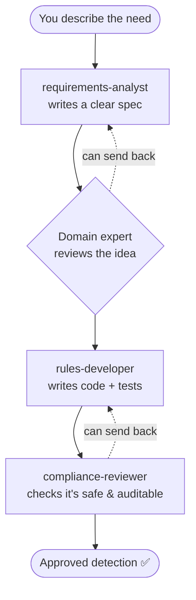
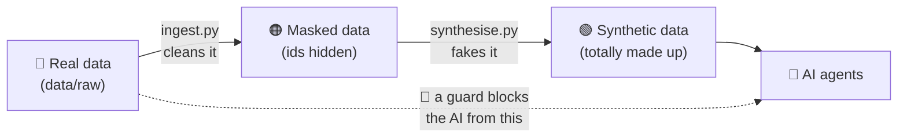

# How this all works — a plain-English overview

New to AI agents and LLMs? Start here. No prior knowledge assumed. By the end you'll
understand what this project *is*, who the "team" are, how a job flows through them, and
why real data never reaches the AI.

---

## 1. The 30-second version

At a bank there's a team of **engineers who build the systems** that spot money laundering,
market manipulation and dodgy trader chat. Note the word *build* — these aren't the
compliance officers who investigate alerts; they're the people who **design, write and test
the detection technology** those officers rely on.

Now imagine that engineering team is made of **AI assistants** instead of people: one writes
the requirements, a couple are subject experts who review the plan, one writes the actual
detection code, one tunes it, and one signs it off.

And "the systems" means more than detection rules. The same team builds the **data
pipelines** that feed surveillance, **scripts** that transform or reconcile data (in Python,
Scala, Java, PowerShell or Bash), **reporting**, **tooling** — or simply **reviews** existing
code to check it's robust and would survive an audit. A detection rule is just the worked
example in this repo.

This repository is the **setup for that virtual engineering team** — the job descriptions,
the rules they follow, a worked example of one thing they'd build (a detection rule), and the
safety rails that stop confidential data ever reaching the AI.

---

## 2. Two words you need: "LLM" and "agent"

- **LLM (Large Language Model)** — the technology behind tools like Claude or ChatGPT. In
  plain terms: a very capable text assistant that has read an enormous amount and can
  understand instructions, explain things, and write code. On its own it just produces
  text.

- **Agent** — an LLM that's been given **a job, some tools, and the ability to work in
  steps**. The "tools" are things like *read a file*, *run a test*, *search the code*.
  So an agent can actually *do* work (open files, write code, run it) rather than only
  chatting about it.

- **Subagent** — one agent set up for **a single, focused role**. This project has 13 of
  them. Each has a short "job description" (a small text file in `.claude/agents/`) telling
  it what it's responsible for and what it's allowed to touch.

Think of it like hiring 10 specialists instead of one generalist: each is briefed for its
job, and you (or a coordinating agent) hand the right task to the right specialist.

---

## 3. Meet the team

There are two kinds of team member.

**🧠 Advisors** can only *read and recommend* — they literally cannot change any code.
They're your experts and reviewers, kept "read-only" on purpose so they stay independent.

**🔧 Builders** can *write code and tests*.

| Member | Type | What they do (in plain terms) |
|---|---|---|
| `requirements-analyst` | 🔧 Builder | Turns a vague ask into a clear, testable spec |
| `tm-sme` | 🧠 Advisor | Money-laundering expert (transaction monitoring) |
| `trade-surveillance-sme` | 🧠 Advisor | Market-abuse expert (spoofing, insider dealing…) |
| `comms-surveillance-sme` | 🧠 Advisor | Trader-chat / email monitoring expert |
| `rules-developer` | 🔧 Builder | Writes the detection code + tests |
| `data-analyst` | 🔧 Builder | Tunes the rules; also data-quality, reconciliation, reporting |
| `ml-engineer` | 🔧 Builder | Builds smarter AI-based detection when needed |
| `qa-engineer` | 🔧 Builder | Independently tests it and evidences what was checked (for a real QA team) |
| `model-validator` | 🧠 Advisor | Independently checks any AI model is sound and fair |
| `cloud-architect` | 🔧 Builder | Builds the data plumbing: pipelines, ETL, transformation scripts, infrastructure |
| `code-reviewer` | 🧠 Advisor | Reviews code quality & security across Python, Scala, Java, PowerShell, Bash |
| `performance-reviewer` | 🧠 Advisor | Checks it's fast enough and will scale to real data volumes |
| `compliance-reviewer` | 🧠 Advisor | Final check: is it auditable, safe, well-tested, done? |

> Why "read-only" matters: a reviewer who could quietly fix the thing they're reviewing
> isn't really an independent check. Making advisors read-only is enforced by the tools
> each one is given — not just a polite request.

---

## 4. How a job flows through the team

You describe what you want. A coordinator (you, or the main AI session acting as a
project manager) routes it through the right specialists in order:

In this repo there's even a shortcut command, `/new-scenario`, that runs this whole chain
for you.

The golden rule the team follows: **every alert must be explainable**. You can always
trace *this alert* → *to the exact logic that produced it* → *to the specific regulation
it enforces*. No black boxes.

---

## 5. The safety story: real data never reaches the AI

This is the most important idea, and it's simpler than it sounds.

**The problem:** anything you show an AI agent is sent off to the AI provider to be
processed. For an ordinary app that's fine. For **bank records** — real customers, real
trades, confidential information — it absolutely is not.

**The solution:** the AI is never allowed to see real data. Instead, real data goes
through a one-way cleaning process first, and the AI only ever works with the cleaned or
made-up version.

Three layers, from most to least sensitive:

1. **🔴 Real data** lives in `data/raw/` and is **off-limits to the AI**. An automatic
   guard (a small script that runs before every file read) blocks any agent that tries to
   open it.
2. **🟠 Masking** (`scripts/ingest.py`) cleans real data: it scrambles the *identities*
   (names, account numbers, traders become meaningless codes; dates are shifted) but keeps
   the *behaviour* (the amounts, the timing, the patterns) so the detection still works.
   We even have a checker (`scripts/validate_masking.py`) that proves the cleaning both
   removed the identities **and** kept the detection working.
3. **🟢 Synthetic data** (`scripts/synthesise.py`) is the safest: it studies the *shape* of
   the cleaned data, then generates **completely made-up** records that behave the same way
   but correspond to nobody real. This is what's safe to put in front of the AI.

> Important honesty: "masked" is safer but **not** anonymous — scrambled bank data is still
> sensitive and stays locked down. "Synthetic" (made-up) data is the safe one to share.

---

## 6. The worked example, explained simply: "spoofing"

**Spoofing** is a real form of market cheating. A trader places a big fake order to *look*
like there's lots of demand (say, a huge "BUY"), tricks others into reacting, quietly does
their real deal on the other side at a better price, then **cancels the big fake order**
before it ever trades. It's illegal market manipulation.

This repo includes a complete, working detector for it:

- `rules/spoofing.py` — the detection logic. It flags an order that is **unusually large**,
  **cancelled very quickly**, **barely traded**, and lines up with a **real trade on the
  opposite side**. Every number it uses (how large? how quickly?) is written down with the
  reason and the date it was set.
- `tests/test_spoofing.py` — proof it works: examples it *should* catch, and innocent cases
  it must *not* wrongly flag.
- `docs/scenarios/spoofing.md` — the paper trail linking the alert to the actual EU
  regulation (MAR) it enforces.

It's the template every other detection in this team would follow.

---

## 7. What's in the box (the folders, in plain terms)

| Path | What it is |
|---|---|
| `CLAUDE.md` | The team handbook — shared rules every AI member reads first |
| `.claude/agents/` | The 10 job descriptions (one file per team member) |
| `.claude/commands/` | Shortcuts, e.g. `/new-scenario` runs the whole team chain |
| `.claude/hooks/` | The automatic guard that blocks the AI from real data |
| `rules/` | The actual detection code (the spoofing example) |
| `scripts/` | Tools: make fake data, clean real data, double-check the cleaning |
| `tests/` | Automated proof everything works (runs on every change) |
| `docs/` | This overview, the spoofing paper trail, and blank templates |
| `config/` | The masking recipe (which fields to scramble vs. keep) |

---

## 8. How you'd actually use it

1. Open this project in **Claude Code** (Anthropic's coding tool). The 13 team members load
   automatically.
2. **Start with the Project Manager.** Type `/engage` and describe whatever you've got — a
   rough idea, some code to check, or a full set of requirements. The PM is the single front
   door: it asks you clarifying questions, lets you **pick which documents you want**
   (a requirements doc? a spec? a review report?), agrees a plan, then runs the right
   specialists for you. You don't need to know who does what.
3. You get back proper deliverables — each as both a **Markdown** file and a ready-to-share
   **HTML** file.
4. Everything is checked automatically: tests must pass, no secrets or real data can sneak
   into the project, and the masking must prove it's safe.

Think of it as a small, flexible delivery team: hand it a problem, a review, or a build, and
it organises and does the work — you stay in the loop at the decision points.

---

## Mini-glossary

- **LLM** — the AI text engine (e.g. Claude). Reads instructions, writes text and code.
- **Agent** — an LLM given a job and tools so it can actually do work.
- **Subagent** — one agent set up for a single focused role (this repo has 10).
- **Orchestrator** — whoever hands tasks to the right agent and chains them together.
- **Masking** — scrambling identities in real data while keeping its behaviour.
- **Synthetic data** — completely made-up data that behaves realistically.
- **Hook** — a small script that runs automatically at a set moment (here: to block real data).
- **Spoofing** — placing fake orders to manipulate a market; our worked example.
