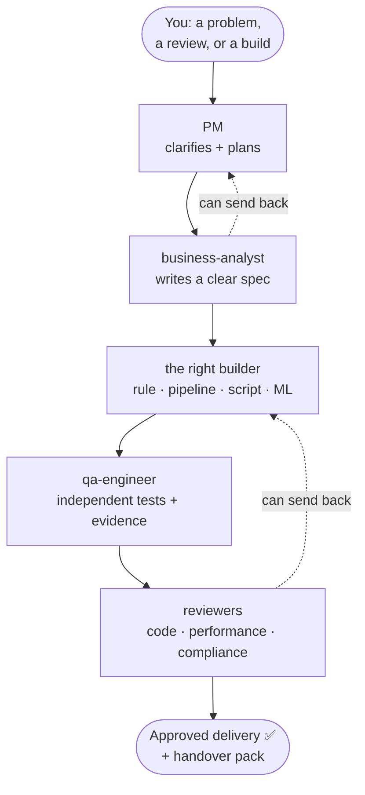
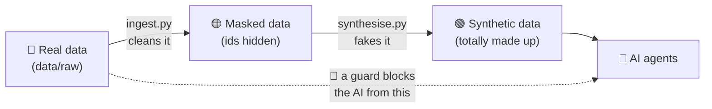

# How this all works - a plain-English overview

New to AI agents and LLMs? Start here. No prior knowledge assumed. By the end you'll
understand what this project *is*, who the "team" are, how a job flows through them, and
how it keeps confidential data away from the AI.

> ⚗️ **This is a proof of concept / experiment** - an exploration of what an AI engineering
> team could do in Claude Code, not a production or accredited system. Its outputs are a
> starting point for real engineers and reviewers, not a replacement for them.

---

## 1. The 30-second version

At a bank there's a team of **engineers who build the systems** that spot money laundering,
market manipulation and dodgy trader chat. Note the word *build* - these aren't the
compliance officers who investigate alerts; they're the people who **design, write and test
the detection technology** those officers rely on.

Now imagine that engineering team is made of **AI assistants** instead of people: one writes
the requirements, a couple are subject experts who review the plan, one writes the actual
detection code, one tunes it, and one signs it off.

And "the systems" means more than detection rules. The same team builds the **data
pipelines** that feed surveillance, **scripts** that transform or reconcile data (in Python,
Scala, Java, PowerShell or Bash), **reporting**, **tooling** - or simply **reviews** existing
code to check it's robust and would survive an audit. A detection rule is just the worked
example in this repo.

This repository is the **setup for that virtual engineering team** - the job descriptions,
the rules they follow, a worked example of one thing they'd build (a detection rule), and the
safety rails that stop confidential data ever reaching the AI.

---

## 2. Two words you need: "LLM" and "agent"

- **LLM (Large Language Model)** - the technology behind tools like Claude or ChatGPT. In
  plain terms: a very capable text assistant that has read an enormous amount and can
  understand instructions, explain things, and write code. On its own it just produces
  text.

- **Agent** - an LLM that's been given **a job, some tools, and the ability to work in
  steps**. The "tools" are things like *read a file*, *run a test*, *search the code*.
  So an agent can actually *do* work (open files, write code, run it) rather than only
  chatting about it.

- **Subagent** - one agent set up for **a single, focused role**. This project has 13 of
  them. Each has a short "job description" (a small text file in `.claude/agents/`) telling
  it what it's responsible for and what it's allowed to touch.

Think of it like having a bench of specialists instead of one generalist: each is briefed for
its job, and the PM hands the right task to the right specialist.

---

## 3. Meet the team

There are two kinds of team member.

**🧠 Advisors** can only *read and recommend* - they have no file-editing tools, so they
can't change the code they review. (A few hold a terminal for running static analysis tools;
the safety hooks stop that being used to run the code itself without a human's consent.)
They're your experts and reviewers, kept that way on purpose so they stay independent.

**🔧 Builders** can *write code and tests*.

| Member | Type | What they do (in plain terms) |
|---|---|---|
| **Amara** `business-analyst` | 🔧 Builder | Turns what a regulation requires into clear, testable written requirements, and works out how a rule change affects the detection already in place |
| **Mateo** `rules-developer` | 🔧 Builder | Writes the detection code + tests |
| **Ana** `data-analyst` | 🔧 Builder | Exploratory analysis, false-positive analysis, data-quality, reconciliation, reporting/MI |
| **Theo** `tuning-analyst` | 🔧 Builder | Sets and defends the alert thresholds - how sensitive each rule is - and shows the trade-off between catching more and raising too many false alarms |
| **Mei** `ml-engineer` | 🔧 Builder | Builds smarter AI-based detection when needed |
| **Linh** `qa-engineer` | 🔧 Builder | Independently tests it and evidences what was checked (for a real QA team) |
| **Viktor** `model-validator` | 🧠 Advisor | Independently checks any AI model is sound and fair |
| **Kenji** `platform-engineer` | 🔧 Builder | Builds the data plumbing: pipelines, ETL, transformation scripts, infrastructure |
| **Ravi** `code-reviewer` | 🧠 Advisor | Reviews code quality & security across Python, TypeScript/JS, Scala, Java, PowerShell, Bash, SQL |
| **Thabo** `performance-reviewer` | 🧠 Advisor | Checks it's fast enough and will scale to real data volumes |
| **Layla** `compliance-reviewer` | 🧠 Advisor | Final check: is it auditable, safe, well-tested, done? |
| **Yuki** `data-quality-reviewer` | 🧠 Advisor | Independently checks the data is complete & accurate, and that nothing in scope goes unmonitored |
| **Pip** `review-scorer` | ⚙️ Helper | A lightweight, low-cost assistant that does the routine review prep - working out what kind of code it is, scoring findings, filtering noise - so the senior reviewers spend their effort on judgement |

> **Where did the domain experts go?** The money-laundering, market-abuse and trader-chat
> expertise used to be three more advisors (Hassan, Camila and Cleo). Since 2026-08-17 it
> ships as three **knowledge packs** (`docs/sme/`) that any team member reads on demand -
> same expertise, no extra teammate to brief, faster and cheaper to consult. Documents cite
> the pack itself rather than a person.

> Why this matters: a reviewer who could quietly fix the thing they're reviewing isn't
> really an independent check. Advisor independence is enforced by the tools each one is
> given (no file-editing tools) - not just a polite request - with the safety hooks gating
> any code execution behind human consent.

---

## 4. How a job flows through the team

You describe what you want - a problem, some code to review, or a build. The **PM** (the
main AI session, acting as project manager) clarifies, agrees a plan, then routes it through
the right specialists. Which builder is used depends on the deliverable - a detection rule, a data
pipeline, a transformation script, an ML model - not always the same person:

```mermaid
flowchart TD
    You([You: a problem,<br/>a review, or a build]) --> PM[PM<br/>clarifies + plans]
    PM --> RA[business-analyst<br/>writes a clear spec]
    RA --> Build[the right builder<br/>rule · pipeline · script · ML]
    Build --> QA[qa-engineer<br/>independent tests + evidence]
    QA --> Rev[reviewers<br/>code · performance · compliance]
    Rev --> Done([Approved delivery ✅<br/>+ handover pack])
    RA -. can send back .-> PM
    Rev -. can send back .-> Build
```

In this repo there are shortcut commands that run these chains for you - `/engage` (the
front door), and focused ones like `/build-solution`, `/audit-review` and `/new-scenario`.

The golden rule the team follows: **everything must be explainable and traceable**. For a
detection, you can trace *this alert* → *the exact logic* → *the specific regulation*. For
any delivery, requirement → code → test → obligation. No black boxes.

---

## 5. The safety story: keeping real data out of the AI

This is the most important idea, and it's simpler than it sounds.

**The problem:** anything you show an AI agent is sent off to the AI provider to be
processed. For an ordinary app that's fine. For **bank records** - real customers, real
trades, confidential information - it absolutely is not.

**The solution:** the most sensitive data - anything in the `data/raw/` folder - is
**hard-blocked**: the hooks block any agent read of `data/raw/` (see
[`docs/safety-model.md`](safety-model.md) for exactly what that does and does not
guarantee). For anything else you have
two options. Clean it first (mask or synthesise, below). Or, if it is already safe, say so at
startup by confirming it is masked, synthetic or anonymised with no prohibited personal data. The
team cannot check that claim for you, so that confirmation is **your responsibility**. And whatever
you share, what gets written **into the repo** (examples, tests, reports) is *always* the cleaned or
made-up version.

```mermaid
flowchart LR
    Raw["🔴 Real data<br/>(data/raw)"] -->|"ingest.py<br/>cleans it"| Masked["🟠 Masked data<br/>(ids hidden)"]
    Masked -->|"synthesise.py<br/>fakes it"| Synth["🟢 Synthetic data<br/>(totally made up)"]
    Synth --> AI["🤖 AI agents"]
    Raw -. "🚫 a guard blocks<br/>the AI from this" .-> AI
```

Three layers, from most to least sensitive:

1. **🔴 Real data** lives in `data/raw/` and is **off-limits to the AI**. An automatic
   guard (a small script that runs before every file read) blocks any agent that tries to
   open it.
2. **🟠 Masking** (`scripts/ingest.py`) is a **basic** cleaning step - useful, but deliberately
   simple, **not a comprehensive anonymiser.** It replaces the *identifiers* (names, account
   numbers, traders) with meaningless codes and shifts the dates, and it does a **pattern-based
   find-and-remove** of common personal details (emails, phone numbers, card and bank-account
   numbers) in free text, while keeping the *behaviour* (amounts, timing, patterns) so detection
   still works. A checker (`scripts/validate_masking.py`) verifies the configured fields were
   cleaned and that detection still fires. **Its limits matter:** the free-text step matches known
   patterns only, so it will **miss names and disguised identifiers** buried in narrative or chat.
   Real chat and email need software that can spot names in running text (named-entity recognition),
   and for anything leaving the environment you should prefer synthetic data (below).
3. **🟢 Synthetic data** (`scripts/synthesise.py`) is the safest: it studies the *shape* of
   the cleaned data, then generates **completely made-up** records that behave the same way
   but correspond to nobody real. This is what's safe to put in front of the AI.

> Important limit: the masking engine is a **placeholder implementation** - it shows where the
> cleaning step fits in the workflow, and it is good for structured identifier fields plus
> pattern-based personal details, but it is **not** a full anonymiser and you should **not rely
> on it as your control** for real data (the same warning `/prepare-data` gives you - if the
> stakes are real, use your organisation's approved masking tooling or fully synthetic data).
> And even well-masked data is **not** anonymous - scrambled bank data is still sensitive and
> stays locked down. "Synthetic" (made-up) data is the safe one to share.

---

## 6. The worked example, explained simply: "spoofing"

**Spoofing** is a real form of market cheating. A trader places a big fake order to *look*
like there's lots of demand (say, a huge "BUY"), tricks others into reacting, quietly does
their real deal on the other side at a better price, then **cancels the big fake order**
before it ever trades. It's illegal market manipulation.

This repo includes a complete, working detector for it:

- `rules/spoofing.py` - the detection logic. It flags an order that is **unusually large**,
  **cancelled very quickly**, **barely traded**, and lines up with a **real trade on the
  opposite side**. Every number it uses (how large? how quickly?) is written down with the
  reason and the date it was set.
- `tests/test_spoofing.py` - proof it works: examples it *should* catch, and innocent cases
  it must *not* wrongly flag.
- `docs/scenarios/spoofing.md` - the paper trail linking the alert to the actual EU
  regulation (MAR) it enforces.

It's the template every other detection in this team would follow.

---

## 7. What's in the box (the folders, in plain terms)

| Path | What it is |
|---|---|
| `CLAUDE.md` | The team handbook - shared rules every AI member reads first |
| `.claude/agents/` | The 13 job descriptions (one file per team member) |
| `.claude/skills/` | Workflow shortcuts, e.g. `/new-scenario` runs the whole team chain |
| `.claude/hooks/` | The automatic guard that blocks the AI from real data |
| `rules/` | The actual detection code (the spoofing example) |
| `scripts/` | Tools: make fake data, clean real data, double-check the cleaning |
| `tests/` | Automated proof everything works (runs on every change) |
| `docs/` | This overview, the spoofing paper trail, and blank templates |
| `config/` | The masking recipe (which fields to scramble vs. keep) |

---

## 8. How you'd actually use it

1. Open the project in **Claude Code** - the recommended way is **`virt-surv go`** from
   your project folder (set up once via the install helper's alias step): it shows the
   team settings, lets you pick resume-or-new before the session starts, and launches
   Claude Code with that choice pre-seeded. Starting `claude` by hand works identically.
   The 13 team members are loaded but stay **dormant** - a normal session behaves like
   ordinary Claude Code until you invoke the team.
2. **Start with the Project Manager - "Morgan".** Type `/engage` and describe whatever
   you've got - a rough idea, some code to check, or a full set of requirements. Morgan is
   warm and plain-speaking, with a can-do but realistic attitude - it'll find a way forward,
   but tell you plainly if something's hard or risky rather than just saying yes. It's the
   single front door: it asks you clarifying questions, lets you **pick which documents you
   want**
   (a requirements doc? a spec? a review report?), agrees a plan, then runs the right
   specialists for you. You don't need to know who does what. **Type `/engage` just once** to
   start - after that, simply chat back and forth; Morgan stays with you for the whole
   session.
3. You get back proper deliverables - each as both a **Markdown** file and a ready-to-share
   **HTML** file. Each piece of work gets its own folder under `artifacts/`, with a
   `START-HERE.md` index that always shows what it is, whether it's finished, and what to
   read in what order - so anyone opening the folder later can pick it up cold.
4. Everything is checked automatically: tests must pass, no secrets or real data can sneak
   into the project, and the masking must prove it's safe. An engagement only counts as
   closed once a mechanical checklist passes - the close refuses until it does.

Think of it as a small, flexible delivery team: hand it a problem, a review, or a build, and
it organises and does the work - you stay in the loop at the decision points.

> ▶️ **Ready to try it?** This page is the *understand-it* tour; the
> [**README**](../README.md) is the *do-it* reference - the one-command quick start, the full list
> of commands, and the install options.

---

## Mini-glossary

*(**LLM**, **agent** and **subagent** are explained in [§2](#2-two-words-you-need-llm-and-agent) above.)*

- **Orchestrator** - whoever hands tasks to the right agent and chains them together.
- **Masking** - scrambling identities in real data while keeping its behaviour.
- **Synthetic data** - completely made-up data that behaves realistically.
- **Hook** - a small script that runs automatically at a set moment (here: to block real data).
- **Spoofing** - placing fake orders to manipulate a market; our worked example.

---

Next: [Demos](demos/README.md) · [FAQ](FAQ.md) · [Glossary](glossary.md) · [README](../README.md)
