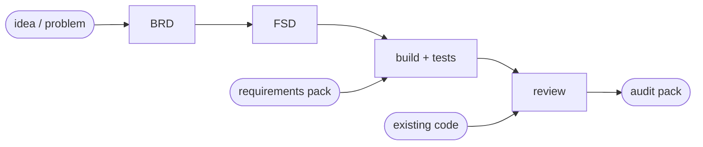

# Ways of working

How this team operates: a single, dynamic, agile delivery team you can throw almost
anything at — a vague problem, existing code to review, or a full set of requirements to
build — that figures out the shape of the work and orchestrates it. This page records the
**established frameworks** we follow (so we don't reinvent the wheel) and how they're wired
into the repo.

## The front door: the PM

Every engagement starts with the **Project Manager** (the main Claude Code session acting as
orchestrator — it's the only role that can direct the specialist subagents). Kick off with:

```
/engage <your problem, code to review, or requirements>
```

The PM will:
1. **Classify** the work (problem → discovery; review; or build-from-requirements).
2. **Ask clarifying questions and wait for your answers** — it never guesses material
   decisions (scope, jurisdiction, data, success criteria).
3. **Offer a menu of documentary artifacts** for you to choose from (below).
4. **Summarise** everything in an *Engagement Brief* (decisions, open questions, assumptions,
   plan), and get your go-ahead.
5. **Oversee delivery** in small agile iterations, routing each step to the right specialist
   and returning to you at the gates.

It's flexible by design: the PM only runs the stages your request actually needs.

## The delivery pipeline (four entry points, one chain)



| You bring… | Command | What runs |
|---|---|---|
| An idea / problem | `/engage` → `/write-brd` | discovery → BRD → FSD → build → review |
| A BRD | `/brd-to-fsd` | functional spec + traceability |
| Existing code (detailed review) | `/deep-review` | dimension fan-out + confidence scoring |
| Existing code (audit sign-off) | `/audit-review` | evaluator–optimizer review loop |
| A requirements pack | `/build-solution` | orchestrator–workers end-to-end build |

## Documentary artifacts (the menu)

Pick what you need; each is produced in **`.md` and `.html`** (rendered by
`scripts/render_html.py`) for easy distribution.

| Artifact | Template | Standard it follows |
|---|---|---|
| Engagement Brief | `engagement-brief.md` | PM intake summary |
| Business Requirements (BRD) | `brd.md` | **BABOK v3** + **EARS** syntax |
| Functional Spec (FSD) | `fsd.md` | **ISO/IEC/IEEE 29148** + **Gherkin** acceptance criteria |
| Architecture Decision Record | `adr.md` | **ADR** (Nygard) |
| Requirements Traceability Matrix | `rtm.md` | **RTM** — the audit golden thread |
| Scenario spec / doc | `scenario-spec.md`, `scenario-doc.md` | repo convention |
| Code & Compliance Review Report | `review-report.md` | **OWASP ASVS**, **CWE**, **SEI CERT** |
| Model Validation Report | `model-validation-report.md` | **SR 11-7**, **PRA SS1/23** |

## Established frameworks we integrate

**Requirements & delivery**
- **BABOK v3** — business analysis / BRD.
- **ISO/IEC/IEEE 29148** — requirements specification (supersedes IEEE 830).
- **EARS** (Easy Approach to Requirements Syntax) — unambiguous, testable requirements.
- **Gherkin / BDD** (Given-When-Then) — acceptance criteria that map straight to tests.
- **C4 model** + **ADRs** — architecture description and decision history.

**Audit & quality**
- **Requirements Traceability Matrix** — requirement → design → code → test → obligation.
- **OWASP ASVS**, **CWE Top 25**, **SEI CERT** secure coding — the review checklists
  `code-reviewer` cites (it drives the standard linters, see the README tooling table).
- **Confidence-scoring + filter-transparency + deep review** — `docs/code-review-method.md`,
  adapted from [turingmind-code-review](https://github.com/turingmindai/turingmind-code-review)
  (MIT). `/deep-review` runs the detailed, multi-dimension review (bugs, security,
  architecture, impact analysis); regulated findings (secrets, PII, broken traceability) are
  never filtered.
- **SR 11-7 / PRA SS1/23** — model-risk governance for any ML detection.

**Agent orchestration** — Anthropic's
[Building Effective Agents](https://www.anthropic.com/research/building-effective-agents)
patterns, mapped to our work:
- **Prompt chaining** → idea → BRD → FSD → build.
- **Routing** → the PM picks the right SME / language reviewer.
- **Orchestrator–workers** → `/build-solution` decomposes a requirements pack and builds the
  parts.
- **Evaluator–optimizer** → `/audit-review`'s review-fix-re-review loop.

> We deliberately do **not** adopt an external multi-agent framework (CrewAI / LangGraph /
> AutoGen). Claude Code's native subagents, slash commands and the PM orchestrator already
> provide routing, chaining and orchestration — adding a framework would be *adding* a wheel,
> not avoiding one.

## The traceability spine (why this survives audit)

The single most important convention: a stable requirement ID minted in the BRD flows all
the way through.

```
BRD-001  ─▶  FSD-001  ─▶  rules/…py  ─▶  test_…  ─▶  MAR Art.12
```

Auditors and regulators don't ask "is the code good" — they ask "show me this control traces
to a requirement, the requirement traces to an obligation, and there's a test that proves
it." The **RTM** keeps that thread intact, and `compliance-reviewer` checks it on every
change.
