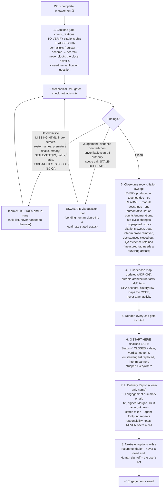

# Engagement workflow - Mermaid diagrams (v0.28.0)

Companion to `engagement-flow-spec.md`. Four diagrams: the end-to-end phase flow, the
always-on hooks layer, the delivery loop with the mandatory code chain, and the close
sequence. State emoji: ⏳ in progress · ⛔ blocked · ✅ closed. Evidence tags: 📊
observed/measured · 🧠 inferred · 📄 coded.

## 1. End-to-end engagement flow

```mermaid
flowchart TD
    REQ["User request arrives"] --> DORM{"Team invoked?<br/>/engage, team command,<br/>or asks for the team / Morgan"}
    DORM -- "No" --> PLAIN["Plain Claude Code session<br/>only Layer 0 hooks stay armed"]
    DORM -- "Yes" --> PROBE["Step 0: ONE compound probe<br/>operating guide, plugin root, python,<br/>run mode, version, analyser inventory,<br/>codebase-map header + history, changelog"]
    PROBE --> BANNER["Opening banner: Morgan intro,<br/>team version, meet-the-team offer,<br/>whats-new line if version changed"]
    BANNER --> TARGET{"Concrete target<br/>or inputs given?"}
    TARGET -- "No (bare /engage)" --> ASK1["Ask ONE question:<br/>where is the code / input?"] --> WAIT1["Wait for user"] --> TARGET
    TARGET -- "Yes" --> GATES["Show 2 VERBATIM disclaimers:<br/>execution safety + data safety"]
    GATES --> BATCH["ONE batched AskUserQuestion call<br/>(only applicable questions):<br/>work-type / execution consent INTENT /<br/>data attestation"]
    BATCH --> CONSENT{"Execution<br/>consent answer"}
    CONSENT -- "Yes = intent only" --> MARKER["User personally types<br/>touch .claude/.exec-consent<br/>(human-only grant, model blocked<br/>from writing it)"]
    CONSENT -- "No" --> DELMARK["Any existing marker DELETED<br/>dynamic findings stay 🧠 inferred"]
    BATCH --> DATTEST{"Data<br/>attestation"}
    DATTEST -- "No / unsure" --> PREP["/prepare-data:<br/>mask or synthesise first"]
    DATTEST -- "Clean or none" --> CLASS
    MARKER --> CLASS{"Classify<br/>the work"}
    DELMARK --> CLASS
    PREP --> CLASS
    CLASS -- "Problem / idea" --> DISC["Discovery, requirements:<br/>/write-brd, /elicit-requirements,<br/>/brd-to-fsd"] --> BUILD
    CLASS -- "Review" --> SECOFFER{"Security-sensitive<br/>surface?"}
    SECOFFER -- "Yes: recommend" --> SECAUD["Offer review + /security-audit<br/>(re-offered at review close)"] --> RMENU
    SECOFFER -- "No" --> RMENU["LOCKED review menu, one call:<br/>Q1 Depth Quick/Deep/Audit/None<br/>Q2 Performance yes/no<br/>Q3 Fix-cycle report/apply/loop"]
    RMENU --> RNONE{"Q1=None and<br/>Q2=No?"}
    RNONE -- "Yes" --> BACKOUT["Nothing to run: say so,<br/>return to outcome question"]
    RNONE -- "No" --> BUILD
    CLASS -- "Build from requirements" --> BUILD["Phase 3: plan and gate"]
    BUILD --> AMENU["LOCKED artifact menu, 2 stages:<br/>consolidated report (default) /<br/>separate / both, then grouped picks"]
    AMENU --> BRIEF["📄 Engagement Brief +<br/>📄 START-HERE living index (⏳)<br/>both rendered to .html"]
    BRIEF --> GOAHEAD{"Go-ahead gate"}
    GOAHEAD -- "Adjust" --> AMENU
    GOAHEAD -- "Stop" --> HALT["Engagement ends unstarted"]
    GOAHEAD -- "Proceed" --> DELIV["Phase 4: delivery loop<br/>(diagram 3)"]
    DELIV --> BLOCKED{"Turn ends needing<br/>user input?"}
    BLOCKED -- "Yes" --> B1["START-HERE set ⛔ with outstanding list:<br/>open questions + every gate not yet run.<br/>Turn ends saying NOT closed.<br/>No email, no delivery report"]
    B1 --> RESUME{"How does it<br/>continue?"}
    RESUME -- "User answers (same session)" --> R1["⛔ flips back to ⏳,<br/>answer logged"] --> DELIV
    RESUME -- "New session (cold resume)" --> R2["Fresh session reads START-HERE +<br/>interim artifacts as state of record,<br/>honours decisions, completes<br/>outstanding list top to bottom"] --> DELIV
    BLOCKED -- "No, work complete" --> CLOSE["Phase 5: close sequence<br/>(diagram 4)"]
    CLOSE --> DONE["✅ CLOSED: delivery report,<br/>summary email, next-step options.<br/>Human sign-off is the user's act"]
```

## 2. Layer 0 - always-on hooks and guards (every session, dormant or not)

```mermaid
flowchart TD
    subgraph PRE["PreToolUse chain - every matching tool call"]
        TC["Tool call"] --> PD{"Permission deny rules"}
        PD -- "read or write on data/raw/**<br/>(read-only deny on .env*, secrets/**,<br/>*.pem, *.key)" --> PDX["Blocked by settings"]
        PD -- "otherwise" --> G1{"guard-raw-data.py<br/>Read Grep Glob Bash"}
        G1 -- "touches data/raw/" --> G1X["BLOCK: raw data must<br/>never reach the model"]
        G1 -- "clean" --> G2{"guard-code-execution.py<br/>Bash only"}
        G2 -- "team script<br/>allow-list" --> G2OK["Allow consent-free<br/>(render_html, convert_file,<br/>check_artifacts, eval_score...)"]
        G2 -- "executes other code" --> G2C{".claude/.exec-consent<br/>exists or<br/>CST_ALLOW_EXEC=1?"}
        G2C -- "Yes (human created it)" --> G2Y["Allow"]
        G2C -- "No" --> G2X["BLOCK: static by default;<br/>consent is a human act"]
        G2 -- "neither" --> G2P["Allow"]
        G2Y --> G3{"guard-consent-writes.py<br/>Write Edit Bash"}
        G2P --> G3
        G2OK --> G3
        G3 -- "writes consent marker,<br/>settings, or hook files" --> G3X["BLOCK: the model can never<br/>grant itself consent or<br/>weaken a guard"]
        G3 -- "otherwise (read-only<br/>mentions allowed)" --> RUN["Tool runs"]
    end
    subgraph UPS["UserPromptSubmit - every user turn"]
        UP["User prompt"] --> PA{"persona_anchor.py:<br/>project START-HERE open<br/>(⏳ or ⛔)?"}
        PA -- "Yes" --> PAI["Inject 8-line Morgan persona +<br/>discipline anchor<br/>(survives compaction)"]
        PA -- "No" --> PAS["Silent - team stays dormant"]
    end
    subgraph STOPH["Stop hook - when the model tries to end its turn"]
        ST["Turn ending"] --> SG{"dod_stop_gate.py:<br/>project START-HERE open?"}
        SG -- "No" --> SGS["Silent"]
        SG -- "Yes" --> SGC{"Mechanical DoD check<br/>finds defects?"}
        SGC -- "No" --> SGS
        SGC -- "Yes" --> SGX["Block the stop ONCE with a FIX-LIST:<br/>the MODEL then auto-fixes deterministic<br/>defects, escalates judgement calls,<br/>or ends plainly saying NOT closed"]
    end
```

## 3. Phase 4 - delivery loop and the mandatory code chain

```mermaid
flowchart TD
    START["Go-ahead received"] --> RS["Right-size OUT LOUD:<br/>agent count + why, before any fan-out<br/>(multi-agent is about 15x tokens)"]
    RS --> ROUTE["Route by deliverable type:<br/>spec Amara · rules Mateo · pipeline Kenji ·<br/>analysis Ana · tuning Theo · ML Mei ·<br/>QA Linh · code review Ravi · perf Thabo ·<br/>compliance Layla · coverage Yuki ·<br/>SMEs Hassan Camila Cleo · scoring Pip ·<br/>validation Viktor"]
    ROUTE --> BRIEFS["Explicit non-overlapping briefs;<br/>returns capped at about 1500 tokens;<br/>coordination via shared artifacts<br/>(the blackboard), not chatter"]
    BRIEFS --> WORK["Specialists work.<br/>Advisory agents hold NO Write/Edit:<br/>they recommend, Morgan routes"]
    WORK --> CHALL["PM challenge - sceptic not relay:<br/>test every Critical, thin evidence,<br/>sample of the rest AND of the filtered set;<br/>verify 📊 vs 🧠 vs 📄 tags"]
    CHALL --> CODE{"Did this phase produce<br/>deliverable code?"}
    CODE -- "No" --> INDEX
    CODE -- "Yes: chain attaches<br/>regardless of workflow" --> TESTS["Tests with the project's own framework,<br/>exact command recorded"]
    TESTS --> REV["Code review (Ravi)"]
    REV --> FIXQ{"Findings?<br/>per Q3 fix-cycle"}
    FIXQ -- "Fix, re-review<br/>(loop until no Criticals<br/>or user stops)" --> REV
    FIXQ -- "Clean or report-only" --> QA{"Execution consent<br/>marker present?"}
    QA -- "Yes" --> QAI["INDEPENDENT QA (Linh):<br/>append-only test cycles,<br/>failed verdicts preserved as-found,<br/>QA suites RETAINED under artifacts/"]
    QAI --> QAV{"QA verdict"}
    QAV -- "Fail: route fix,<br/>new cycle" --> TESTS
    QAV -- "Pass" --> INDEX
    QA -- "No" --> STATIC["Static-only DoD path:<br/>QA verdict stays 🧠, DoD PARTIAL,<br/>untested code named residual risk,<br/>close offers consent-to-upgrade"]
    STATIC --> INDEX["📄 Every artifact write appends a<br/>START-HERE row IN THE SAME TURN.<br/>Interim names only: review-pass-N,<br/>qa-cycle-N, interim-*, + interim banner"]
    INDEX --> MORE{"More iterations<br/>needed?"}
    MORE -- "Yes (no hard cycle limit:<br/>the user at gates is the brake)" --> RS
    MORE -- "No" --> OUT["To Phase 5 close"]
```

## 4. Phase 5 - close sequence (the only path to ✅)

