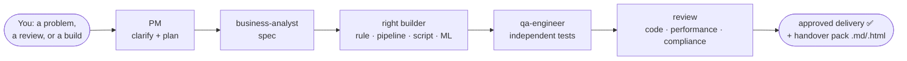

# The team

> Moved out of README.md on 2026-09-14 (framework review, step 6.8); the README keeps a short roster and links here. The canonical roster and routing table are in `team-operating-guide.md`.

*The team as portrayed at v0.33 - all seventeen. Since 2026-08-17 the three SME advisors
(Hassan, Camila and Cleo, back row) are retired: their expertise ships as the
[`docs/sme/`](sme/README.md) knowledge packs, consulted in-line at zero spawn cost, and
the live roster is Morgan + 13.*

**Morgan** (PM & orchestrator) leads **13 agents**: twelve specialists and a tireless junior
(Pip). Each has a day job, a name, strong opinions, and a Slack
status that tells you more than their job title does. (Type `/meet-the-team` and Morgan does the
introductions live.) **🧠 Advisors** hold no file-editing tools, your *independent* check, so they
can critique all day but can't change the code (segregation of duties, basically). **🔧 Builders**
write the stuff. Morgan engages only the ones a task needs, **not all of them every time**.

*The shape of a full delivery: a typical task fires only **2-5** of the 13; complexity is opt-in
("use the simplest thing that works").*

> Routing by deliverable, not habit: a detection rule → `rules-developer`; an ETL pipeline or
> a PowerShell transform → `platform-engineer`; a reconciliation/reporting job → `data-analyst`;
> **threshold tuning → `tuning-analyst`**; **requirements/elicitation/reg-change → `business-analyst`**;
> an ML model → `ml-engineer`. The PM picks; see CLAUDE.md §6.

👥 <b>The full roster</b>: day jobs, strong opinions and Slack statuses (or run <code>/meet-the-team</code>)

**🎩 Morgan**: *Project Manager & orchestrator.* Translates regulator-speak into plain English,
leads with "yes, here's how", and physically cannot let a piece of work end at "analysis". Will
get it past the reviewers **and** the change board. · *Slack:* "happy to take that as an action."

### 🔧 Builders: they engineer the surveillance technology

- **Amara**: *Business Analyst.* Asks "but what does the regulation *actually require*?" until the
  spec can't be misread. BABOK to her bones; allergic to ambiguity and to thresholds that turned up
  without a rationale. · *Slack:* "requirement unclear → workshop booked (recurring)."
- **Mateo**: *Detection Rules Developer.* Turns "catch the spoofers" into deterministic, tested
  logic, second line of defence, in code form. A rule without a false-positive test is, to him,
  just a rumour. · *Slack:* "no test, no merge. it's in the SDLC."
- **Ana**: *Data Analyst.* Lives in the data and the false positives; trusts nothing until she's
  seen the distribution. Will name your FP driver before you've finished writing the ticket. ·
  *Slack:* "the data says otherwise."
- **Theo**: *Tuning Analyst.* Can defend a threshold to a regulator with a straight face: ATL/BTL,
  segmentation, the lot. Treats "let's just round it to 10k" as a personal insult. · *Slack:*
  "show me the below-the-line sample."
- **Mei**: *ML Engineer.* Reaches for ML only when plain rules aren't enough, and says
  so out loud, because she knows Viktor's coming. Won't ship a model she can't explain to a
  regulator. · *Slack:* "…do we actually need a model for this?"
- **Kenji**: *Platform / Data Engineer.* Builds the plumbing nobody thanks him for until a feed
  drops at quarter-end. Pipelines, ETL, retention, lineage, and a deep, personal grudge against
  silent failures. · *Slack:* "have you tried the runbook?"
- **Linh**: *QA Engineer.* Refuses to mark her own homework, independent by design. Finds the
  edge case you were hoping nobody would raise in UAT. Residual risk: stated, not buried. ·
  *Slack:* "reopening: it's a finding, not a nit."

### 🧠 Advisors: they guide and sign off (read-only)

- *(Retired 2026-08-17: **Hassan** the AML SME, **Camila** the trade-surveillance SME and
  **Cleo** the comms-surveillance SME - their expertise now ships as the three
  [`docs/sme/`](sme/README.md) knowledge packs, read in-line by whoever needs them: same
  substance, no spawn, and a leaner roster that routes better. Their Slack statuses are
  preserved in the packs' git history.)*
- **Viktor**: *Model Validator.* Independent of Mei *by design*, and entirely comfortable telling
  her the model's wrong. Lives in **SR 26-2** (the model-risk guidance that replaced SR 11-7 in 2026); the friendly adversary every model needs. ·
  *Slack:* "prove it. then prove it again. then document it."
- **Ravi**: *Code Reviewer.* Reads seven languages (**Python, TypeScript/JS, Scala, Java,
  PowerShell, Bash, SQL**) and the security flaws in all of them. Drives the real analysers
  (ruff/mypy/bandit/SpotBugs/ShellCheck…), adds judgement on top, and, sorry, there's a
  hard-coded secret on line 42. · *Slack:* "nit: naming (×40). also: CRITICAL, line 42."
- **Thabo**: *Performance Reviewer.* Asks one question (*"will it survive month-end?"*) and
  answers with evidence, not vibes. **Static by default** (won't run your code uninvited, §7). ·
  *Slack:* "fine in dev. now do it at 10× and T+1."
- **Layla**: *Compliance Reviewer.* The last gate before anything ships: auditability, the
  alert→logic→obligation trail, secrets/PII, the Definition of Done. "Probably fine" does not pass
  review. · *Slack:* "if it isn't documented, it didn't happen."
- **Yuki**: *Data-Quality Reviewer.* Quietly obsessed with the one missing feed that means abuse
  goes undetected: completeness, timeliness, **total coverage**. Knows a silent feed gap *is* the
  control failure. · *Slack:* "no feed, no alert, no idea."

### ⚙️ …and behind the scenes

- **Pip**: *Review Coordinator.* Haiku-tier and proud of it. Preps every review: detects the
  context, picks the lenses, scores findings and keeps the Found/Reported/Filtered tallies, so the
  senior reviewers never burn opus on arithmetic. Will absolutely raise a ticket for it. ·
  *Slack:* "review prepped & triaged ▓▓▓░░ (JIRA raised)"

> Why read-only matters: an advisor that could quietly edit the thing it's reviewing isn't a
> real independent check. The restriction is enforced by the tools each agent is granted: no
> advisor holds `Write`/`Edit` (the reviewers add `Bash`
> for static analysers and `git diff`, gated by the execution hook), not by convention.

[↑ Back to top](../README.md#readme-top)
