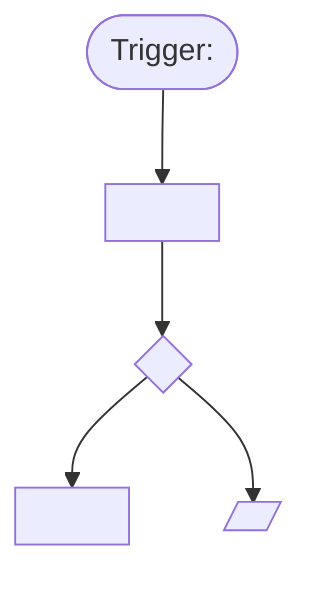
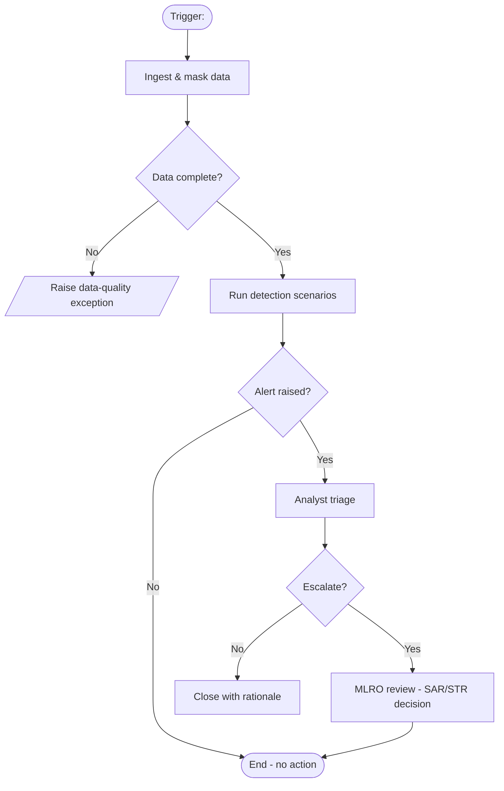

# Process Map - <PROCESS NAME>

> Produced by `business-analyst` (BPMN-style). Captures current- and target-state flow,
> actors, decisions, controls and hand-offs for a surveillance process. Authored in `.md`,
> rendered to `.html`. Synthetic illustrations only - no real data (§5).

> **Document control** · ID `PROC-001` · Version `0.1` · Status `Draft | In review | Approved`
> · Classification `Internal | Confidential` · Owner `<name / role>` · As-of `<YYYY-MM-DD>`
>
> | Version | Date | Author | Change |
> |---|---|---|---|
> | 0.1 | <YYYY-MM-DD> | <author> | Initial draft |

| | |
|---|---|
| **Process owner** | <role> |
| **Trigger** | <event that starts the process> |
| **Outcome** | <what "done" looks like> |

## 1. Overview
One paragraph: what the process does and why it exists (link the obligation it supports, §2 -
e.g. alert triage feeding SAR/STR decisioning).

## 2. Actors / swimlanes
| Lane | Actor / system | Responsibility in this process |
|------|----------------|--------------------------------|
| 1 | Data feed / ingestion | deliver masked, complete data |
| 2 | Detection engine | run scenarios, raise alerts |
| 3 | Surveillance analyst | triage, escalate or close |
| 4 | MLRO / Compliance | decision & regulatory filing |

## 3. Current-state (as-is) steps
| # | Step | Lane | Input - Output | Pain point / risk |
|---|------|------|----------------|-------------------|
| 1 | <step> | <lane> | … | <manual / gap / delay> |

## 4. Current-state (as-is) diagram (Mermaid)
Replace placeholder nodes with the real as-is flow. Annotate manual steps and pain points.

## 5. Target-state (to-be) steps
| # | Step | Lane | Input - Output | Change vs as-is |
|---|------|------|----------------|-----------------|
| 1 | <step> | <lane> | … | <automated / new control> |

## 6. Target-state diagram (Mermaid)
Replace the placeholder nodes with the real flow; keep decisions as diamonds and controls
annotated.

## 7. Decision points
| ID | Decision | Criteria | Outcomes |
|----|----------|----------|----------|
| D1 | Data complete? | reconciliation pass | proceed / exception |
| D2 | Escalate alert? | typology + materiality | close / escalate |

## 8. Exceptions & error paths
| Exception | Detected at | Handling | Owner |
|-----------|-------------|----------|-------|
| Missing feed | ingestion | block + alert ops | IT team |
| Late data | batch window | reprocess | platform-engineer |

## 9. Controls in the flow
| Control | Step | Type (preventive/detective) | Obligation (§2) |
|---------|------|-----------------------------|-----------------|
| Reconciliation check | step 1 | detective | FCA SYSC record-keeping |
| Alert audit trail | triage | detective | MAR / SR 11-7 |

## 10. KPIs & SLAs
Measurable performance targets for the process. Agree baselines and review cadence with the
process owner.

| KPI / SLA | Target | Measurement method | Review cadence |
|-----------|--------|--------------------|----------------|
| Alert triage SLA | <e.g. analyst completes triage within 2 business days of alert raise> | case-management system timestamp | Monthly MI |
| SAR / STR filing window | <e.g. filed within 3 business days of escalation decision> | filing system timestamp vs. escalation date | Monthly MI + regulatory requirement |
| False-positive rate | <e.g. < 20 % of alerts escalated> | closed-no-action / total alerts | Monthly tuning review |
| Feed completeness | <e.g. 100 % of expected records received within batch window> | reconciliation report | Daily |
| Detection latency | <e.g. alert raised within 15 min of triggering event> | end-to-end timing | Weekly |

## 11. Hand-offs
| From - To | What is handed over | SLA / trigger |
|-----------|---------------------|---------------|
| Detection - Analyst | alert + evidence | on raise |
| Analyst - MLRO | escalation pack | on escalate |

> Traceability: process steps and controls map to FSD functional requirements and RTM rows;
> data-quality exceptions feed the data requirements in the elicitation doc.

## Sign-off
| Role | Name | Decision | Date |
|------|------|----------|------|
| Author / owner | | | |
| `compliance-reviewer` (DoD gate) | | | |
| Human approver (or `[IT team]`) | | | |
