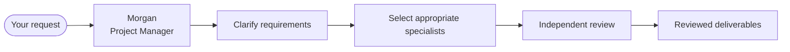

<a id="readme-top"></a>

# Virtual Surv-IT


> **AI-powered Compliance Surveillance Engineering Team for Claude Code**
>
> Morgan leads a team of specialist AI engineers that build, review, test and document compliance-surveillance software inside Claude Code.

---

## What is Virtual Surv-IT?

Virtual Surv-IT is a **collaborative AI engineering framework** that assembles a project manager and specialist AI agents into a coordinated software engineering team.

Instead of asking one general-purpose assistant to do everything, Morgan delegates work to the specialists best suited to the task—business analysts, rule developers, data engineers, reviewers, QA engineers and subject-matter experts—before bringing the results back together into a reviewed deliverable.

The project focuses on **engineering the technology behind compliance surveillance**, not performing compliance activities themselves.

Typical work includes:

- Detection rules
- ETL and data pipelines
- Data transformation utilities
- Python, Scala, Java, PowerShell and Bash tooling
- Technical documentation
- Code reviews
- Performance reviews
- QA evidence
- Solution handover packs

Whether you're starting with a blank sheet of paper, an existing codebase or a functional specification, Morgan coordinates the work and engages only the specialists required for that task.

---

## Project Status

> ⚗️ **Proof of Concept**

Virtual Surv-IT is an active experiment exploring how a team of specialist AI agents can collaborate inside Claude Code.

It is **not** a production platform, and it should not be considered regulatory or legal tooling.

Expect:

- frequent improvements
- occasional breaking changes
- rough edges
- features that continue to evolve

Every engineering output should be reviewed by a human before production use.

---

## Safety by Design

Virtual Surv-IT follows two simple principles:

### The team is dormant until you ask

A normal Claude Code session behaves exactly like Claude Code.

Morgan and the engineering team become active only when you explicitly invoke them using one of the project commands such as:

```
/compliance-surveillance-team:engage
```

or, when working inside the repository itself:

```
/engage
```

---

### Raw data never reaches the model

The project includes an always-on data safety guard.

Anything stored under:

```
data/raw/
```

is blocked from being read by agents.

Any other information you choose to provide should already be appropriately masked, anonymised or synthetic.

More information is available later in **Data Safety**.

### Reviewing code means reading it, not running it

A second always-on guard governs **code execution**. Reviewing code only requires reading it, so commands that *run* code (test runners, scripts, profilers) are blocked unless you explicitly consent at intake—the team writes a `.claude/.exec-consent` marker, or you set `CST_ALLOW_EXEC=1`. The team's own helper `scripts/` are always allowed.

Both guards are wired in two places, so they apply whether the team runs as a plugin or directly in the repository, and a test keeps the two copies identical.

**How strong are the guards?** For file reads (`Read`/`Grep`/`Glob`) the block is backed by an OS-level deny-list, so it genuinely holds. For shell commands the guards work by inspecting the command text—a strong default and a consent record, but **not a sandbox** (a determined user could evade string-matching). The real boundary for shell is OS file permissions and keeping raw data off the machine. Full analysis: [`docs/adr/ADR-002`](docs/adr/ADR-002-safety-hook-threat-model.md).

---

## Why Virtual Surv-IT?

Building surveillance technology requires expertise across many disciplines.

A single AI assistant can often produce a reasonable first draft, but there is usually nobody checking:

- whether requirements were interpreted correctly
- whether thresholds are defensible
- whether code is maintainable
- whether tests are adequate
- whether documentation is complete
- whether the solution would survive technical review

Virtual Surv-IT separates these responsibilities across specialist agents.

Rather than one assistant doing everything, Morgan coordinates a small engineering team where builders and reviewers each have clearly defined responsibilities.

Reviewers are intentionally independent from builders, providing a genuine second opinion rather than reviewing their own work.

---

## How work flows through the team



Morgan rarely engages the entire team.

Most tasks involve only **two to five specialists**, keeping engagements focused while following Anthropic's guidance to use the simplest approach that solves the problem.

---

## Key Features

| Feature | Description |
|----------|-------------|
| Collaborative engineering | Morgan coordinates specialist AI agents rather than relying on one general assistant. |
| Right-sized teams | Only the specialists required for a task are engaged. |
| Independent review | Builders and reviewers have separate responsibilities. |
| Claude Code native | Runs as a Claude Code plugin or directly from the repository. |
| Engineering focused | Detection rules, pipelines, tooling, documentation and reviews. |
| Safe by default | Raw data protection and guidance for masked or synthetic data. |
| Evidence driven | Reviews, documentation and traceability are built into the workflows. |
| Extensible | New specialists and workflows can be added over time. |

---

## Quick Start

### Install as a Claude Code plugin (recommended)

> You must type the `/plugin` commands **yourself** — `/plugin …` is interactive, so asking the assistant to "install the plugin" won't actually do it. (First remove any earlier hand-copy such as `~/.claude/skills/…`, which would conflict.)

```text
/plugin marketplace add danieledge/virtual-surv-IT
/plugin install compliance-surveillance-team@virtual-surv-it
```

Restart Claude Code, then **verify** with `/plugin` — it should list **compliance-surveillance-team** as enabled. If it isn't listed, the install didn't run; re-type the commands.

Engage the team from any project — commands are namespaced:

```text
/compliance-surveillance-team:engage Build a spoofing detection rule for equities
/compliance-surveillance-team:engage Review this PowerShell ETL
/compliance-surveillance-team:engage Build this from the attached FSD
```

Describe the problem in plain English; Morgan selects the right specialists. *(One session only? `claude --plugin-dir /path/to/virtual-surv-IT` loads it temporarily, without saving.)*

> **What works everywhere vs repository mode.** The full review/advisory team — `engage`, all the reviews, the SMEs, Morgan — works in any project. The helper *script* steps (the `.md`→`.html` render and the masking pipeline) need the plugin's `scripts/` reachable from the working directory, which Claude Code doesn't expose from a foreign project, so those run cleanest in repository mode (below). The data-safety guard is fully portable: it protects *your* project's `data/raw/`, backed by an OS-level deny-list.

### Repository mode

Running Claude Code directly inside this repository gives you the same workflows without installing anything — plus the demos, the worked example, the masking pipeline and the rendering scripts:

```bash
git clone https://github.com/danieledge/virtual-surv-IT.git
cd virtual-surv-IT     # start Claude from the repo root (discovery doesn't walk up directories)
claude
```

Then use `/engage`, `/deep-review`, `/audit-review`, `/handover`, … (un-namespaced in repository mode), or `/demo` to watch a full engagement on synthetic data.

<details>
<summary>Manual / partial install — hand-pick the team into an existing repo</summary>

Without the marketplace, copy these into your repo and restart Claude Code:

1. `CLAUDE.md` (the shared handbook) to your repo root — merge if you already have one.
2. `.claude/agents/` — the 16 subagents.
3. `.claude/skills/` — the workflows (`/engage`, `/audit-review`, …); without these you get agents but no front door.
4. `.claude/hooks/` **and** `.claude/settings.json` — the always-on data-safety + code-execution guards. Don't skip these.
5. `docs/templates/` — the artifact templates the workflows render.

Run `/agents` and `/help` to confirm the team and its commands loaded. (Installing as a plugin ships all of this together.)

</details>

---

## New to AI agents?

Start with:

```
docs/OVERVIEW.md
```

It explains:

- how the team works
- who the specialists are
- how work flows through the project
- how the data safety model works

No prior knowledge of AI agents is assumed.

---

## Navigation

📑 **Jump to** — [Meet the Team](#meet-the-team) · [Working with Morgan](#working-with-morgan) · [Engineering in Practice](#engineering-in-practice) · [Safety by Design](#safety-by-design) · [Masking Pipeline](#masking-pipeline) · [Repository Structure](#repository-structure) · [Configuration](#configuration) · [Token Usage & Cost](#token-usage--cost) · [Quality & Evaluation](#quality--evaluation) · [Documentation](#documentation) · [Roadmap](#roadmap) · [Contributing](#contributing)

---

## Meet the Team

> "You don't work with one AI assistant. You work with Morgan's engineering team."

Virtual Surv-IT is organised like a real engineering department. Morgan coordinates the work, selects the specialists each engagement needs, and keeps everyone moving in the same direction. Most jobs involve **2–5 specialists**, not the whole team — builders build, reviewers review, and nobody marks their own homework.


*Seventeen people. Seventeen opinions. One project manager who somehow keeps them all moving in the same direction.*

### 🎩 Morgan — Project Manager & Orchestrator

The only person you ever need to talk to. Describe the problem in plain English and Morgan clarifies requirements, spots what's missing, recommends deliverables, selects the right specialists, coordinates reviews and delivers the finished work. Morgan doesn't try to be the smartest engineer in the room — only to make sure the right engineer is. · *Slack:* "Happy to take that as an action."

### 🔧 Builders — they engineer the surveillance technology

- **Amara — Business Analyst.** Turns regulations into buildable requirements; keeps asking "what does the regulation *actually* require?" until the spec can't be misread. · *Slack:* "Requirement unclear → workshop booked (recurring)."
- **Mateo — Detection Rules Developer.** Turns "catch the spoofers" into deterministic, tested logic. A rule without a false-positive test is, to him, just a rumour. · *Slack:* "No test, no merge."
- **Ana — Data Analyst.** Lives in the data and the false positives; trusts distributions over opinions. Names your FP driver before you've finished the ticket. · *Slack:* "The data says otherwise."
- **Theo — Tuning Analyst.** Defends every threshold with evidence — ATL/BTL, segmentation, the lot. Regards "let's just make it 10,000" as an anti-pattern. · *Slack:* "Show me the below-the-line sample."
- **Mei — ML Engineer.** Reaches for ML only when deterministic rules genuinely aren't enough — and says so out loud, because she knows Viktor is coming. · *Slack:* "…do we actually need a model?"
- **Kenji — Platform / Data Engineer.** Builds the pipelines nobody thanks him for until a feed drops at quarter-end. Carries a deep distrust of silent failures. · *Slack:* "Have you tried the runbook?"
- **Linh — QA Engineer.** Independent by design; doesn't believe engineers should mark their own homework. Finds the edge case everyone hoped nobody would raise. · *Slack:* "Reopening — it's a finding, not a nit."

### 🧠 Advisors — they guide and sign off (read-only)

- **Hassan — Transaction Monitoring / AML SME.** The money-laundering brain — structuring, smurfing, layering, usually spotted before lunch. · *Slack:* "That's structuring. And that. And that."
- **Camila — Trade Surveillance SME.** Reads an order book like a detective novel: spoofing, layering, marking the close, insider dealing. · *Slack:* "…and there's the cancel. Classic."
- **Cleo — Communications Surveillance SME.** Reads trader chat for a living — lexicons, NLP risk flags, e-comms and voice. Fluent in euphemism. · *Slack:* "'Per my last message' is doing a lot of work here."
- **Viktor — Model Validator.** Professionally sceptical and independent of Mei by design. Believes every model should earn the right to exist. · *Slack:* "Prove it. Then prove it again."
- **Ravi — Code Reviewer.** Reads seven languages and the security flaws in all of them. Will find the secret on line 42 — and leave forty comments about naming. · *Slack:* "Nit ×40. Also: line 42 is a problem."
- **Thabo — Performance Reviewer.** One question — will it survive month-end? — answered with evidence, not vibes. Static by default. · *Slack:* "Now test it at 10×."
- **Layla — Compliance Reviewer.** The final engineering gate: documentation, traceability, auditability, the Definition of Done. · *Slack:* "If it isn't documented, it didn't happen."
- **Yuki — Data Quality Reviewer.** Obsessed with the missing feed that means abuse goes undetected — completeness, timeliness, total coverage. · *Slack:* "No feed. No alert. No idea."

### ⚙️ Behind the scenes

- **Pip — Review Coordinator.** Haiku-tier and proud of it. Preps every review — context, scoring, finding classification, triage — so the senior reviewers don't have to. Still somehow cheerful. · *Slack:* "Review prepped & triaged ▓▓▓░░"

> **Why the advisors are read-only.** It isn't just convention — it's enforced through tool permissions. Builders get write access; advisors get read-only (`Read, Grep, Glob`). An independent reviewer shouldn't be able to quietly "fix" the thing it's reviewing, and that's how Virtual Surv-IT keeps review genuinely independent.

---


## Working with Morgan

Morgan is the front door to the engineering team.

You don't need to decide which specialist should work on your request—that's Morgan's job.

Describe the problem in plain English and Morgan will:

- clarify requirements
- identify missing information
- recommend appropriate deliverables
- select the right specialists
- coordinate reviews
- manage the engagement through to handover

For most work, you only need one command.

```text
/engage
```

Everything else happens through conversation.

---

### Starting an engagement

Examples:

```text
/engage Build a spoofing detection rule for equities.

/engage Review this PowerShell ETL.

/engage Build this solution from the attached FSD.

/engage Explain why this detector generates false positives.

/engage Create a handover pack for this pipeline.
```

Morgan begins by understanding the problem before assigning work.

Rather than guessing, Morgan asks questions about things like:

- business objectives
- jurisdiction
- regulations
- technology stack
- expected deliverables
- success criteria

Once those are clear, Morgan prepares an Engagement Brief and proposes an engineering plan.

---

### Choosing the right specialists

One of the core ideas behind Virtual Surv-IT is that **not every problem needs every specialist.**

Morgan assembles a team based on the work required.

Examples:

| Task | Typical specialists |
|------|----------------------|
| Detection rule | Business Analyst → Rules Developer → Reviewer |
| ETL pipeline | Platform Engineer → QA → Code Reviewer |
| Threshold tuning | Tuning Analyst → Data Analyst |
| ML detector | ML Engineer → Model Validator |
| Existing code review | Code Reviewer → Performance Reviewer → Compliance Reviewer |

Most engagements involve between **two and five specialists**.

The entire team is rarely required.

---

## Available Workflows

Virtual Surv-IT includes a number of focused workflows alongside the general `/engage` command.

| Command | Purpose |
|----------|---------|
| `/engage` | General engineering work |
| `/prepare-data` | Prepare masked or synthetic datasets |
| `/write-brd` | Create a Business Requirements Document |
| `/brd-to-fsd` | Convert a BRD into a Functional Specification |
| `/deep-review` | Comprehensive code review |
| `/performance-review` | Performance and scalability review |
| `/audit-review` | Audit readiness assessment |
| `/remediate` | Improve legacy or existing code |
| `/build-solution` | Build from requirements |
| `/handover` | Produce implementation and QA handover documentation |
| `/new-scenario` | Build a new surveillance scenario |

Each workflow follows the same principle:

Morgan coordinates.

Specialists deliver.

Reviewers challenge.

You approve.

---

## Deliverables

Depending on the engagement, Morgan may recommend producing one or more engineering artifacts.

Examples include:

- Business Requirements Documents
- Functional Specifications
- Architecture Decision Records
- Traceability Matrices
- Technical Designs
- Review Reports
- QA Evidence
- Handover Documentation

Artifacts are generated in both Markdown and HTML where supported.

Each completed engagement also finishes with a short summary email from Morgan explaining what was delivered.

---

## Typical Engagement

```text
You

↓

Morgan

↓

Clarification

↓

Engineering Plan

↓

Specialists

↓

Independent Review

↓

Final Deliverables

↓

Handover
```

This process stays the same regardless of whether the work involves:

- writing a new detector
- reviewing existing code
- building pipelines
- tuning thresholds
- generating documentation

Morgan simply adjusts which specialists participate.

---

## Repository Mode vs Plugin Mode

Virtual Surv-IT can be used in two ways.

### Plugin Mode

Ideal when you want to bring the engineering team into an existing project.

The review team, specialist agents and workflows are available immediately after installation.

---

### Repository Mode

Opening the repository directly provides access to:

- demonstration workflows
- bundled examples
- masking pipeline
- HTML rendering scripts
- evaluation harness
- supporting utilities

Repository mode is the easiest way to explore everything the project currently provides.

---

## Engineering in Practice

Virtual Surv-IT is designed to help engineers build software that is understandable, reviewable and maintainable.

The project isn't centred around a particular surveillance scenario.

It's centred around an engineering workflow.

Whether you're creating a new detector, reviewing existing code or building an ETL pipeline, the same principles apply throughout.

---

### A Worked Example

The repository includes a complete reference implementation built entirely on synthetic data.

```
rules/spoofing.py
tests/test_spoofing.py
scripts/gen_synthetic.py
docs/scenarios/spoofing.md
```

The example demonstrates an end-to-end engineering workflow including:

- requirements
- implementation
- testing
- documentation
- traceability

Because the dataset is synthetic, it can safely be shared, modified and experimented with.

Run the example locally:

```bash
pip install -r requirements-dev.txt

pytest

python -m scripts.gen_synthetic \
    --kind spoofing \
    --out data/synthetic/spoofing.jsonl
```

### See it in action

Recorded transcripts let you read a full engagement without spending any tokens: a complete [build, end to end](docs/demos/build-demo.md) (with every artifact in [`docs/demos/build-artifacts/`](docs/demos/build-artifacts/)), a [code review](docs/demos/review-demo.md), the [data-safety guard blocking a read live](docs/demos/data-safety-demo.md), and a [run comparison](docs/demos/build-run-comparison.md).

---

### Engineering Principles

Everything Virtual Surv-IT produces is guided by the same engineering principles.

| Principle | What it means |
|-----------|---------------|
| Engineering first | Builds software rather than providing compliance advice. |
| Human oversight | Every deliverable should be reviewed before production use. |
| Independent review | Builders build. Reviewers review. |
| Right-sized teams | Morgan selects only the specialists a task requires. |
| Safe development | Synthetic or appropriately protected data only. |
| Traceability | Requirements, code and tests should connect together. |
| Explainability | Detection logic should be understandable by engineers and reviewers. |
| Modular architecture | Specialists evolve independently without affecting the wider team. |

These principles influence every workflow, regardless of which specialists are involved.

---

## Code Review

Code review is treated as an engineering activity rather than a checklist.

Reviewers don't simply look for syntax errors.

They consider:

- correctness
- maintainability
- security
- scalability
- performance
- auditability
- documentation
- regulatory traceability where appropriate

Where available, the `code-reviewer` agent uses established analysis tools rather than attempting to replace them.

Examples include:

| Language | Typical Tooling |
|-----------|-----------------|
| Python | Ruff, Black, MyPy, Bandit, Pip Audit, Semgrep |
| Bash | ShellCheck, shfmt |
| PowerShell | PSScriptAnalyzer |
| Java | Checkstyle, PMD, SpotBugs |
| Scala | Scalafmt, Scapegoat, WartRemover |
| Multi-language | Semgrep, Gitleaks |

These tools are optional.

If they are installed, they provide additional evidence for the review.

If they are not installed, reviews continue using the information available to the reviewer.

The review report clearly states which analysers were available.

Nothing is silently skipped.

---

## Quality & Evaluation

Virtual Surv-IT tests both the repository **and** the behaviour of the engineering team itself.

Repository quality is verified through unit tests.

Team quality is assessed using the evaluation harness under:

```
evals/
```

The evaluation framework includes:

- golden test cases
- scoring rubrics
- seeded defects
- false-positive traps
- deterministic scoring
- optional LLM-assisted evaluation

This helps identify regressions where prompt or workflow changes reduce review quality without affecting the underlying code.

---

## Continuous Improvement

Virtual Surv-IT treats engineering quality as something that should be measured rather than assumed.

The project favours:

- repeatable workflows
- independent review
- objective evidence
- incremental improvement

The goal isn't to produce perfect software automatically.

The goal is to help engineers produce better software, more consistently.

---

## Masking Pipeline

> [!WARNING]
> **Experimental implementation**
>
> The current masking pipeline is an **early proof of concept** designed to demonstrate the overall approach to preparing data for AI-assisted engineering. It is **not** a mature or production-ready anonymisation solution and **must not be relied upon as the sole control** for protecting sensitive data.

The repository currently includes tooling for:

- Schema-driven masking
- Masking validation
- Synthetic data generation

These tools exist to support experimentation and local development. They demonstrate the intended workflow but should be considered an **interim capability**, not a finished security control.

### Project position

**This implementation exists to explore the workflow, not to define the final architecture.**

The current masking pipeline is **expected to be replaced**, not incrementally evolved into the long-term solution. As the project matures, it will be superseded by a more robust data preparation pipeline designed around stronger masking, validation and synthetic data generation.

Typical usage:

```bash
export MASKING_KEY=...

python -m scripts.ingest \
    --in data/raw/example.jsonl \
    --out data/masked/example.jsonl

python -m scripts.validate_masking \
    --in data/masked/example.jsonl
```

### Current limitations

The current implementation has several important limitations:

- Free-text masking is intentionally basic and is **not suitable** for reliably anonymising complex communications data.
- Validation cannot prove that every sensitive identifier has been removed.
- The pipeline has **not** been designed, validated or independently assessed as an enterprise-grade anonymisation solution.
- It should be viewed as an engineering aid rather than a data protection product.

### Roadmap

The planned replacement pipeline is intended to:

- Profile datasets locally without exposing raw data to AI models.
- Apply stronger masking and anonymisation techniques.
- Use NER-based detection for free-text fields.
- Generate validated synthetic datasets where appropriate.
- Automatically verify outputs before they are made available to the engineering team.

Until that work is complete, the recommended approach is:

1. Keep production data under `data/raw/`, where it remains inaccessible to AI agents.
2. Prefer fully synthetic datasets wherever practical.
3. If real data must be used, ensure it has been independently masked or anonymised using controls appropriate for your organisation before making it available to Virtual Surv-IT.

> Pseudonymised data is still personal data under GDPR; even well-masked records remain sensitive. Prefer fully synthetic data for anything that leaves your environment.

> **In short:** treat the current masking pipeline as a demonstration of the intended workflow, **not** as a production-ready security control. The long-term direction of the project is to replace it with a more capable and rigorously validated data preparation solution.

---

## Repository Structure

The repository is organised around the engineering team, supporting workflows and reference material.

```text
.
├── .claude/                  # Agents, workflows, hooks and settings
├── .claude-plugin/           # Claude Code plugin manifest
├── config/                   # Configuration and reference data
├── docs/                     # Documentation
├── evals/                    # Team quality evaluation harness
├── rules/                    # Example surveillance scenarios
├── scripts/                  # Helper utilities
├── tests/                    # Unit tests
├── README.md
└── CLAUDE.md
```

The complete repository layout, including every directory and supporting script, is documented in the project documentation.

---

## Configuration

Virtual Surv-IT is intentionally configurable.

Examples include:

- Agent model selection
- Tool permissions
- Regulatory register
- Masking configuration
- Review workflows
- Team operating guidance

The default configuration is designed to demonstrate the framework while remaining easy to customise for your own organisation.

### Tool permissions

Virtual Surv-IT deliberately separates responsibilities.

| Role | Permissions |
|------|-------------|
| Builders | Read, Write, Edit, Bash |
| Advisors | Read, Grep, Glob (read-only) |

This separation helps preserve independent review by ensuring reviewers cannot quietly modify the implementation they are assessing.

### Memory

Project knowledge belongs to the **project**, not the plugin.

Project-specific decisions should be recorded within the project's own documentation or `CLAUDE.md`.

The plugin itself intentionally avoids accumulating project-specific memory because it may be installed across many unrelated repositories.

---

## Token Usage & Cost

Multi-agent work costs tokens, so the team is built to be cost-conscious. The biggest lever is **right-sizing**—engaging only the specialists a task needs, never the whole team.

<details>
<summary>Measured per-run figures, the cost levers, and a tongue-in-cheek rate card</summary>

Measured on real runs (the Agent tool reports actual usage; roughly four characters per token, so ±15%):

| What | Tokens | ~API cost |
|------|--------|-----------|
| One quick `code-reviewer` review (small file) | ~18.7k | ~$0.80 |
| A lean engagement (intake, scorer, reviewer, synthesis) | ~35–50k | ~$0.50–1.00 |
| A full build → 3 reviews → tuning → performance delivery (8 agents) | ~182k | ~$3–6 |

> Rough basis (±2×), at list prices: opus ~$15/$75, sonnet ~$3/$15, haiku ~$1/$5 per million input/output tokens. The counts are totals (no input/output split), and prompt-caching can reduce this substantially. Treat as order-of-magnitude, not a quote.
>
> For context, that full eight-agent delivery (~$3–6 of API, ~9 minutes) represents roughly £2–4k of human consulting effort—the routine 80% in minutes, so people spend their time on the judgement that matters. The [delivery report](docs/demos/build-artifacts/delivery-report.md) includes the full rate card.

**The cost levers:**

- **Right-sizing** — a narrow change uses two or three specialists, not the whole team, and Morgan states the agent count at the gate.
- **Model tiering** — **4 opus / 11 sonnet / 1 haiku**; the top tier is reserved for final-judgement and novel-design roles, and the cheapest tier handles mechanical review bookkeeping.
- **Artifacts as a blackboard** — specialists return condensed results; large output goes to files rather than back through Morgan's context.

</details>

---

## Documentation

The repository includes detailed documentation covering both the engineering framework and its implementation.

| Document | Description |
|----------|-------------|
| `docs/OVERVIEW.md` | Introduction to Virtual Surv-IT |
| `docs/WAYS-OF-WORKING.md` | Engineering workflows and deliverables |
| `docs/agent-design.md` | Agent architecture and design decisions |
| `docs/DEFINITION-OF-DONE.md` | Delivery quality gates |
| `docs/code-review-method.md` | Code review methodology |
| `docs/house-rules.md` | Cross-project engineering conventions |
| `CHANGELOG.md` | Release history |

New users should begin with **OVERVIEW.md** before exploring the remaining documentation.

---

## Roadmap

Virtual Surv-IT continues to evolve.

Current areas of focus include:

- Replacing the current masking pipeline with a more robust data preparation workflow.
- Expanding the evaluation harness and golden test cases.
- Improving synthetic data generation.
- Extending specialist workflows.
- Strengthening evidence and traceability.
- Continuing to align the project with Anthropic guidance for collaborative AI systems.

The roadmap reflects the project's direction rather than a commitment to specific delivery dates.

---

## Contributing

Contributions are welcome.

Whether you are reporting an issue, improving documentation or contributing code, please help keep the project aligned with its engineering principles.

Before submitting a pull request:

- Keep tests passing.
- Do not commit secrets or production data.
- Use synthetic or appropriately protected datasets.
- Add or update tests where appropriate.
- Document significant behavioural changes.

See `CONTRIBUTING.md` for full guidance.

---

## Acknowledgements

Virtual Surv-IT explores how specialist AI agents can collaborate as an engineering team rather than operating as a single general-purpose assistant.

The project draws inspiration from Anthropic's published guidance on:

- Building Effective Agents
- Multi-Agent Research Systems
- Context Engineering
- Claude Code Subagents

The code review methodology also builds upon ideas from the excellent **turingmind-code-review** project, adapted for compliance surveillance engineering.

---

## Disclaimer

Virtual Surv-IT is an **engineering productivity framework**.

It is **not**:

- regulatory advice
- legal advice
- compliance software
- a substitute for professional judgement

The project is an active proof of concept.

Outputs should always be reviewed by appropriately qualified engineers before production use.

---

## License

Released under the MIT License.

See `LICENSE` for details.

---

## Final Thoughts

Virtual Surv-IT began as an experiment exploring whether specialist AI agents could collaborate like a real engineering team.

It continues to evolve with the same philosophy:

> **Use the simplest team that can solve the problem. Build with evidence. Review independently. Keep humans responsible for the final decision.**
